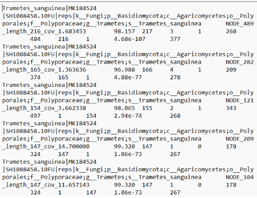

# bioinfoport

## PREFACE
Tri Tuong's place of data.

Following https://www.biostarhandbook.com/fast/ and will be documenting my (hopefully) own personal projects here. 

Start Date: 4/17/2026

*unrelated picture from an unrelated project*

## PROGRESS BAR

## FastTrack Bioinformatics 2025 — Lectures

- [x] 1. Introduction to the course
- [x] 2. The Unix command line  
  - [x] ⭐ How to solve it
- [x] 3. Genomic Data Visualization
- [x] 4. Genomic Data Sources
- [x] 5. Sequencing and FASTQ  
  - [ ] ⭐ AI-Powered Scripting
- [ ] 6. Short Read Alignments  
  - [ ] ⭐ AI-Powered Makefiles
- [ ] 7. Binary Alignment Map (BAM)  
  - [ ] ⭐ Bioinformatics Toolbox  
  - [ ] ⭐ Toolbox Documentation
- [ ] 8. Automation and Design Files