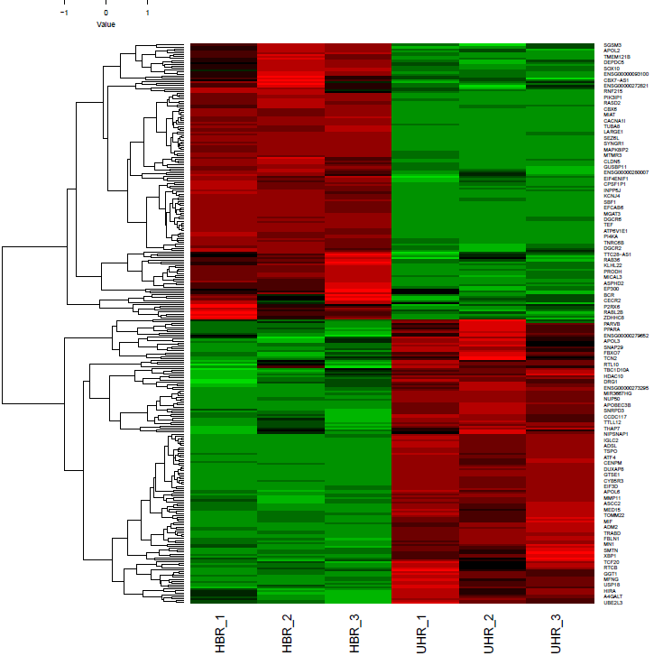
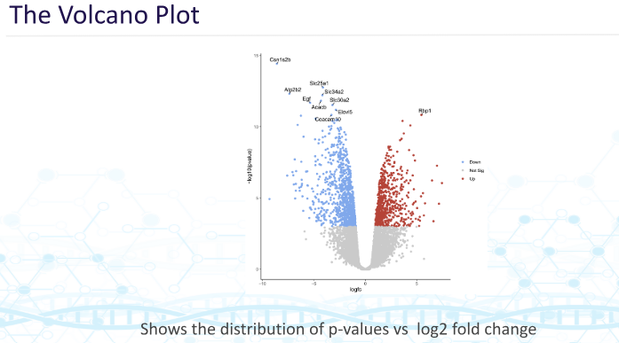
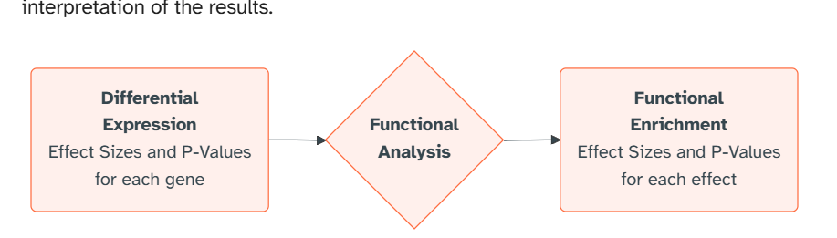
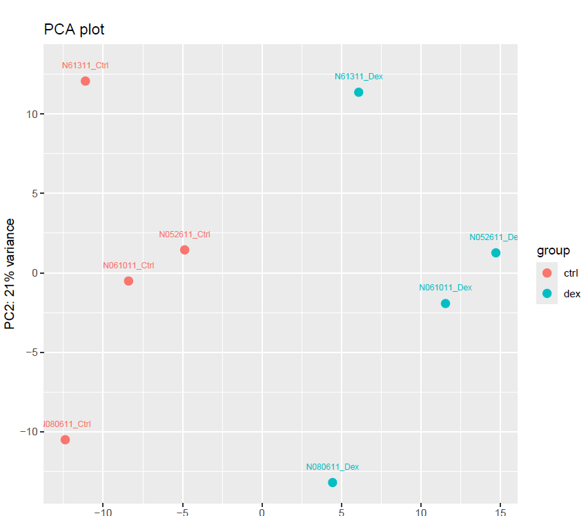
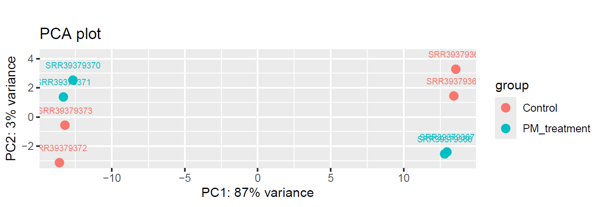

# RNA-SEQ-2 README 
## SALMON 
RNA-Seq sequencing data using methods that rely on quantification 

```SALMON``` uses the species transcriptome

We then index the transcriptome
```
make -f src/run/salmon.mk \
    REF=refs/chr22.transcripts.fa \
    index
```

We then align 
```
make -f src/run/salmon.mk \
    REF=refs/chr22.transcripts.fa \
    R1=reads/HBR_1_R1.fq  \
    SAMPLE=HBR_1 \
    run
```
```
cat salmon/HBR_1/quant.sf | column -t | head
Name                Length  EffectiveLength  TPM            NumReads
ENST00000615943.1   113     3.832            0.000000       0.000
ENST00000618365.1   139     4.702            0.000000       0.000
ENST00000623473.1   54      2.626            0.000000       0.000
ENST00000624155.1   120     4.038            0.000000       0.000
ENST00000422332.1   1241    991.000          0.000000       0.000
ENST00000612732.1   151     5.225            0.000000       0.000
ENST00000614148.1   115     3.889            0.000000       0.000
ENST00000614087.1   73      2.935            0.000000       0.000
ENST00000621672.1   82      3.104            0.000000       0.000
```

Rerun for all samples 
```
REF=refs/chr22.transcripts.fa
DESIGN=design.csv
NCPU=4

tail -n +2 "${DESIGN}" | parallel --eta --lb --colsep , \
    make -f src/run/salmon.mk \
    REF=${REF} \
    R1=reads/{1}_R1.fq \
    SAMPLE={1} \
    NCPU=${NCPU} \
    run
```

```
 head salmon/*/quant.sf
==> salmon/HBR_1/quant.sf <==
Name    Length  EffectiveLength TPM     NumReads
ENST00000615943.1       113     3.832   0.000000        0.000
ENST00000618365.1       139     4.702   0.000000        0.000
ENST00000623473.1       54      2.626   0.000000        0.000
ENST00000624155.1       120     4.038   0.000000        0.000
ENST00000422332.1       1241    991.000 0.000000        0.000
ENST00000612732.1       151     5.225   0.000000        0.000
ENST00000614148.1       115     3.889   0.000000        0.000
ENST00000614087.1       73      2.935   0.000000        0.000
ENST00000621672.1       82      3.104   0.000000        0.000

==> salmon/HBR_2/quant.sf <==
Name    Length  EffectiveLength TPM     NumReads
ENST00000615943.1       113     3.832   0.000000        0.000
ENST00000618365.1       139     4.702   0.000000        0.000
ENST00000623473.1       54      2.626   0.000000        0.000
ENST00000624155.1       120     4.038   0.000000        0.000
ENST00000422332.1       1241    991.000 0.000000        0.000
ENST00000612732.1       151     5.225   0.000000        0.000
ENST00000614148.1       115     3.889   0.000000        0.000
ENST00000614087.1       73      2.935   0.000000        0.000
ENST00000621672.1       82      3.104   0.000000        0.000

==> salmon/HBR_3/quant.sf <==
Name    Length  EffectiveLength TPM     NumReads
ENST00000615943.1       113     3.832   0.000000        0.000
ENST00000618365.1       139     4.702   0.000000        0.000
ENST00000623473.1       54      2.626   0.000000        0.000
ENST00000624155.1       120     4.038   0.000000        0.000
ENST00000422332.1       1241    991.000 0.000000        0.000
ENST00000612732.1       151     5.225   0.000000        0.000
ENST00000614148.1       115     3.889   0.000000        0.000
ENST00000614087.1       73      2.935   0.000000        0.000
ENST00000621672.1       82      3.104   0.000000        0.000

==> salmon/UHR_1/quant.sf <==
Name    Length  EffectiveLength TPM     NumReads
ENST00000615943.1       113     3.832   0.000000        0.000
ENST00000618365.1       139     4.702   0.000000        0.000
ENST00000623473.1       54      2.626   0.000000        0.000
ENST00000624155.1       120     4.038   0.000000        0.000
ENST00000422332.1       1241    991.000 0.000000        0.000
ENST00000612732.1       151     5.225   0.000000        0.000
ENST00000614148.1       115     3.889   0.000000        0.000
ENST00000614087.1       73      2.935   0.000000        0.000
ENST00000621672.1       82      3.104   0.000000        0.000

==> salmon/UHR_2/quant.sf <==
Name    Length  EffectiveLength TPM     NumReads
ENST00000615943.1       113     3.832   0.000000        0.000
ENST00000618365.1       139     4.702   0.000000        0.000
ENST00000623473.1       54      2.626   0.000000        0.000
ENST00000624155.1       120     4.038   0.000000        0.000
ENST00000422332.1       1241    991.000 17.213738       1.000
ENST00000612732.1       151     5.225   0.000000        0.000
ENST00000614148.1       115     3.889   0.000000        0.000
ENST00000614087.1       73      2.935   0.000000        0.000
ENST00000621672.1       82      3.104   0.000000        0.000

==> salmon/UHR_3/quant.sf <==
Name    Length  EffectiveLength TPM     NumReads
ENST00000615943.1       113     3.832   0.000000        0.000
ENST00000618365.1       139     4.702   0.000000        0.000
ENST00000623473.1       54      2.626   0.000000        0.000
ENST00000624155.1       120     4.038   0.000000        0.000
ENST00000422332.1       1241    991.000 0.000000        0.000
ENST00000612732.1       151     5.225   0.000000        0.000
ENST00000614148.1       115     3.889   0.000000        0.000
ENST00000614087.1       73      2.935   0.000000        0.000
ENST00000621672.1       82      3.104   0.000000        0.000
(bioinfo)
```
Using their design script
```src/r/combine_salmon.r -d design.csv ```
```
head counts.csv
name,length,HBR_1,HBR_2,HBR_3,UHR_1,UHR_2,UHR_3
ENST00000615943.1,3.8,0,0,0,0,0,0
ENST00000618365.1,4.7,0,0,0,0,0,0
ENST00000623473.1,2.6,0,0,0,0,0,0
ENST00000624155.1,4,0,0,0,0,0,0
ENST00000422332.1,991,0,0,0,0,1,0
ENST00000612732.1,5.2,0,0,0,0,0,0
ENST00000614148.1,3.9,0,0,0,0,0,0
ENST00000614087.1,2.9,0,0,0,0,0,0
ENST00000621672.1,3.1,0,0,0,0,0,0
(stats)
```
With the scripts you can also have genes name added
```src/r/create_tx2gene.r -d hsapiens_gene_ensembl ``` + ```src/r/combine_salmon.r  -t tx2gene.csv ```
```
head counts.csv
name,gene,HBR_1,HBR_2,HBR_3,UHR_1,UHR_2,UHR_3
ENST00000615943.1,U2,0,0,0,0,0,0
ENST00000618365.1,ENST00000618365.1,0,0,0,0,0,0
ENST00000623473.1,ENST00000623473.1,0,0,0,0,0,0
ENST00000624155.1,ENSG00000279973,0,0,0,0,0,0
ENST00000422332.1,ACTR3BP7,0,0,0,0,1,0
ENST00000612732.1,5_8S_rRNA,0,0,0,0,0,0
ENST00000614148.1,ENST00000614148.1,0,0,0,0,0,0
ENST00000614087.1,ENST00000614087.1,0,0,0,0,0,0
ENST00000621672.1,EN
```
Summarizing gene naming using ```src/r/combine_salmon.r -t tx2gene.csv  -G```
```
name,gene,HBR_1,HBR_2,HBR_3,UHR_1,UHR_2,UHR_3
ENSG00000008735,MAPK8IP2,402,544,475,14,17,8
ENSG00000015475,BID,64,85,54,86,70,40
ENSG00000025708,TYMP,23,11,29,46,23,26
ENSG00000025770,NCAPH2,81,84,80,213,125,166
ENSG00000040608,RTN4R,71,94,82,18,11,11
ENSG00000054611,TBC1D22A,36,48,41,76,49,66
ENSG00000056487,PHF21B,11,10,4,13,12,7
ENSG00000063515,GSC2,0,0,0,0,0,0
ENSG00000069998,HDHD5,28,41,33,126,79,139
```

## DIFFERENTIAL EXPRESSION

```
# Show help for the edger module
Rscript src/r/edger.r -h

# Show help for the deseq2 module
Rscript src/r/deseq2.r -h
Usage: src/r/edger.r [options]

Options:
        -d DESIGN_FILE, --design_file=DESIGN_FILE
                the design file for the samples [design.csv]

        -c COUNTS, --counts=COUNTS
                input count file  [counts.csv]

        -o OUT, --out=OUT
                the output file [edger.csv]

        -m METHOD, --method=METHOD
                the method glm/classic [glm]

        -f FACTOR_NAME, --factor_name=FACTOR_NAME
                the factor column name in the design file [group]

        -s SAMPLE_NAME, --sample_name=SAMPLE_NAME
                the sample column name in the design file [sample]

        -h, --help
                Show this help message and exit
Usage: src/r/deseq2.r [options]

Options:
        -d DESIGN_FILE, --design_file=DESIGN_FILE
                the design file for the samples [design.csv]

        -c COUNTS, --counts=COUNTS
                input counts file  [counts.csv]

        -o OUT, --out=OUT
                the  results file  [deseq2.csv]

        -f FACTOR_NAME, --factor_name=FACTOR_NAME
                the factor column name in the design file [group]

        -s SAMPLE_NAME, --sample_name=SAMPLE_NAME
                the sample column name in the design file [sample]

        -h, --help
                Show this help message and exit
```
```edger``` and ```DESeq2``` both do similar things:
- Normalize, model 

Using edger we have 
```Rscript src/r/edger.r -d design.csv -c counts.csv```

```
# Significant PVal:  295 ( 76.20 %)
# Significant FDRs:  289 ( 74.70 %)
# Results: edger.csv
```

There is also an evluate script that allows you to evluate your results 
```
# Tool: evaluate_results.r 
# File 1: 270 counts.csv 
# File 2: 219 edger.csv 
# 173 match
# 97 found only in counts.csv 
# 46 found only in edger.csv 
# Summary: summary.csv 
``` 

## PCA PLOTS
In a PCA plot, samples with similar expression patterns cluster together, while samples with different patterns are positioned farther apart.

For each axis (PC1, PC2, etc.), you interpret two things:

% variance explained (in the axis label) — how much of the total variation in your data that axis captures. 
Higher = more important axis.
Position of samples along it — samples that are far apart on that axis differ a lot in overall expression profile; samples close together are similar. 
PC1 captures the single biggest source of difference between your samples, 
PC2 the next biggest (uncorrelated with PC1), etc.

## HEATMAPS
Heat rescales value to "z-scores" (NOT FOLD CHANGE - RELATIVE TO ROW CHANGE)


## VOLCANO PLOTS 



## FDR - false discovery rate

```
name,gene,PValue,FDR
ENSG00000211677,IGLC2,2.7e-15,0
ENSG00000100167,SEPTIN3,5.7e-13,0
ENSG00000100321,SYNGR1,6.8e-13,0
ENSG00000225783,MIAT,2.1e-12,0
ENSG00000130540,SULT4A1,2.4e-12,0
ENSG00000100095,SEZ6L,2.5e-12,0
ENSG00000100427,MLC1,3.7e-12,0
ENSG00000008735,MAPK8IP2,9.4e-12,0
ENSG00000128245,YWHAH,9.6e-12,0
```
## FUNCTIONAL ANALYSIS
WHAT DO WE WANT TO KNOW ABOUT AN EXPRESSION? - 


### Running g:Profiler
```bio gprofiler -c edger.csv -d hsapiens``` 
```
source,native,name,p_value,significant,description,term_size,query_size,intersection_size,effective_domain_size,precision,recall,query,parents
GO:BP,GO:0099046,clearance of foreign intracellular nucleic acids,0.04954898967425828,True,"""A defense process that protects an organism from DNA or RNA from an invading organism."" [GO:dos]",6,234,3,20972,0.01282051282051282,0.5,query_1,['GO:0140546']
GO:BP,GO:0006810,transport,0.009767161408643501,True,"""The directed movement of substances (such as macromolecules, small molecules, ions) or cellular components (such as complexes and organelles) into, out of or within a cell, or between cells, or within a multicellular organism by means of some agent such as a transporter or a transporter complex, a pore or a motor protein."" [GOC:dos, GOC:dph, GOC:jl, GOC:mah]",4370,234,78,20972,0.3333333333333333,0.017848970251716247,query_1,['GO:0051234']
GO:BP,GO:0031669,cellular response to nutrient levels,0.009334798033220801,True,"""Any process that results in a change in state or activity of a cell (in terms of movement, secretion, enzyme production, gene expression, etc.) as a result of a stimulus reflecting the presence, absence, or concentration of nutrients."" [GOC:mah]",250,234,13,20972,0.05555555555555555,0.052,query_1,"['GO:0031667', 'GO:0051716']"
GO:BP,GO:0016554,cytidine to uridine editing,0.012908050521155014,True,"""The conversion of a cytosine residue to uridine in an RNA molecule by deamination."" [PMID:11092837]",12,234,4,20972,0.017094017094017096,0.3333333333333333,query_1,['GO:0016553']
GO:BP,GO:0044355,clearance of foreign intracellular DNA,0.04954898967425828,True,"""A defense process that protects an organism from invading foreign DNA."" [GO:jl, PMID:20062055]",6,234,3,20972,0.01282051282051282,0.5,query_1,['GO:0099046']
GO:BP,GO:0033036,macromolecule localization,0.014985609957240758,True,"""Any process in which a macromolecule is transported to, or maintained in, a specific location."" [GOC:mah]",2876,234,57,20972,0.24358974358974358,0.019819193324061197,query_1,['GO:0051179']
GO:BP,GO:0045869,negative regulation of single stranded viral RNA replication via double stranded DNA intermediate,0.008681371655954517,True,"""Any process that stops, prevents, or reduces the frequency, rate or extent of single stranded viral RNA replication via double stranded DNA intermediate."" [GOC:go_curators]",11,234,4,20972,0.017094017094017096,0.36363636363636365,query_1,"['GO:0039692', 'GO:0045071', 'GO:0045091', 'GO:1902679']"
GO:BP,GO:0039694,viral RNA genome replication,0.016668928565624398,True,"""The replication of a viral RNA genome."" [GOC:bf, GOC:jl]",26,234,5,20972,0.021367521367521368,0.19230769230769232,query_1,"['GO:0019079', 'GO:0032774']"
GO:BP,GO:0045006,DNA deamination,0.018481781620112176,True,"""The removal of an amino group from a nucleotide base in DNA. An example is the deamination of cytosine to produce uracil."" [GOC:ai]",13,234,4,20972,0.017094017094017096,0.3076923076923077,query_1,['GO:0006304']
(stats)
tristuowngf@DESKTOP-OGB28J5 ~/diffex
```

### RUNNING ENRICHR
```bio enrichr -c edger.csv ```
```
 head enrichr.csv
Term,Overlap,P-value,Adjusted P-value,Old P-value,Old Adjusted P-value,Odds Ratio,Combined Score,Genes
atrazine degradation,3 of 9,2.3515713831641388E-4,0.022339928140059317,0,0,34.4493006993007,287.8327468125996,APOBEC3C;APOBEC3G;APOBEC3B
mapk signaling pathway,9 of 248,0.010276058173754139,0.32082436743973064,0,0,2.618768679019725,11.988562059421282,CACNA1I;MAPK11;RAC2;MAPK1;MAPK8IP2;PLA2G6;CACNG2;CRKL;ATF4
sphingolipid metabolism,3 of 36,0.014997752709229378,0.32082436743973064,0,0,6.254926891290528,26.269785406624365,ARSA;GAL3ST1;CERK
vegf signaling pathway,4 of 68,0.016878564966993,0.32082436743973064,0,0,4.308552631578947,17.58626583984339,MAPK11;RAC2;MAPK1;PLA2G6
glycosphingolipid biosynthesis globoseries,2 of 14,0.016885493023143718,0.32082436743973064,0,0,11.439605110336817,46.688465217955674,NAGA;A4GALT
fc epsilon ri signaling pathway,4 of 74,0.02231115974558493,0.33289385068205696,0,0,3.9380451127819547,14.975079269732397,MAPK11;RAC2;MAPK1;PLA2G6
cysteine metabolism,2 of 17,0.024529020576572618,0.33289385068205696,0,0,9.150290360046458,33.92834651965899,MPST;SULT4A1
phenylalanine metabolism,2 of 24,0.04660738860374543,0.42819005492271883,0,0,6.23661704149509,19.12144412943853,PNPLA3;MIF
gnrh signaling pathway,4 of 96,0.05055709552922021,0.42819005492271883,0,0,2.992982456140351,8.933011004288293,MAPK11;MAPK1;PLA2G6;ATF4
(stats)
```

## WORKED EXAMPLE AIRWAY RNA-SEQ
```bio search PRJNA229998 -H --csv --all > PRJNA229998.csv``` -> for metadata
```make -f src/workflows/airway.mk design``` -> for design.csv
1. Download the genome
```make -f src/workflows/airway.mk genome```
2. Reads
```make -f src/workflows/airway.mk fastq```
3. Align
```make -f src/workflows/airway.mk align NCPU=4``` - using salmon
```
 ls *
N052611_Ctrl:
aux_info  cmd_info.json  libParams  lib_format_counts.json  logs  quant.sf

N052611_Dex:
aux_info  cmd_info.json  libParams  lib_format_counts.json  logs  quant.sf

N061011_Ctrl:
aux_info  cmd_info.json  libParams  lib_format_counts.json  logs  quant.sf

N061011_Dex:
aux_info  cmd_info.json  libParams  lib_format_counts.json  logs  quant.sf

N080611_Ctrl:
aux_info  cmd_info.json  libParams  lib_format_counts.json  logs  quant.sf

N080611_Dex:
aux_info  cmd_info.json  libParams  lib_format_counts.json  logs  quant.sf

N61311_Ctrl:
aux_info  cmd_info.json  libParams  lib_format_counts.json  logs  quant.sf

N61311_Dex:
aux_info  cmd_info.json  libParams  lib_format_counts.json  logs  quant.sf
(bioinfo)
tristuowngf@DESKTOP-OGB28J5 ~/airway/salmon
$
```
4. Counts
```make -f src/workflows/airway.mk counts```
5. graph

6. compared to the published data
```micromamba run -n stats \
  src/r/evaluate_results.r -a res/edger.csv -b res/published.csv -c gene
  ```

**Good data can be small**

bio gprofiler -c res/edger.csv -d hsapiens
cat gprofiler.csv | csvcut -c 2,3 | grep -iE 'vessel|lung|matrix'
 
-> Gives ontologies

## ASSIGNMENT
PREFACE: RNA-seq by nature we will miss out on a lot of data: Here is a simulated count:
```
$ micromamba run -n stats Rscript src/r/simulate_counts.r
# Initializing  PROPER ... done
# PROspective Power Evaluation for RNAseq
# Error level: 1 (bottomly)
# All genes: 20000
# Genes with data: 4674
# Genes that changed: 1000
# Changes we can detect: 241
# Replicates: 3
# Design: design.csv
# Counts: counts.csv
(bioinfo)
```

```
$ micromamba run -n stats src/r/edger.r -d design.csv -c counts.csv
# Initializing edgeR tibble dplyr tools ... done
# Tool: edgeR
# Design: design.csv
# Counts: counts.csv
# Sample column: sample
# Factor column: group
# Factors: A B
# Group A has 3 samples.
# Group B has 3 samples.
# Method: glm
# Input: 20000 rows
# Removed: 15312 rows
# Fitted: 4688 rows
# Significant PVal:  395 ( 8.40 %)
# Significant FDRs:  148 ( 3.20 %)
# Results: edger.csv
(bioinfo)
```
detecting 148/241 we can detect

## RNA-Seq DE Analysis — Checklist

### Deliverables
- [x] `README.md` — concise summary of analysis
This
- [ ] `Makefile` — automates the full workflow
We are starting with 
```
$ ls
rnaseq.mk  src
(bioinfo)
```
And we will create another file that creates my differential expression analysis for me.
- [x] `design.csv` — experimental groups/conditions

```
 cat design.csv
sample,cell_line,treatment
SRR39379373,EpH4,Control
SRR39379372,EpH4,Control
SRR39379371,EpH4,PM_treatment
SRR39379370,EpH4,PM_treatment
SRR39379369,EpH4-AS,Control
SRR39379368,EpH4-AS,Control
SRR39379367,EpH4-AS,PM_treatment
SRR39379366,EpH4-AS,PM_treatment
(bioinfo)
```

```
cd /home/tristuowngf/rnaseqdiff

# Build the index (chr9 only — already extracted to ref/chr9/)
make -f rnaseq2.mk index \
  REF=ref/chr9/Mus_musculus.GRCm39.chr9.fa

# Run parallel then count
cat srr_list.txt | parallel \
  make -f rnaseq2.mk all IS_PAIRED=true NCPU=2 \
    REF=ref/chr9/Mus_musculus.GRCm39.chr9.fa \
    GTF=ref/chr9/Mus_musculus.GRCm39.111.chr9.gtf \
    R1=reads/{}_1.fastq R2=reads/{}_2.fastq \
    BAM=bam/{}.bam ID={} SM={} LB={}

# Combine the feature counts
make -f rnaseq2.mk combine \
  GTF=ref/chr9/Mus_musculus.GRCm39.111.chr9.gtf NCPU=4

# From the feature counts get the stats
make -f rnaseq2.mk stats-all \
  DESIGN_FILE=design.csv

```

```
Aligning reads to reference genome ref/chr9/Mus_musculus.GRCm39.chr9.fa using HISAT2...
Generating wiggle file for SRR39379366 from alignment bam/SRR39379366.bam...
Counting reads per gene for SRR39379366 using featureCounts...
500000 reads; of these:
  500000 (100.00%) were paired; of these:
    478641 (95.73%) aligned concordantly 0 times
    20715 (4.14%) aligned concordantly exactly 1 time
    644 (0.13%) aligned concordantly >1 times
    ----
    478641 pairs aligned concordantly 0 times; of these:
      102 (0.02%) aligned discordantly 1 time
    ----
    478539 pairs aligned 0 times concordantly or discordantly; of these:
      957078 mates make up the pairs; of these:
        936965 (97.90%) aligned 0 times
        19057 (1.99%) aligned exactly 1 time
        1056 (0.11%) aligned >1 times
6.30% overall alignment rate

        ==========     _____ _    _ ____  _____  ______          _____
        =====         / ____| |  | |  _ \|  __ \|  ____|   /\   |  __ \
          =====      | (___ | |  | | |_) | |__) | |__     /  \  | |  | |
            ====      \___ \| |  | |  _ <|  _  /|  __|   / /\ \ | |  | |
              ====    ____) | |__| | |_) | | \ \| |____ / ____ \| |__| |
        ==========   |_____/ \____/|____/|_|  \_\______/_/    \_\_____/
          v2.1.1

//========================== featureCounts setting ===========================\\
||                                                                            ||
||             Input files : 1 BAM file                                       ||
||                                                                            ||
||                           SRR39379366.bam                                  ||
||                                                                            ||
||             Output file : SRR39379366_gene_counts.csv                      ||
||                 Summary : SRR39379366_gene_counts.csv.summary              ||
||              Paired-end : no                                               ||
||        Count read pairs : no                                               ||
||              Annotation : Mus_musculus.GRCm39.111.chr9.gtf (GTF)           ||
||      Dir for temp files : counts                                           ||
||                                                                            ||
||                 Threads : 2                                                ||
||                   Level : meta-feature level                               ||
||      Multimapping reads : not counted                                      ||
|| Multi-overlapping reads : not counted                                      ||
||   Min overlapping bases : 1                                                ||
||                                                                            ||
\\============================================================================//

//================================= Running ==================================\\
||                                                                            ||
|| Load annotation file Mus_musculus.GRCm39.111.chr9.gtf ...                  ||
||    Features : 49868                                                        ||
||    Meta-features : 2922                                                    ||
||    Chromosomes/contigs : 1                                                 ||
||                                                                            ||
|| Process BAM file SRR39379366.bam...                                        ||
ERROR: Paired-end reads were detected in single-end read library : bam/SRR39379366.bam
make: *** [rnaseq2.mk:164: counts/SRR39379366_gene_counts.csv] Error 255
Aligning reads to reference genome ref/chr9/Mus_musculus.GRCm39.chr9.fa using HISAT2...
Generating wiggle file for SRR39379369 from alignment bam/SRR39379369.bam...
Counting reads per gene for SRR39379369 using featureCounts...
500000 reads; of these:
  500000 (100.00%) were paired; of these:
    479100 (95.82%) aligned concordantly 0 times
    20336 (4.07%) aligned concordantly exactly 1 time
    564 (0.11%) aligned concordantly >1 times
    ----
    479100 pairs aligned concordantly 0 times; of these:
      110 (0.02%) aligned discordantly 1 time
    ----
    478990 pairs aligned 0 times concordantly or discordantly; of these:
      957980 mates make up the pairs; of these:
        937900 (97.90%) aligned 0 times
        18872 (1.97%) aligned exactly 1 time
        1208 (0.13%) aligned >1 times
6.21% overall alignment rate

        ==========     _____ _    _ ____  _____  ______          _____
        =====         / ____| |  | |  _ \|  __ \|  ____|   /\   |  __ \
          =====      | (___ | |  | | |_) | |__) | |__     /  \  | |  | |
            ====      \___ \| |  | |  _ <|  _  /|  __|   / /\ \ | |  | |
              ====    ____) | |__| | |_) | | \ \| |____ / ____ \| |__| |
        ==========   |_____/ \____/|____/|_|  \_\______/_/    \_\_____/
          v2.1.1

//========================== featureCounts setting ===========================\\
||                                                                            ||
||             Input files : 1 BAM file                                       ||
||                                                                            ||
||                           SRR39379369.bam                                  ||
||                                                                            ||
||             Output file : SRR39379369_gene_counts.csv                      ||
||                 Summary : SRR39379369_gene_counts.csv.summary              ||
||              Paired-end : no                                               ||
||        Count read pairs : no                                               ||
||              Annotation : Mus_musculus.GRCm39.111.chr9.gtf (GTF)           ||
||      Dir for temp files : counts                                           ||
||                                                                            ||
||                 Threads : 2                                                ||
||                   Level : meta-feature level                               ||
||      Multimapping reads : not counted                                      ||
|| Multi-overlapping reads : not counted                                      ||
||   Min overlapping bases : 1                                                ||
||                                                                            ||
\\============================================================================//

//================================= Running ==================================\\
||                                                                            ||
|| Load annotation file Mus_musculus.GRCm39.111.chr9.gtf ...                  ||
||    Features : 49868                                                        ||
||    Meta-features : 2922                                                    ||
||    Chromosomes/contigs : 1                                                 ||
||                                                                            ||
|| Process BAM file SRR39379369.bam...                                        ||
ERROR: Paired-end reads were detected in single-end read library : bam/SRR39379369.bam
make: *** [rnaseq2.mk:164: counts/SRR39379369_gene_counts.csv] Error 255
Aligning reads to reference genome ref/chr9/Mus_musculus.GRCm39.chr9.fa using HISAT2...
Generating wiggle file for SRR39379368 from alignment bam/SRR39379368.bam...
Counting reads per gene for SRR39379368 using featureCounts...
500000 reads; of these:
  500000 (100.00%) were paired; of these:
    478883 (95.78%) aligned concordantly 0 times
    20516 (4.10%) aligned concordantly exactly 1 time
    601 (0.12%) aligned concordantly >1 times
    ----
    478883 pairs aligned concordantly 0 times; of these:
      82 (0.02%) aligned discordantly 1 time
    ----
    478801 pairs aligned 0 times concordantly or discordantly; of these:
      957602 mates make up the pairs; of these:
        937736 (97.93%) aligned 0 times
        18675 (1.95%) aligned exactly 1 time
        1191 (0.12%) aligned >1 times
6.23% overall alignment rate

        ==========     _____ _    _ ____  _____  ______          _____
        =====         / ____| |  | |  _ \|  __ \|  ____|   /\   |  __ \
          =====      | (___ | |  | | |_) | |__) | |__     /  \  | |  | |
            ====      \___ \| |  | |  _ <|  _  /|  __|   / /\ \ | |  | |
              ====    ____) | |__| | |_) | | \ \| |____ / ____ \| |__| |
        ==========   |_____/ \____/|____/|_|  \_\______/_/    \_\_____/
          v2.1.1

//========================== featureCounts setting ===========================\\
||                                                                            ||
||             Input files : 1 BAM file                                       ||
||                                                                            ||
||                           SRR39379368.bam                                  ||
||                                                                            ||
||             Output file : SRR39379368_gene_counts.csv                      ||
||                 Summary : SRR39379368_gene_counts.csv.summary              ||
||              Paired-end : no                                               ||
||        Count read pairs : no                                               ||
||              Annotation : Mus_musculus.GRCm39.111.chr9.gtf (GTF)           ||
||      Dir for temp files : counts                                           ||
||                                                                            ||
||                 Threads : 2                                                ||
||                   Level : meta-feature level                               ||
||      Multimapping reads : not counted                                      ||
|| Multi-overlapping reads : not counted                                      ||
||   Min overlapping bases : 1                                                ||
||                                                                            ||
\\============================================================================//

//================================= Running ==================================\\
||                                                                            ||
|| Load annotation file Mus_musculus.GRCm39.111.chr9.gtf ...                  ||
||    Features : 49868                                                        ||
||    Meta-features : 2922                                                    ||
||    Chromosomes/contigs : 1                                                 ||
||                                                                            ||
|| Process BAM file SRR39379368.bam...                                        ||
ERROR: Paired-end reads were detected in single-end read library : bam/SRR39379368.bam
make: *** [rnaseq2.mk:164: counts/SRR39379368_gene_counts.csv] Error 255
Aligning reads to reference genome ref/chr9/Mus_musculus.GRCm39.chr9.fa using HISAT2...
Generating wiggle file for SRR39379372 from alignment bam/SRR39379372.bam...
Counting reads per gene for SRR39379372 using featureCounts...
500000 reads; of these:
  500000 (100.00%) were paired; of these:
    438611 (87.72%) aligned concordantly 0 times
    55124 (11.02%) aligned concordantly exactly 1 time
    6265 (1.25%) aligned concordantly >1 times
    ----
    438611 pairs aligned concordantly 0 times; of these:
      238 (0.05%) aligned discordantly 1 time
    ----
    438373 pairs aligned 0 times concordantly or discordantly; of these:
      876746 mates make up the pairs; of these:
        862732 (98.40%) aligned 0 times
        12144 (1.39%) aligned exactly 1 time
        1870 (0.21%) aligned >1 times
13.73% overall alignment rate

        ==========     _____ _    _ ____  _____  ______          _____
        =====         / ____| |  | |  _ \|  __ \|  ____|   /\   |  __ \
          =====      | (___ | |  | | |_) | |__) | |__     /  \  | |  | |
            ====      \___ \| |  | |  _ <|  _  /|  __|   / /\ \ | |  | |
              ====    ____) | |__| | |_) | | \ \| |____ / ____ \| |__| |
        ==========   |_____/ \____/|____/|_|  \_\______/_/    \_\_____/
          v2.1.1

//========================== featureCounts setting ===========================\\
||                                                                            ||
||             Input files : 1 BAM file                                       ||
||                                                                            ||
||                           SRR39379372.bam                                  ||
||                                                                            ||
||             Output file : SRR39379372_gene_counts.csv                      ||
||                 Summary : SRR39379372_gene_counts.csv.summary              ||
||              Paired-end : no                                               ||
||        Count read pairs : no                                               ||
||              Annotation : Mus_musculus.GRCm39.111.chr9.gtf (GTF)           ||
||      Dir for temp files : counts                                           ||
||                                                                            ||
||                 Threads : 2                                                ||
||                   Level : meta-feature level                               ||
||      Multimapping reads : not counted                                      ||
|| Multi-overlapping reads : not counted                                      ||
||   Min overlapping bases : 1                                                ||
||                                                                            ||
\\============================================================================//

//================================= Running ==================================\\
||                                                                            ||
|| Load annotation file Mus_musculus.GRCm39.111.chr9.gtf ...                  ||
||    Features : 49868                                                        ||
||    Meta-features : 2922                                                    ||
||    Chromosomes/contigs : 1                                                 ||
||                                                                            ||
|| Process BAM file SRR39379372.bam...                                        ||
ERROR: Paired-end reads were detected in single-end read library : bam/SRR39379372.bam
make: *** [rnaseq2.mk:164: counts/SRR39379372_gene_counts.csv] Error 255
Aligning reads to reference genome ref/chr9/Mus_musculus.GRCm39.chr9.fa using HISAT2...
Generating wiggle file for SRR39379370 from alignment bam/SRR39379370.bam...
Counting reads per gene for SRR39379370 using featureCounts...
500000 reads; of these:
  500000 (100.00%) were paired; of these:
    446345 (89.27%) aligned concordantly 0 times
    49011 (9.80%) aligned concordantly exactly 1 time
    4644 (0.93%) aligned concordantly >1 times
    ----
    446345 pairs aligned concordantly 0 times; of these:
      236 (0.05%) aligned discordantly 1 time
    ----
    446109 pairs aligned 0 times concordantly or discordantly; of these:
      892218 mates make up the pairs; of these:
        876301 (98.22%) aligned 0 times
        13529 (1.52%) aligned exactly 1 time
        2388 (0.27%) aligned >1 times
12.37% overall alignment rate

        ==========     _____ _    _ ____  _____  ______          _____
        =====         / ____| |  | |  _ \|  __ \|  ____|   /\   |  __ \
          =====      | (___ | |  | | |_) | |__) | |__     /  \  | |  | |
            ====      \___ \| |  | |  _ <|  _  /|  __|   / /\ \ | |  | |
              ====    ____) | |__| | |_) | | \ \| |____ / ____ \| |__| |
        ==========   |_____/ \____/|____/|_|  \_\______/_/    \_\_____/
          v2.1.1

//========================== featureCounts setting ===========================\\
||                                                                            ||
||             Input files : 1 BAM file                                       ||
||                                                                            ||
||                           SRR39379370.bam                                  ||
||                                                                            ||
||             Output file : SRR39379370_gene_counts.csv                      ||
||                 Summary : SRR39379370_gene_counts.csv.summary              ||
||              Paired-end : no                                               ||
||        Count read pairs : no                                               ||
||              Annotation : Mus_musculus.GRCm39.111.chr9.gtf (GTF)           ||
||      Dir for temp files : counts                                           ||
||                                                                            ||
||                 Threads : 2                                                ||
||                   Level : meta-feature level                               ||
||      Multimapping reads : not counted                                      ||
|| Multi-overlapping reads : not counted                                      ||
||   Min overlapping bases : 1                                                ||
||                                                                            ||
\\============================================================================//

//================================= Running ==================================\\
||                                                                            ||
|| Load annotation file Mus_musculus.GRCm39.111.chr9.gtf ...                  ||
||    Features : 49868                                                        ||
||    Meta-features : 2922                                                    ||
||    Chromosomes/contigs : 1                                                 ||
||                                                                            ||
|| Process BAM file SRR39379370.bam...                                        ||
ERROR: Paired-end reads were detected in single-end read library : bam/SRR39379370.bam
make: *** [rnaseq2.mk:164: counts/SRR39379370_gene_counts.csv] Error 255
Aligning reads to reference genome ref/chr9/Mus_musculus.GRCm39.chr9.fa using HISAT2...
Generating wiggle file for SRR39379367 from alignment bam/SRR39379367.bam...
Counting reads per gene for SRR39379367 using featureCounts...
500000 reads; of these:
  500000 (100.00%) were paired; of these:
    478356 (95.67%) aligned concordantly 0 times
    21039 (4.21%) aligned concordantly exactly 1 time
    605 (0.12%) aligned concordantly >1 times
    ----
    478356 pairs aligned concordantly 0 times; of these:
      96 (0.02%) aligned discordantly 1 time
    ----
    478260 pairs aligned 0 times concordantly or discordantly; of these:
      956520 mates make up the pairs; of these:
        937011 (97.96%) aligned 0 times
        18421 (1.93%) aligned exactly 1 time
        1088 (0.11%) aligned >1 times
6.30% overall alignment rate

        ==========     _____ _    _ ____  _____  ______          _____
        =====         / ____| |  | |  _ \|  __ \|  ____|   /\   |  __ \
          =====      | (___ | |  | | |_) | |__) | |__     /  \  | |  | |
            ====      \___ \| |  | |  _ <|  _  /|  __|   / /\ \ | |  | |
              ====    ____) | |__| | |_) | | \ \| |____ / ____ \| |__| |
        ==========   |_____/ \____/|____/|_|  \_\______/_/    \_\_____/
          v2.1.1

//========================== featureCounts setting ===========================\\
||                                                                            ||
||             Input files : 1 BAM file                                       ||
||                                                                            ||
||                           SRR39379367.bam                                  ||
||                                                                            ||
||             Output file : SRR39379367_gene_counts.csv                      ||
||                 Summary : SRR39379367_gene_counts.csv.summary              ||
||              Paired-end : no                                               ||
||        Count read pairs : no                                               ||
||              Annotation : Mus_musculus.GRCm39.111.chr9.gtf (GTF)           ||
||      Dir for temp files : counts                                           ||
||                                                                            ||
||                 Threads : 2                                                ||
||                   Level : meta-feature level                               ||
||      Multimapping reads : not counted                                      ||
|| Multi-overlapping reads : not counted                                      ||
||   Min overlapping bases : 1                                                ||
||                                                                            ||
\\============================================================================//

//================================= Running ==================================\\
||                                                                            ||
|| Load annotation file Mus_musculus.GRCm39.111.chr9.gtf ...                  ||
||    Features : 49868                                                        ||
||    Meta-features : 2922                                                    ||
||    Chromosomes/contigs : 1                                                 ||
||                                                                            ||
|| Process BAM file SRR39379367.bam...                                        ||
ERROR: Paired-end reads were detected in single-end read library : bam/SRR39379367.bam
make: *** [rnaseq2.mk:164: counts/SRR39379367_gene_counts.csv] Error 255
Aligning reads to reference genome ref/chr9/Mus_musculus.GRCm39.chr9.fa using HISAT2...
Generating wiggle file for SRR39379373 from alignment bam/SRR39379373.bam...
Counting reads per gene for SRR39379373 using featureCounts...
500000 reads; of these:
  500000 (100.00%) were paired; of these:
    441292 (88.26%) aligned concordantly 0 times
    52657 (10.53%) aligned concordantly exactly 1 time
    6051 (1.21%) aligned concordantly >1 times
    ----
    441292 pairs aligned concordantly 0 times; of these:
      258 (0.06%) aligned discordantly 1 time
    ----
    441034 pairs aligned 0 times concordantly or discordantly; of these:
      882068 mates make up the pairs; of these:
        867076 (98.30%) aligned 0 times
        12960 (1.47%) aligned exactly 1 time
        2032 (0.23%) aligned >1 times
13.29% overall alignment rate

        ==========     _____ _    _ ____  _____  ______          _____
        =====         / ____| |  | |  _ \|  __ \|  ____|   /\   |  __ \
          =====      | (___ | |  | | |_) | |__) | |__     /  \  | |  | |
            ====      \___ \| |  | |  _ <|  _  /|  __|   / /\ \ | |  | |
              ====    ____) | |__| | |_) | | \ \| |____ / ____ \| |__| |
        ==========   |_____/ \____/|____/|_|  \_\______/_/    \_\_____/
          v2.1.1

//========================== featureCounts setting ===========================\\
||                                                                            ||
||             Input files : 1 BAM file                                       ||
||                                                                            ||
||                           SRR39379373.bam                                  ||
||                                                                            ||
||             Output file : SRR39379373_gene_counts.csv                      ||
||                 Summary : SRR39379373_gene_counts.csv.summary              ||
||              Paired-end : no                                               ||
||        Count read pairs : no                                               ||
||              Annotation : Mus_musculus.GRCm39.111.chr9.gtf (GTF)           ||
||      Dir for temp files : counts                                           ||
||                                                                            ||
||                 Threads : 2                                                ||
||                   Level : meta-feature level                               ||
||      Multimapping reads : not counted                                      ||
|| Multi-overlapping reads : not counted                                      ||
||   Min overlapping bases : 1                                                ||
||                                                                            ||
\\============================================================================//

//================================= Running ==================================\\
||                                                                            ||
|| Load annotation file Mus_musculus.GRCm39.111.chr9.gtf ...                  ||
||    Features : 49868                                                        ||
||    Meta-features : 2922                                                    ||
||    Chromosomes/contigs : 1                                                 ||
||                                                                            ||
|| Process BAM file SRR39379373.bam...                                        ||
ERROR: Paired-end reads were detected in single-end read library : bam/SRR39379373.bam
make: *** [rnaseq2.mk:164: counts/SRR39379373_gene_counts.csv] Error 255
Aligning reads to reference genome ref/chr9/Mus_musculus.GRCm39.chr9.fa using HISAT2...
Generating wiggle file for SRR39379371 from alignment bam/SRR39379371.bam...
Counting reads per gene for SRR39379371 using featureCounts...
500000 reads; of these:
  500000 (100.00%) were paired; of these:
    442948 (88.59%) aligned concordantly 0 times
    51809 (10.36%) aligned concordantly exactly 1 time
    5243 (1.05%) aligned concordantly >1 times
    ----
    442948 pairs aligned concordantly 0 times; of these:
      236 (0.05%) aligned discordantly 1 time
    ----
    442712 pairs aligned 0 times concordantly or discordantly; of these:
      885424 mates make up the pairs; of these:
        870956 (98.37%) aligned 0 times
        12339 (1.39%) aligned exactly 1 time
        2129 (0.24%) aligned >1 times
12.90% overall alignment rate

        ==========     _____ _    _ ____  _____  ______          _____
        =====         / ____| |  | |  _ \|  __ \|  ____|   /\   |  __ \
          =====      | (___ | |  | | |_) | |__) | |__     /  \  | |  | |
            ====      \___ \| |  | |  _ <|  _  /|  __|   / /\ \ | |  | |
              ====    ____) | |__| | |_) | | \ \| |____ / ____ \| |__| |
        ==========   |_____/ \____/|____/|_|  \_\______/_/    \_\_____/
          v2.1.1

//========================== featureCounts setting ===========================\\
||                                                                            ||
||             Input files : 1 BAM file                                       ||
||                                                                            ||
||                           SRR39379371.bam                                  ||
||                                                                            ||
||             Output file : SRR39379371_gene_counts.csv                      ||
||                 Summary : SRR39379371_gene_counts.csv.summary              ||
||              Paired-end : no                                               ||
||        Count read pairs : no                                               ||
||              Annotation : Mus_musculus.GRCm39.111.chr9.gtf (GTF)           ||
||      Dir for temp files : counts                                           ||
||                                                                            ||
||                 Threads : 2                                                ||
||                   Level : meta-feature level                               ||
||      Multimapping reads : not counted                                      ||
|| Multi-overlapping reads : not counted                                      ||
||   Min overlapping bases : 1                                                ||
||                                                                            ||
\\============================================================================//

//================================= Running ==================================\\
||                                                                            ||
|| Load annotation file Mus_musculus.GRCm39.111.chr9.gtf ...                  ||
||    Features : 49868                                                        ||
||    Meta-features : 2922                                                    ||
||    Chromosomes/contigs : 1                                                 ||
||                                                                            ||
|| Process BAM file SRR39379371.bam...                                        ||
ERROR: Paired-end reads were detected in single-end read library : bam/SRR39379371.bam
make: *** [rnaseq2.mk:164: counts/SRR39379371_gene_counts.csv] Error 255
```
-> There is error in feature counts because we didn't specify paired ends mode. Let's retry

```
make -f rnaseq2.mk combine \
  IS_PAIRED=true \
  GTF=ref/chr9/Mus_musculus.GRCm39.111.chr9.gtf NCPU=4
Counting reads per gene across all BAMs in bam...

        ==========     _____ _    _ ____  _____  ______          _____
        =====         / ____| |  | |  _ \|  __ \|  ____|   /\   |  __ \
          =====      | (___ | |  | | |_) | |__) | |__     /  \  | |  | |
            ====      \___ \| |  | |  _ <|  _  /|  __|   / /\ \ | |  | |
              ====    ____) | |__| | |_) | | \ \| |____ / ____ \| |__| |
        ==========   |_____/ \____/|____/|_|  \_\______/_/    \_\_____/
          v2.1.1

//========================== featureCounts setting ===========================\\
||                                                                            ||
||             Input files : 8 BAM files                                      ||
||                                                                            ||
||                           SRR39379366.bam                                  ||
||                           SRR39379367.bam                                  ||
||                           SRR39379368.bam                                  ||
||                           SRR39379369.bam                                  ||
||                           SRR39379370.bam                                  ||
||                           SRR39379371.bam                                  ||
||                           SRR39379372.bam                                  ||
||                           SRR39379373.bam                                  ||
||                                                                            ||
||             Output file : all_counts.txt                                   ||
||                 Summary : all_counts.txt.summary                           ||
||              Paired-end : yes                                              ||
||        Count read pairs : yes                                              ||
||              Annotation : Mus_musculus.GRCm39.111.chr9.gtf (GTF)           ||
||      Dir for temp files : counts                                           ||
||                                                                            ||
||                 Threads : 4                                                ||
||                   Level : meta-feature level                               ||
||      Multimapping reads : not counted                                      ||
|| Multi-overlapping reads : not counted                                      ||
||   Min overlapping bases : 1                                                ||
||                                                                            ||
\\============================================================================//

//================================= Running ==================================\\
||                                                                            ||
|| Load annotation file Mus_musculus.GRCm39.111.chr9.gtf ...                  ||
||    Features : 49868                                                        ||
||    Meta-features : 2922                                                    ||
||    Chromosomes/contigs : 1                                                 ||
||                                                                            ||
|| Process BAM file SRR39379366.bam...                                        ||
||    Paired-end reads are included.                                          ||
||    Total alignments : 502517                                               ||
||    Successfully assigned alignments : 32951 (6.6%)                         ||
||    Running time : 0.01 minutes                                             ||
||                                                                            ||
|| Process BAM file SRR39379367.bam...                                        ||
||    Paired-end reads are included.                                          ||
||    Total alignments : 502573                                               ||
||    Successfully assigned alignments : 32733 (6.5%)                         ||
||    Running time : 0.01 minutes                                             ||
||                                                                            ||
|| Process BAM file SRR39379368.bam...                                        ||
||    Paired-end reads are included.                                          ||
||    Total alignments : 502535                                               ||
||    Successfully assigned alignments : 32175 (6.4%)                         ||
||    Running time : 0.01 minutes                                             ||
||                                                                            ||
|| Process BAM file SRR39379369.bam...                                        ||
||    Paired-end reads are included.                                          ||
||    Total alignments : 502470                                               ||
||    Successfully assigned alignments : 32286 (6.4%)                         ||
||    Running time : 0.01 minutes                                             ||
||                                                                            ||
|| Process BAM file SRR39379370.bam...                                        ||
||    Paired-end reads are included.                                          ||
||    Total alignments : 517357                                               ||
||    Successfully assigned alignments : 44613 (8.6%)                         ||
||    Running time : 0.01 minutes                                             ||
||                                                                            ||
|| Process BAM file SRR39379371.bam...                                        ||
||    Paired-end reads are included.                                          ||
||    Total alignments : 518646                                               ||
||    Successfully assigned alignments : 45013 (8.7%)                         ||
||    Running time : 0.01 minutes                                             ||
||                                                                            ||
|| Process BAM file SRR39379372.bam...                                        ||
||    Paired-end reads are included.                                          ||
||    Total alignments : 520917                                               ||
||    Successfully assigned alignments : 47713 (9.2%)                         ||
||    Running time : 0.01 minutes                                             ||
||                                                                            ||
|| Process BAM file SRR39379373.bam...                                        ||
||    Paired-end reads are included.                                          ||
||    Total alignments : 521085                                               ||
||    Successfully assigned alignments : 46802 (9.0%)                         ||
||    Running time : 0.01 minutes                                             ||
||                                                                            ||
|| Write the final count table.                                               ||
|| Write the read assignment summary.                                         ||
||                                                                            ||
|| Summary of counting results can be found in file "counts/all_counts.txt.s  ||
|| ummary"                                                                    ||
||                                                                            ||
\\============================================================================//

Formatting combined counts into counts/all_counts.csv...
# Reformating featurecounts.
# Input: counts/all_counts.txt
# Output: counts/all_counts.csv
```

Also this bug 
```
$ make -f rnaseq2.mk stats-all \
  DESIGN_FILE=design.csv
Generating statistics across all samples in counts/all_counts.csv...
# Initializing edgeR tibble dplyr tools ... done
# Tool: edgeR
# Design: design.csv
# Counts: counts/all_counts.csv
# Sample column: sample
# Factor column: group
Error: # Factor column: group not found in design file (use -f).
Execution halted
make: *** [rnaseq2.mk:189: stats-all] Error 1
(bioinfo)
```
We have to add a factor variable then rerun ```make -f rnaseq2.mk stats-all   DESIGN_FILE=design.csv FACTOR_NAME=treatment```

### Pipeline steps
- [x] FASTQ → alignment (HISAT2)
- [x] Alignment → count matrix (featureCounts)
- [x] Load counts + design into DESeq2/edgeR
- [x] Normalize + run DE analysis
- [x] **PCA plot** (sample clustering by condition)
- [x] **Heatmap** (DE genes or sample-to-sample distances)
```
Generating statistics across all samples in counts/all_counts.csv...
# Initializing edgeR tibble dplyr tools ... done
# Tool: edgeR
# Design: design.csv
# Counts: counts/all_counts.csv
# Sample column: sample
# Factor column: treatment
# Factors: Control PM_treatment
# Group Control has 4 samples.
# Group PM_treatment has 4 samples.
# Method: glm
# Input: 2922 rows
# Removed: 2426 rows
# Fitted: 496 rows
# Significant PVal:    7 ( 1.40 %)
# Significant FDRs:    0 ( 0.00 %)
# Results: stats/all_edger.csv
# Generating PCA plot
# Design: design.csv
# Counts: counts/all_counts.csv
# Sample column: sample
# Factor column: treatment
# Group Control has 4 samples.
# Group PM_treatment has 4 samples.
# Initializing  DESeq2 tibble dplyr ... done
using ntop=500 top features by variance
# PCA plot: stats/all_pca.pdf
# Initializing  gplots tibble dplyr tools ... done
# Tool: Create heatmap
# Design: design.csv
# Counts: counts/all_counts.csv
# Sample column: sample
# Factor column: treatment
# Group Control has 4 samples.
# Group PM_treatment has 4 samples.
# Warning: The count data has no rows that pass the FDR cutoff.
```
-> None passed FDR cutoff so I only have PCA and no heatmap. I can add an option to increase MIN_FDR to 0.1 

- [x] Extract significant DE gene/transcript list (padj/logFC threshold)
- [x] Functional enrichment (e.g. GO/KEGG) on DE gene set
```
micromamba run -n stats bio gprofiler \
  -c stats/all_edger.csv \
  -d mmusculus \
  -n gene \
  -p PValue \
  -t 0.05 \
  -o stats/gprofiler_results.csv
```
```
# Running g:Profiler
# Counts: stats/all_edger.csv
# Organism: mmusculus
# Name column: gene
# Pval column: PValue < 0.05
# Gene count: 7
# Genes: ENSMUSG00000032348,ENSMUSG00000032126,ENSMUSG00000110786,ENSMUSG00000032418,ENSMUSG00000100839,[...]
# Submitting to gProfiler
# Found 5 functions
# Output: stats/gprofiler_results.csv
```
```
source,native,name,p_value,significant,description,term_size,query_size,intersection_size,effective_domain_size,precision,recall,query,parents
GO:MF,GO:0016765,"transferase activity, transferring alkyl or aryl (other than methyl) groups",0.015978390641169044,True,"""Catalysis of the transfer of an alkyl or aryl (but not methyl) group from one compound (donor) to another (acceptor)."" [EC:2.5.1.-]",62,5,2,23512,0.4,0.03225806451612903,query_1,['GO:0016740']
GO:MF,GO:0004418,hydroxymethylbilane synthase activity,0.049919569589498405,True,"""Catalysis of the reaction: H2O + 4 porphobilinogen = hydroxymethylbilane + 4 NH4."" [EC:2.5.1.61, RHEA:13185]",1,5,1,23512,0.2,1.0,query_1,['GO:0016765']
GO:MF,GO:0043843,ADP-specific glucokinase activity,0.049919569589498405,True,"""Catalysis of the reaction: ADP + D-glucose = AMP + D-glucose 6-phosphate."" [EC:2.7.1.147]",1,5,1,23512,0.2,1.0,query_1,"['GO:0016301', 'GO:0016773']"
KEGG,KEGG:01100,Metabolic pathways,0.03038819857718599,True,Metabolic pathways,1646,4,4,10539,1.0,0.002430133657351154,query_1,['KEGG:00000']
KEGG,KEGG:01200,Carbon metabolism,0.039583935897905646,True,Carbon metabolism,121,4,2,10539,0.5,0.01652892561983471,query_1,['KEGG:00000']
(bioinfo)
```
which after some LLM formating
```
┌────────┬───────────────────────────────────────┬─────────┬───────────┐
│ source │                 term                  │ p-value │ genes hit │
├────────┼───────────────────────────────────────┼─────────┼───────────┤
│ GO:MF  │ transferase activity (alkyl/aryl)     │ 0.016   │ 2/62      │
├────────┼───────────────────────────────────────┼─────────┼───────────┤
│ GO:MF  │ hydroxymethylbilane synthase activity │ 0.050   │ 1/1       │
├────────┼───────────────────────────────────────┼─────────┼───────────┤
│ GO:MF  │ ADP-specific glucokinase activity     │ 0.050   │ 1/1       │
├────────┼───────────────────────────────────────┼─────────┼───────────┤
│ KEGG   │ Metabolic pathways                    │ 0.030   │ 4/1646    │
├────────┼───────────────────────────────────────┼─────────┼───────────┤
│ KEGG   │ Carbon metabolism                     │ 0.040   │ 2/121     │
└────────┴───────────────────────────────────────┴─────────┴───────────┘
```



-> There is good sign that similar cell line from the same treatment cluster together. 

- [x] Write up README: methods, key results, plots referenced