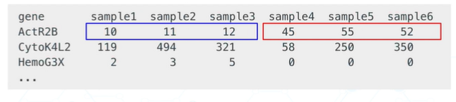

# RNA SEQ 

## 1. STATISTICS 

For any RNA-seq analysis, you would have to set up some statistical environment.

You can use Rstudio. But you can also run R on the command line (WHAT!!!)

```micromamba run -n stats Rscript src/setup/doctor.r``` (You can use micromamba run -n <env_nam> + command to run commad in a specific environemnt)

```micromamba run -n stats Rscript src/r/simulate_counts.r``` gives 2 .csv

```
 head *.csv -n 5
==> counts.csv <==
name,state,FDR,A1,A2,A3,B1,B2,B3
GENE-127,YES,0,7,7,7,33,18,20
GENE-155,YES,0,68,60,72,59,73,85
GENE-199,YES,0,24,16,30,5,4,3
GENE-333,YES,0,23,21,28,18,39,19

==> design.csv <==
sample,group
A1,A
A2,A
A3,A
B1,B
```

You can run R using the command of ```Rscript```

You can create environment with ```micromamba create -n rnaseq --file requirements.txt```. More on them later

### STATISTICS SURVIVAL GUIDE

```pairwise comparisons.``` are the most common in biology

## 2. INTRO TO RNA-SEQ

Quantification with sequencing? Using DNA fragments to measure STRENGTH of biological process -> There are hundreds of methods (CHIP-seq, RNA-seq etc)

2 ESSENTIAL ELEMNENTS

**WHERE DID THE DNA FRAGMENT COME FROM?**

**OCCUPANCY (location) OR INTENSITY (how much)**

RNA-seq specifically:
Gene -> RNA transcript -> Reverse transcriptase into DNA -> sequence -> align -> **count matrix** -> **differential expression.**

Q: Why does RNA-seq create many fragmented reads? 
-> Because introns are removed during rna processing so reads that cover 2 exons will be fragmented

Q: What about the statistics in RNA-seq?



From this image, you can get the gist of what RNA-seq is about, we are comparing and making comparisons basically which require statistics. Data normalization, biological repeats, making groups, data schotacism, etc! 

LOG FC (FOLD CHANGE) is basically comparison in power of 2s 

2 fold change = 2^2 = 4. 

-1 fold change = 2^-1 = 1/2


## 3 GENERATING THE COUNT MATRIX 

"Tools don't matter"
