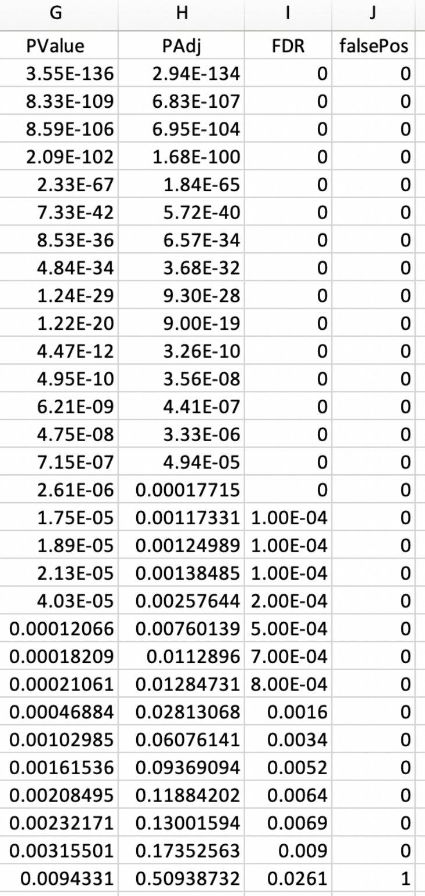
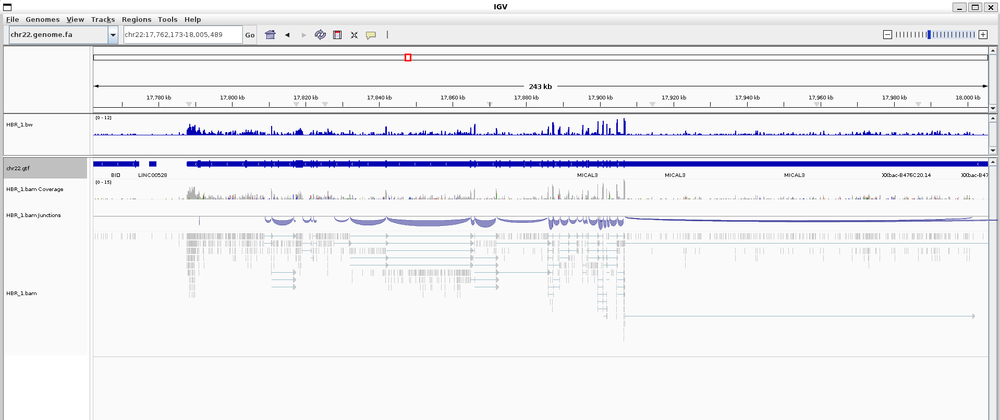
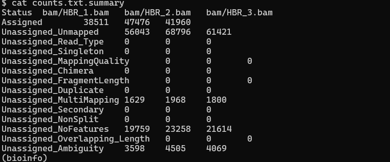
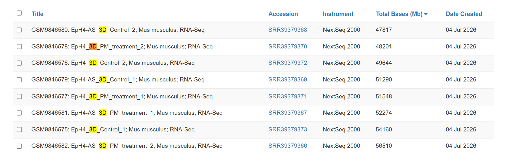
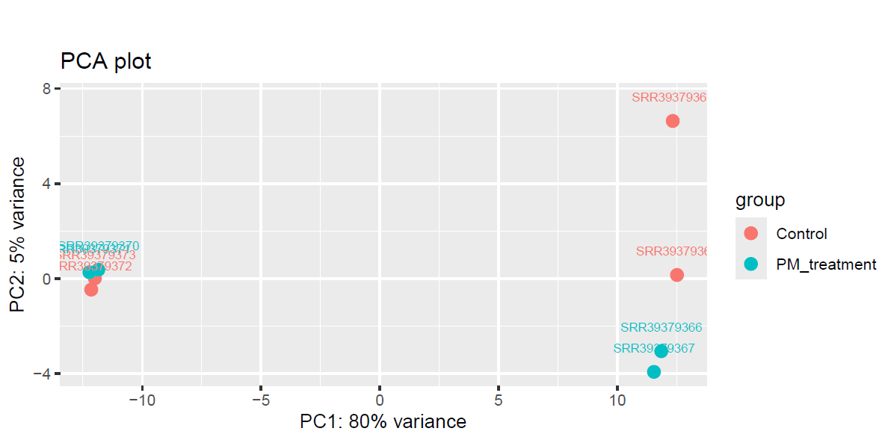
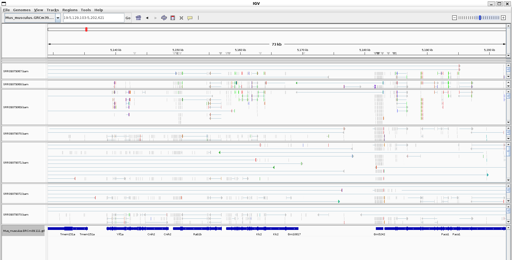

# RNA SEQ 

## 1. STATISTICS 

For any RNA-seq analysis, you would have to set up some statistical environment.

You can use Rstudio. But you can also run R on the command line (WHAT!!!)

```micromamba run -n stats Rscript src/setup/doctor.r``` (You can use micromamba run -n <env_nam> + command to run commad in a specific environemnt)

```micromamba run -n stats Rscript src/r/simulate_counts.r``` gives 2 .csv

```
 head *.csv -n 5
==> counts.csv <==
name,state,FDR,A1,A2,A3,B1,B2,B3
GENE-127,YES,0,7,7,7,33,18,20
GENE-155,YES,0,68,60,72,59,73,85
GENE-199,YES,0,24,16,30,5,4,3
GENE-333,YES,0,23,21,28,18,39,19

==> design.csv <==
sample,group
A1,A
A2,A
A3,A
B1,B
```

You can run R using the command of ```Rscript```

You can create environment with ```micromamba create -n rnaseq --file requirements.txt```. More on them later

### STATISTICS SURVIVAL GUIDE

```pairwise comparisons.``` are the most common in biology. They are significant when the variation across **CONDITIONS** is larger than between **REPLICATES**

```normalization``` is when you RESCALE experiments so that they are comparable. Say experiment-1 successfully pulled results from 2 cells whilst experiment-2 somehow got double the reagent and got 4 cels -> you would then normalize the data o that 2 experiment are comparable. 

```Effect size``` is the quantitative measure of the magnitude of a phenomenon.

```A p-value``` represents the probability for the observed effect size to be a product of random chance.

```An adjusted p-value```is a correction applied to a p-value to account for the repeated chances we gave it. (The adjusted p-value is roughly p * n (n the number of comparisons).

```The false discovery rate``` is also an adjustment of p-values where the order of p-values (smallest to largest) must be retained (The FDR reflects what percent of p-values (going down on the list) are false positives up to that point.)

Basically, a probability about probabilities



```Confidence intervals``` are a range. You cannot say anything about things outside the range, and middle values aren't really "more reliable"

```Meta analysis```. A lot of times data can actually not pass data significance threshold, however, if you combine them, they can still produce a "slight" significant effect

## 2. INTRO TO RNA-SEQ

Quantification with sequencing? Using DNA fragments to measure STRENGTH of biological process -> There are hundreds of methods (CHIP-seq, RNA-seq etc)

2 ESSENTIAL ELEMNENTS

**WHERE DID THE DNA FRAGMENT COME FROM?**

**OCCUPANCY (location) OR INTENSITY (how much)**

RNA-seq specifically:
Gene -> RNA transcript -> Reverse transcriptase into DNA -> sequence -> align -> **count matrix** -> **differential expression.**

Q: Why does RNA-seq create many fragmented reads? 
-> Because introns are removed during rna processing so reads that cover 2 exons will be fragmented

Q: What about the statistics in RNA-seq?


From this image, you can get the gist of what RNA-seq is about, we are comparing and making comparisons basically which require statistics. Data normalization, biological repeats, making groups, data schotacism, etc! 

LOG FC (FOLD CHANGE) is basically comparison in power of 2s 

2 fold change = 2^2 = 4. 

-1 fold change = 2^-1 = 1/2


## 3 GENERATING THE ____

"Tools don't matter"

They are like these 

```
gene       sample1  sample2  sample3  sample4  sample5  sample6
ActR2B       10       29       11       45       55       89
CytoK4L2     12       23       34       45       56       67
HemoG3X      13       24       35       46       57       68
```

What is gene expression? Counting reads aligning to a region

What is differential expression? Change in expression (basically)

What is a count file? A count file, (usually delimited by commas)

What is a design file? connects sample names to a group. Design files can also be called metadata, coldata, samplesheets. 

## QUANTIFICATION METHOD

There are two main methods for quantifying RNA-Seq data:

**Genome based quantification** -> gives context in te context of the genome
1. Reference is the GENOME itself 
2. If the species has splciing, the aligner is "splice-aware"
3. Requires GTF/GFF file

**Transcriptome based quantification** -> is useful for isoform and is more sensitive
1. Reference is a transcriptome file
2. All known transcripts are in the reference
3. Aligner is transcriptome aware and should be able to distrubute reads in multiple locations

BOTTOM LINE: USE BOTH 

```
Checklist
Create the design file that connects samples to groups=
Collect the reference files for both the genome and transcriptome
Index the genome and transcriptome
Align the reads to the genome and transcriptome
Quantify the gene expression
Run the differential expression analysis
```

## EXAMPLE WORKFLOWS 1: RNA-Seq with Hisat2
We will use this 
```
# Download the data
wget -nc  http://data.biostarhandbook.com/data/uhr-hbr.tar.gz

# Unpack the data
tar xzvf uhr-hbr.tar.gz
```

We have the design file
```
 cat design.csv
sample,group
A1,A
A2,A
A3,A
B1,B
B2,B
B3,B
```
It matches the columns to rows

As for our data
```
 ls *
counts.csv  design.csv  uhr-hbr.tar.gz

reads:
HBR_1_R1.fq  HBR_2_R1.fq  HBR_3_R1.fq  UHR_1_R1.fq  UHR_2_R1.fq  UHR_3_R1.fq

refs:
chr22.genome.fa  chr22.gtf  chr22.transcripts.fa
```
The reads are single reads with 3 replicates per condition

HBR (HUMAN BRAIN REFERECE)
UHR (UNIVERSAL HUMAN REFERENCE)

```Hisat2``` is an aligner that is splice aware 

We can index using the recipes given: ```make -f src/run/hisat2.mk index REF=refs/chr22.genome.fa```

We can align using the recipes as well: 
```# Run the alignment for a single sample
make -f src/run/hisat2.mk \
        REF=refs/chr22.genome.fa \
        R1=reads/HBR_1_R1.fq \
        BAM=bam/HBR_1.bam \
        run
 ```


We can use featureCounts to see what it looks like, we can input multiple files as well

```
featureCounts -a refs/chr22.gtf -o counts.txt \
              bam/HBR_1.bam \
              bam/HBR_2.bam \
              bam/HBR_3.bam \
              bam/UHR_1.bam \
              bam/UHR_2.bam \
              bam/UHR_3.bam
```


You can also flag STRAND specificity using ```-s``` 
```featureCounts -a refs/chr22.gtf -o counts.txt -s 2 bam/HBR_1.bam```

There are various .r scripts you can use to

1. ```Rscript src/r/format_featurecounts.r  -h``` - reformat
2. ```Rscript src/r/create_tx2gene.r -s > names.txt 
Rscript src/r/create_tx2gene.r -d hsapiens_gene_ensembl ``` -> connects various identifiers
3. ```Rscript src/r/format_featurecounts.r -c counts.txt -t tx2gene.csv -o counts.csv``` -> Add informative information


## ASSIGNMENT

## Progress

We will choose this project: PRJNA1483692 ```Comparative RNA-seq analysis of PM2.5 responses in wildtype and malignantly transformed mouse mammary epithelial cells cultured as spheroids (house mouse)```
 

And for this project we will download all 8 SRR using ```fasterq``` and limit download size to 5 million reads with the reference only being the 19th chromosome (the smallest autosome)

- [X] Set up stats environment
- [] Download reference genome + GTF

```
wget https://ftp.ensembl.org/pub/release-111/fasta/mus_musculus/dna/Mus_musculus.GRCm39.dna.chromosome.19.fa.gz
gunzip Mus_musculus.GRCm39.dna.chromosome.19.fa.gz

wget https://ftp.ensembl.org/pub/release-111/gtf/mus_musculus/Mus_musculus.GRCm39.111.gtf.gz
gunzip Mus_musculus.GRCm39.111.gtf.gz

mkdir ref

mv * ref

GTF=ref/Mus_musculus.GRCm39.111.gtf

FASTA=ref/Mus_musculus.GRCm39.dna.chromosome.19.fa

```

- [x] Build HISAT2 index
```make -f src/run/hisat2.mk index REF=ref/Mus_musculus.GRCm39.dna.chromosome.19.fa```
- [x] Select 6 SRR datasets (3 control, 3 treatment)
SRR39379368
SRR39379370
SRR39379372
SRR39379369
SRR39379371
SRR39379367
SRR39379373
SRR39379366

```cat srr_list.txt | parallel --eta --lb -j 4 make -f src/run/sra.mk run SRR={} DIR=fastq N=500000```

- [x] Write design file
```
sample,cell_line,treatment
SRR39379373,EpH4,Control
SRR39379372,EpH4,Control
SRR39379371,EpH4,PM_treatment
SRR39379370,EpH4,PM_treatment
SRR39379369,EpH4-AS,Control
SRR39379368,EpH4-AS,Control
SRR39379367,EpH4-AS,PM_treatment
SRR39379366,EpH4-AS,PM_treatment
```
- [x] Write Makefile (align → BAM → BigWig)
- [x] Run Makefile on all samples

```
cat srr_list.txt | parallel -j4 --joblog parallel.log \
  make -f rnaseq.mk all \
    IS_PAIRED=true NCPU=2 \
    REF=ref/Mus_musculus.GRCm39.dna.chromosome.19.fa \
    R1=fastq/{}_1.fastq R2=fastq/{}_2.fastq \
    BAM=bam/{}.bam ID={} SM={} LB={}
```

which gives 

```
$ cat srr_list.txt | parallel -j4 --joblog parallel.log \
  make -f rnaseq.mk all \
    IS_PAIRED=true NCPU=2 \
    REF=ref/Mus_musculus.GRCm39.dna.chromosome.19.fa \
    R1=fastq/{}_1.fastq R2=fastq/{}_2.fastq \
    BAM=bam/{}.bam ID={} SM={} LB={}
Aligning reads to reference genome ref/Mus_musculus.GRCm39.dna.chromosome.19.fa using HISAT2...
500000 reads; of these:
  500000 (100.00%) were paired; of these:
    485180 (97.04%) aligned concordantly 0 times
    14360 (2.87%) aligned concordantly exactly 1 time
    460 (0.09%) aligned concordantly >1 times
    ----
    485180 pairs aligned concordantly 0 times; of these:
      127 (0.03%) aligned discordantly 1 time
    ----
    485053 pairs aligned 0 times concordantly or discordantly; of these:
      970106 mates make up the pairs; of these:
        955410 (98.49%) aligned 0 times
        13787 (1.42%) aligned exactly 1 time
        909 (0.09%) aligned >1 times
4.46% overall alignment rate
Aligning reads to reference genome ref/Mus_musculus.GRCm39.dna.chromosome.19.fa using HISAT2...
500000 reads; of these:
  500000 (100.00%) were paired; of these:
    485102 (97.02%) aligned concordantly 0 times
    14439 (2.89%) aligned concordantly exactly 1 time
    459 (0.09%) aligned concordantly >1 times
    ----
    485102 pairs aligned concordantly 0 times; of these:
      128 (0.03%) aligned discordantly 1 time
    ----
    484974 pairs aligned 0 times concordantly or discordantly; of these:
      969948 mates make up the pairs; of these:
        955185 (98.48%) aligned 0 times
        13848 (1.43%) aligned exactly 1 time
        915 (0.09%) aligned >1 times
4.48% overall alignment rate
Aligning reads to reference genome ref/Mus_musculus.GRCm39.dna.chromosome.19.fa using HISAT2...
500000 reads; of these:
  500000 (100.00%) were paired; of these:
    447690 (89.54%) aligned concordantly 0 times
    48203 (9.64%) aligned concordantly exactly 1 time
    4107 (0.82%) aligned concordantly >1 times
    ----
    447690 pairs aligned concordantly 0 times; of these:
      203 (0.05%) aligned discordantly 1 time
    ----
    447487 pairs aligned 0 times concordantly or discordantly; of these:
      894974 mates make up the pairs; of these:
        881716 (98.52%) aligned 0 times
        11439 (1.28%) aligned exactly 1 time
        1819 (0.20%) aligned >1 times
11.83% overall alignment rate
Aligning reads to reference genome ref/Mus_musculus.GRCm39.dna.chromosome.19.fa using HISAT2...
500000 reads; of these:
  500000 (100.00%) were paired; of these:
    443245 (88.65%) aligned concordantly 0 times
    51277 (10.26%) aligned concordantly exactly 1 time
    5478 (1.10%) aligned concordantly >1 times
    ----
    443245 pairs aligned concordantly 0 times; of these:
      142 (0.03%) aligned discordantly 1 time
    ----
    443103 pairs aligned 0 times concordantly or discordantly; of these:
      886206 mates make up the pairs; of these:
        874808 (98.71%) aligned 0 times
        9876 (1.11%) aligned exactly 1 time
        1522 (0.17%) aligned >1 times
12.52% overall alignment rate
Aligning reads to reference genome ref/Mus_musculus.GRCm39.dna.chromosome.19.fa using HISAT2...
500000 reads; of these:
  500000 (100.00%) were paired; of these:
    484213 (96.84%) aligned concordantly 0 times
    15282 (3.06%) aligned concordantly exactly 1 time
    505 (0.10%) aligned concordantly >1 times
    ----
    484213 pairs aligned concordantly 0 times; of these:
      133 (0.03%) aligned discordantly 1 time
    ----
    484080 pairs aligned 0 times concordantly or discordantly; of these:
      968160 mates make up the pairs; of these:
        953406 (98.48%) aligned 0 times
        13859 (1.43%) aligned exactly 1 time
        895 (0.09%) aligned >1 times
4.66% overall alignment rate
Aligning reads to reference genome ref/Mus_musculus.GRCm39.dna.chromosome.19.fa using HISAT2...
500000 reads; of these:
  500000 (100.00%) were paired; of these:
    445640 (89.13%) aligned concordantly 0 times
    49553 (9.91%) aligned concordantly exactly 1 time
    4807 (0.96%) aligned concordantly >1 times
    ----
    445640 pairs aligned concordantly 0 times; of these:
      147 (0.03%) aligned discordantly 1 time
    ----
    445493 pairs aligned 0 times concordantly or discordantly; of these:
      890986 mates make up the pairs; of these:
        879129 (98.67%) aligned 0 times
        10186 (1.14%) aligned exactly 1 time
        1671 (0.19%) aligned >1 times
12.09% overall alignment rate
Aligning reads to reference genome ref/Mus_musculus.GRCm39.dna.chromosome.19.fa using HISAT2...
500000 reads; of these:
  500000 (100.00%) were paired; of these:
    484394 (96.88%) aligned concordantly 0 times
    15099 (3.02%) aligned concordantly exactly 1 time
    507 (0.10%) aligned concordantly >1 times
    ----
    484394 pairs aligned concordantly 0 times; of these:
      163 (0.03%) aligned discordantly 1 time
    ----
    484231 pairs aligned 0 times concordantly or discordantly; of these:
      968462 mates make up the pairs; of these:
        953189 (98.42%) aligned 0 times
        14342 (1.48%) aligned exactly 1 time
        931 (0.10%) aligned >1 times
4.68% overall alignment rate
Aligning reads to reference genome ref/Mus_musculus.GRCm39.dna.chromosome.19.fa using HISAT2...
500000 reads; of these:
  500000 (100.00%) were paired; of these:
    444352 (88.87%) aligned concordantly 0 times
    50260 (10.05%) aligned concordantly exactly 1 time
    5388 (1.08%) aligned concordantly >1 times
    ----
    444352 pairs aligned concordantly 0 times; of these:
      169 (0.04%) aligned discordantly 1 time
    ----
    444183 pairs aligned 0 times concordantly or discordantly; of these:
      888366 mates make up the pairs; of these:
        876187 (98.63%) aligned 0 times
        10542 (1.19%) aligned exactly 1 time
        1637 (0.18%) aligned >1 times
12.38% overall alignment rate
Generating wiggle files from alignment bam/SRR39379369.bam...
Generating wiggle files from alignment bam/SRR39379368.bam...
Generating wiggle files from alignment bam/SRR39379372.bam...
Generating wiggle files from alignment bam/SRR39379370.bam...
Generating wiggle files from alignment bam/SRR39379367.bam...
Generating wiggle files from alignment bam/SRR39379371.bam...
Generating wiggle files from alignment bam/SRR39379366.bam...
Generating wiggle files from alignment bam/SRR39379373.bam...
```

**Q: WHY IS THE ALIGNMENT RATE SO LOW**
**A: BECAUSE WE ONLY USED CHROMOSOME 19 (2% out of the entire genome) AS A REFERENCE SO IT MAKES SENSE**

cat the content of srr_list and then run the parallel such that it runs the make files with our parameters. (This requires standardized naming so that the brackets filling wouldn't glitch out)

- [x] Run featureCounts to generate count matrix
```
mkdir -p res
micromamba run -n bioinfo featureCounts \
    -p --countReadPairs \
    -a ref/Mus_musculus.GRCm39.111.gtf \
    -o res/counts-hisat.txt \
    -T 4 \
    bam/SRR39379366.bam bam/SRR39379367.bam bam/SRR39379368.bam bam/SRR39379369.bam \
    bam/SRR39379370.bam bam/SRR39379371.bam bam/SRR39379372.bam bam/SRR39379373.bam
```
```
micromamba run -n bioinfo featureCounts \
    -p --countReadPairs \
    -a ref/Mus_musculus.GRCm39.111.gtf \
    -o res/counts-hisat.txt \
    -T 4 \
    bam/SRR39379366.bam bam/SRR39379367.bam bam/SRR39379368.bam bam/SRR39379369.bam \
    bam/SRR39379370.bam bam/SRR39379371.bam bam/SRR39379372.bam bam/SRR39379373.bam

        ==========     _____ _    _ ____  _____  ______          _____
        =====         / ____| |  | |  _ \|  __ \|  ____|   /\   |  __ \
          =====      | (___ | |  | | |_) | |__) | |__     /  \  | |  | |
            ====      \___ \| |  | |  _ <|  _  /|  __|   / /\ \ | |  | |
              ====    ____) | |__| | |_) | | \ \| |____ / ____ \| |__| |
        ==========   |_____/ \____/|____/|_|  \_\______/_/    \_\_____/
          v2.1.1

//========================== featureCounts setting ===========================\\
||                                                                            ||
||             Input files : 8 BAM files                                      ||
||                                                                            ||
||                           SRR39379366.bam                                  ||
||                           SRR39379367.bam                                  ||
||                           SRR39379368.bam                                  ||
||                           SRR39379369.bam                                  ||
||                           SRR39379370.bam                                  ||
||                           SRR39379371.bam                                  ||
||                           SRR39379372.bam                                  ||
||                           SRR39379373.bam                                  ||
||                                                                            ||
||             Output file : counts-hisat.txt                                 ||
||                 Summary : counts-hisat.txt.summary                         ||
||              Paired-end : yes                                              ||
||        Count read pairs : yes                                              ||
||              Annotation : Mus_musculus.GRCm39.111.gtf (GTF)                ||
||      Dir for temp files : res                                              ||
||                                                                            ||
||                 Threads : 4                                                ||
||                   Level : meta-feature level                               ||
||      Multimapping reads : not counted                                      ||
|| Multi-overlapping reads : not counted                                      ||
||   Min overlapping bases : 1                                                ||
||                                                                            ||
\\============================================================================//

//================================= Running ==================================\\
||                                                                            ||
|| Load annotation file Mus_musculus.GRCm39.111.gtf ...                       ||
||    Features : 863301                                                       ||
||    Meta-features : 57180                                                   ||
||    Chromosomes/contigs : 38                                                ||
||                                                                            ||
|| Process BAM file SRR39379366.bam...                                        ||
||    Paired-end reads are included.                                          ||
||    Total alignments : 502204                                               ||
||    Successfully assigned alignments : 23471 (4.7%)                         ||
||    Running time : 0.01 minutes                                             ||
||                                                                            ||
|| Process BAM file SRR39379367.bam...                                        ||
||    Paired-end reads are included.                                          ||
||    Total alignments : 502142                                               ||
||    Successfully assigned alignments : 23092 (4.6%)                         ||
||    Running time : 0.01 minutes                                             ||
||                                                                            ||
|| Process BAM file SRR39379368.bam...                                        ||
||    Paired-end reads are included.                                          ||
||    Total alignments : 502095                                               ||
||    Successfully assigned alignments : 22635 (4.5%)                         ||
||    Running time : 0.02 minutes                                             ||
||                                                                            ||
|| Process BAM file SRR39379369.bam...                                        ||
||    Paired-end reads are included.                                          ||
||    Total alignments : 502107                                               ||
||    Successfully assigned alignments : 22157 (4.4%)                         ||
||    Running time : 0.06 minutes                                             ||
||                                                                            ||
|| Process BAM file SRR39379370.bam...                                        ||
||    Paired-end reads are included.                                          ||
||    Total alignments : 514197                                               ||
||    Successfully assigned alignments : 42865 (8.3%)                         ||
||    Running time : 0.02 minutes                                             ||
||                                                                            ||
|| Process BAM file SRR39379371.bam...                                        ||
||    Paired-end reads are included.                                          ||
||    Total alignments : 515548                                               ||
||    Successfully assigned alignments : 41874 (8.1%)                         ||
||    Running time : 0.02 minutes                                             ||
||                                                                            ||
|| Process BAM file SRR39379372.bam...                                        ||
||    Paired-end reads are included.                                          ||
||    Total alignments : 517193                                               ||
||    Successfully assigned alignments : 42688 (8.3%)                         ||
||    Running time : 0.02 minutes                                             ||
||                                                                            ||
|| Process BAM file SRR39379373.bam...                                        ||
||    Paired-end reads are included.                                          ||
||    Total alignments : 517446                                               ||
||    Successfully assigned alignments : 42888 (8.3%)                         ||
||    Running time : 0.01 minutes                                             ||
||                                                                            ||
|| Write the final count table.                                               ||
|| Write the read assignment summary.                                         ||
||                                                                            ||
|| Summary of counting results can be found in file "res/counts-hisat.txt.su  ||
|| mmary"                                                                     ||
||                                                                            ||
\\============================================================================//
```

which gives 
```
cat res/counts-hisat.txt.summary
Status  bam/SRR39379366.bam     bam/SRR39379367.bam     bam/SRR39379368.bam     bam/SRR39379369.bam     bam/SRR39379370.bam     bam/SRR39379371.bam     bam/SRR39379372.bam     bam/SRR39379373.bam
Assigned        23471   23092   22635   22157   42865   41874   42688   42888
Unassigned_Unmapped     469559  469946  470862  470999  435713  435041  433010  433318
Unassigned_Read_Type    0       0       0       0       0       0       0       0
Unassigned_Singleton    0       0       0       0       0       0       0       0
Unassigned_MappingQuality       0       0       0       0       0       0       0       0
Unassigned_Chimera      0       0       0       0       0       0       0       0
Unassigned_FragmentLength       0       0       0       0       0       0       0       0
Unassigned_Duplicate    0       0       0       0       0       0       0       0
Unassigned_MultiMapping 3618    3521    3449    3459    20020   21921   24117   24375
Unassigned_Secondary    0       0       0       0       0       0       0       0
Unassigned_NonSplit     0       0       0       0       0       0       0       0
Unassigned_NoFeatures   4485    4484    4069    4400    13717   14886   15714   15075
Unassigned_Overlapping_Length   0       0       0       0       0       0       0       0
Unassigned_Ambiguity    1071    1099    1080    1092    1882    1826    1664    1790
(bioinfo)
```

We can generate heatmaps and plots using the recipes given 
```
micromamba run -n stats Rscript src/r/deseq2.r \
  -d design.csv -c counts.csv -o deseq2.csv -f treatment -s sample

micromamba run -n stats Rscript src/r/plot_pca.r \
  -d design.csv -c counts.csv -o pca.pdf -f treatment -s sample

micromamba run -n stats Rscript src/r/plot_heatmap.r \
  -d design.csv -c deseq2.csv -o heatmap.pdf -f treatment -s sample

```
-> Found nothing significant


Not very strange since we are only mapping to chromosome 19 which is a lottery ticket if we actually some different gene expression. Let's try the entire mouse genome this time 


- [x] Take IGV screenshots (control vs treatment)

Too much noise and can't really differentiate between the 2 groups. 
- [x] Write README (dataset, pipeline, how to reproduce)
- [x] Discuss count matrix rows + compare to IGV tracks