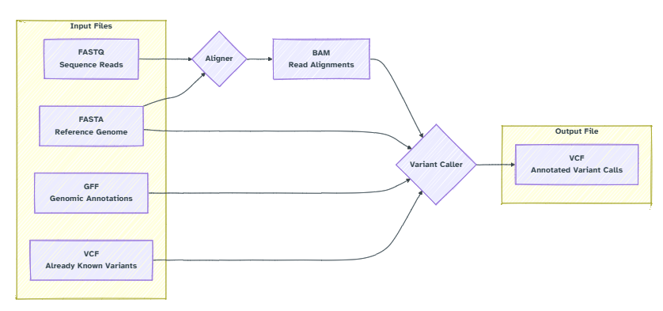
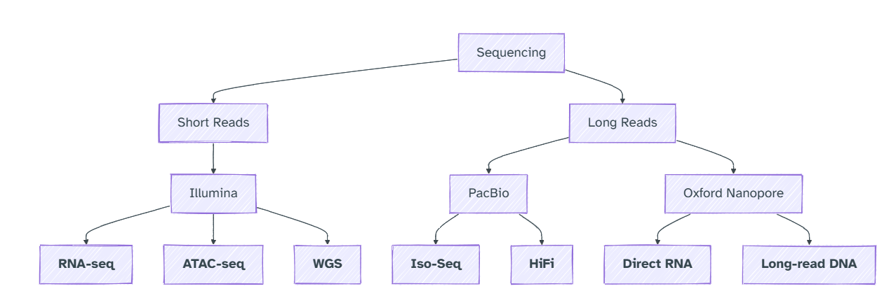

# DATA AND WORKFLOW REPORT 2

## 1. BIOINFORMATICS DATA TYPE




### As a summary 
Sequence information (ATCGATAC) stored in file types of ```FASTA```, ````FASTQ```

What about ```FASTA``` that is so special?

FASTA files always start with this ```>```

for example:

``` 
>alpha more info here
ACGTATTAATTAGGAGA
>beta other text here
GATACGGATGA

```

A real FASTA file might look like this (from Biostar)
```
>NC_045512.2 Severe acute respiratory syndrome coronavirus 2 isolate
ATTAAAGGTTTATACCTTCCCAGGTAACAAACCAACCAACTTTCGATCTCTTGTAGATCTGTTCTCTAAA
CGAACTTTAAAATCTGTGTGGCTGTCACTCGGCTGCATGCTTAGTGCACTCACGCAGTATAATTAATAAC
TAATTACTGTCGTTGACAGGACACGAGTAACTCGTCTATCTTCTGCAGGCTGCTTACGGTTTCGTCCGTG
TTGCAGCCGATCATCAGCACATCTAGGTTTCGTCCGGGTGTGACCGAAAGGTAAGATGGAGAGCCTTGTC
```

What is the sequence ID? -> ```NC_045512.2```

What is its description -> The thing that follows

What about soft vs hardmasking?

-> Masking (or hard masking) completely replaces data (e.g., repeating DNA sequences) with placeholders like 'N'. Making sure that tools ignore them
Example: 
```
>example
ATGCNNNNNNATGC
```

-> Soft masking marks data as lowercase instead of uppercase, preserving the underlying sequence information

Example: 

```
>example
ATGCtggcatcATGC
```

What about the FASTQ files? 

They store ```reads``` 

Sound familar? Those are the products of a sequencing run! 

Why does my professor always tell me to check if my sequencing run is a multiple of 4?

Because each entry in a ```FASTQ``` is 4 lines! So if it's off, there is some bad reads in your file. 

```
@some_id // Header
ACGTACGTACGTACGT // Sequence
+some_id // Header (again)
BBBBBBBBBBBBBBBB // Quality
```

Some actual read

```
@HWI-D00653:77:C6EBMANXX:7:1101:1429:1868
CGCCCGGTTAGCGATCAACAATGGACTGCATCATTTCATGCAGCTCGAGCCGATTGTAAGTCGCCCGTAACGCG
+HWI-D00653:77:C6EBMANXX:7:1101:1429:1868
#:=AA==EGG>FFCEFGDE1EFF@FEFFBBFGGGGGGDFGGG>@FGEGBGGGGGBGGGGGGGGFDFGGGGGBBG
```
Ugly right? Here are some Illumina specific ID


What about the quality of a FASTQ?

-> It's encoded in ASCII characters and the more it looks like swearing, the more it is probably bad. The data is swearing at you. 

```
!"#$%&'()*+,-./0123456789:;<=>?@ABCDEFGHI  (FASTQ code)
|    |    |    |    |    |    |    |    | 
0    5   10   15   20   25   30   35   40  (error rate 10^(-N/10))
|    |    |    |    |    |    |    |    |
yuck..............meh................best  (interpretation)
```

Quick FASTQ check: 

```seqkit stats file.fastq ```

Genomic intervals (basically coordinates) stored as files called ````BED```, ```GFF```, ```VCF```, ```BAM```

```BAM``` = Binary map

```VCF``` = varaints

What about these ```BAM``` and ```SAM``` files?

```BAM``` = binary and ```SAM``` = sequence (```SAM``` is humanreadable but not really compact) Both of these are maps

How do I work with SAM or BAM files? Here is a biostar pipeline
```FASTA (reference) + FASTQ (reads) + aligner -> SAM (alignment) + Converter -> BAM (Yay!)```

How do I keep track of the ```SAM``` file complicated headers?


What about Wiggle files or VCF? More on them later!

There are generic formats that we could call encylopedic formats such as ```GENBANK``` and ```EMBL```.
These are like storage systems.

Coordinate systems may different across data formats:

```GFF``` formats start counting at ```1```. The index of the second base is ```2```.

```BED``` formats start counting at ```0```. The index of the second base is ```1```.

Directionality: Most coordinate representations will display positions on the forward (positive) strand, even when describing features on the reverse (negative) strand.

For example, an interval ```[100, 200]``` may be used to describe a transcript on the reverse strand. The start column will contain ```100```.

In reality, the functional start coordinate is ```200``` as the feature is transcribed from the opposite direction.

Format naming
Different formats may have the same naming:

```MAF```: Multiple Alignment Format represents alignments of multiple sequences.
```MAF```: Mutation Annotation Format represents variants.



What about these? According Biostar

**RNA-seq**: A technique for analyzing the **transcriptome** by sequencing **RNA** molecules, providing insights into gene expression levels and alternative splicing.

**ATAC-seq**: Assay for Transposase-Accessible Chromatin sequencing, used to study **chromatin accessibility** and identify open regions of DNA.

**WGS**: **Whole Genome Sequencing**, a method for determining the complete DNA sequence of an organism's genome.

**Iso-Seq**: A PacBio sequencing method for full-length transcript sequencing, enabling the identification of **alternative splicing** and gene isoforms.

**HiFi**: **High-Fidelity** sequencing, a PacBio technology that produces long, **highly accurate** reads for improved genome assembly and variant detection.

**Direct RNA**: A Nanopore sequencing technique that sequences **native RNA molecules without conversion to cDNA**, preserving RNA modifications.

**Long-read DNA**: Nanopore sequencing method for generating **long DNA reads**, useful for resolving complex genomic regions and structural variants.

How do I choose what to use?

Well, it depends on your research!

What kind of nucleic acid gets sequenced? 


## 2. WHAT TO DO TO ANALYSE?

Be very careful and pay a lot of attention to details. A lot of the time, errors can arrive just because the data files have different ways of saying the same thing -> incompatiblity. 

## 3. MISC

