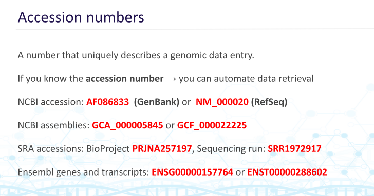
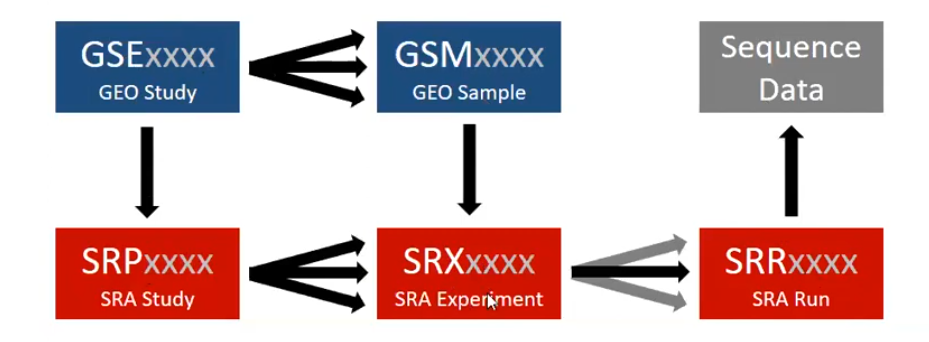

# GENOMIC DATA SOURCE 

## HOW DO I GET DATA

Step 1: Go to the Internet

Step 2: Download the data

Is there one reliable source? No. So which data to choose? Depends on your research. 


## HOW IS DATA USUALLY IDED

Via accession numbers like these 



NCBI GCA vs GCF, what to choose? 
usually GCF
what are SRA. Short read datahase. More on it later.

## OLD VS NEW DATA, WHAT TO CHOOSE?

Depends, old genome has better coordinates that match typical data. And it also has better already done research
However, if new data does not match old data. Old data = bad.

## HOW CAN I ACCESS DATA FROM JUST THE COMMAND LINE

## MISC: HOW TO AUTOMATE IGV 

Here are some template from the biostar handbook

```
# Home directory
DIR=/Users/ialbert/work

# Create a new session
echo new

# Load the genome.
echo genome ${DIR}/refs/AF086833.fa

# Load the alignment file.
echo load ${DIR}/bam/SRR1972739.bam

# Load the annotation file.
echo load ${DIR}/refs/AF086833.gff

# Expand the view.
echo expand

# Go to the feature
echo goto VP30
```

and 
```
# Feature name
LOC=VP30

# Screenshot directory
PNG=/Users/ialbert/work/png/

# Make a snapshot directory
mkdir -p ${PNG}

# Set the snapshot directory
echo snapshotDirectory ${PNG}

# Go to the feature
echo goto VP30

# Take a screenshot
echo snapshot ${LOC}.png
```

## SIDENOTE 1: THERE ARE ACTUALLY SOME AUTHORITY ON DATABASE

There is the  INSDC: International Nucleotide Sequence Database Collaboration Which includes
NCBI, EMBL, DDBJ

Type of data they endorse
```Genbank for raw annotated DNA```
```SRA: short read archive for sequencing projects```
```Uniprot: the authority in proteins basically```

for some other database of model organisms,refer when needed

```
UCSC Genome Browser invented the graphical browser visualization of genomes. Today it offers comprehensive comparative genomics data across vertebrate genomes.
FlyBase is the database of Drosophila (fruit fly) genes and genomes.
WormBase is the primary resource for nematode biology.
SGD: Saccharomyces Genome Database provides comprehensive integrated biological information for the budding yeast Saccharomyces cerevisiae along with search and analysis tools to explore these data.
RNA-Central is a meta-database that integrates information from several other resources.
TAIR The Arabidopsis Information Resource is the primary resource for genetic and molecular data about Arabidopsis thaliana, a model higher plant.
EcoCyc (Encyclopedia of E. coli Genes and Metabolic Pathways) is a scientific database for the bacterium Escherichia coli K-12 MG1655.
```

## SIDENOTE 2: James Watson is a jerk?

## SIDENOTE 3: SO YOU WANT DATA?

There is a “cottage industry” of tools all trying to solve the same problem, how to get data in a reproducible way.
```efetch, esearch: https://www.ncbi.nlm.nih.gov/books/NBK179288/```
```bio: https://www.bioinfo.help```
```gget: https://github.com/pachterlab/gget```
```ffq: https://github.com/pachterlab/ffq```
```refgenie: http://refgenie.databio.org/en/latest/```
```ggd: https://gogetdata.github.io/index.html```
```ncbi-genome-download: https://github.com/kblin/ncbi-genome-download```
```sra-tools: https://github.com/ncbi/sra-tools```
```bioconductor: https://bioconductor.org```

## SIDENOTE 4: NAVIGATING THROUGH DATABASE


```SR archive```, enter SRX, it's complicated like that
You can also use a different database, like ```ENA``` ```EBI```?
```SRA EXPLORER``` is a lovely website for bulk download
```fastq dump``` is a tool for bulk download but it is ineffcient since they are uncompressed
```SRA Run Selector``` is a GEO endorsed tool to download individual runs
```SRA Run downloader``` is another SRA downloader by S-Andrews
Please be careful about read files because they usually need 2 files. one forward one backward. Sometimes research can have both of them in 1 file. 
UCSC have a pretty good tool too that can download query, use ```micromamba install mysql```

the ```datasets``` command can be used for navigating through NCBI database
```datasets summary```
```datasets download``` can be used

an example of datasets summary if you have the accession number

Using ```$ datasets summary genome accession GCF_000006945 | jq```

```
{
  "reports": [
    {
      "accession": "GCF_000006945.2",
      "annotation_info": {
        "name": "Annotation submitted by NCBI RefSeq",
        "provider": "NCBI RefSeq",
        "release_date": "2022-09-08",
        "stats": {
          "gene_counts": {
            "non_coding": 118,
            "other": 6,
            "protein_coding": 4554,
            "pseudogene": 39,
            "total": 4717
          }
        }
      },
      "assembly_info": {
        "assembly_level": "Complete Genome",
        "assembly_name": "ASM694v2",
        "assembly_status": "current",
        "assembly_type": "haploid",
        "bioproject_accession": "PRJNA241",
        "bioproject_lineage": [
          {
            "bioprojects": [
              {
                "accession": "PRJNA241",
                "title": "Major laboratory strain of Salmonella typhimurium"
              }
            ]
          }
        ],
        "biosample": {
          "accession": "SAMN02604315",
          "attributes": [
            {
              "name": "strain",
              "value": "LT2"
            },
            {
              "name": "isolate",
              "value": "LT2; SGSC 1412; ATCC 700720"
            },
            {
              "name": "isolation_source",
              "value": "missing"
            },
            {
              "name": "serovar",
              "value": "Typhimurium"
            },
            {
              "name": "sub_species",
              "value": "enterica"
            },
            {
              "name": "culture_collection",
              "value": "ATCC:700720"
            },
            {
              "name": "type-material",
              "value": "type strain of Salmonella enterica"
            }
          ],
          "bioprojects": [
            {
              "accession": "PRJNA241"
            }
          ],
          "description": {
            "organism": {
              "organism_name": "Salmonella enterica subsp. enterica serovar Typhimurium str. LT2",
              "tax_id": 99287
            },
            "title": "Sample from Salmonella enterica subsp. enterica serovar Typhimurium str. LT2"
          },
          "isolate": "LT2; SGSC 1412; ATCC 700720",
          "isolation_source": "missing",
          "last_updated": "2019-05-23T14:41:47.531",
          "models": [
            "Generic"
          ],
          "owner": {
            "name": "NCBI"
          },
          "package": "Generic.1.0",
          "publication_date": "2014-01-30T00:00:00.000",
          "sample_ids": [
            {
              "label": "Sample name",
              "value": "AE006468"
            }
          ],
          "serovar": "Typhimurium",
          "status": {
            "status": "live",
            "when": "2014-01-30T15:13:24.360"
          },
          "strain": "LT2",
          "sub_species": "enterica",
          "submission_date": "2014-01-30T15:13:24.360"
        },
        "comments": "Supported by NIH grant 5U 01 AI43283\n\nCoding sequences below are predicted from manually evaluated computer analysis, using similarity information and the programs; GLIMMER; http://www.tigr.org/softlab/glimmer/glimmer.html and GeneMark; http://opal.biology.gatech.edu/GeneMark/\n\nEC numbers were kindly provided by Junko Yabuzaki and the Kyoto Encyclopedia of Genes and Genomes; http://www.genome.ad.jp/kegg/, and Pedro Romero and Peter Karp at EcoCyc; http://ecocyc.PangeaSystems.com/ecocyc/\n\nThe analyses of ribosome binding sites and promoter binding sites were kindly provided by Heladia Salgado, Julio Collado-Vides and ReguonDB;\nhttp://kinich.cifn.unam.mx:8850/db/regulondb_intro.frameset\n\nThis sequence was finished as follows unless otherwise noted: all regions were double stranded, sequenced with an alternate chemistries or covered by high quality data (i.e., phred quality >= 30); an attempt was made to resolve all sequencing problems, such as compressions and repeats; all regions were covered by sequence from more than one m13 subclone.",
        "paired_assembly": {
          "accession": "GCA_000006945.2",
          "annotation_name": "Annotation submitted by Washington University Genome Sequencing Center",
          "status": "current"
        },
        "refseq_category": "reference genome",
        "release_date": "2016-01-13",
        "submitter": "Washington University Genome Sequencing Center"
      },
      "assembly_stats": {
        "atgc_count": "4951383",
        "contig_l50": 1,
        "contig_n50": 4857450,
        "gc_count": "2586547",
        "gc_percent": 52,
        "number_of_component_sequences": 2,
        "number_of_contigs": 2,
        "number_of_scaffolds": 2,
        "scaffold_l50": 1,
        "scaffold_n50": 4857450,
        "total_number_of_chromosomes": 2,
        "total_sequence_length": "4951383",
        "total_ungapped_length": "4951383"
      },
      "average_nucleotide_identity": {
        "best_ani_match": {
          "ani": 99.99,
          "assembly": "GCA_001558355.2",
          "assembly_coverage": 100,
          "category": "type",
          "organism_name": "Salmonella enterica",
          "type_assembly_coverage": 100
        },
        "category": "type",
        "comment": "na",
        "match_status": "species_match",
        "submitted_ani_match": {
          "ani": 99.99,
          "assembly": "GCA_001558355.2",
          "assembly_coverage": 100,
          "category": "type",
          "organism_name": "Salmonella enterica",
          "type_assembly_coverage": 100
        },
        "submitted_organism": "Salmonella enterica subsp. enterica serovar Typhimurium str. LT2",
        "submitted_species": "Salmonella enterica",
        "taxonomy_check_status": "OK"
      },
      "checkm_info": {
        "checkm_marker_set": "Salmonella enterica",
        "checkm_marker_set_rank": "species",
        "checkm_species_tax_id": 28901,
        "checkm_version": "v1.2.4",
        "completeness": 99.71,
        "completeness_percentile": 88.1681,
        "contamination": 0.44
      },
      "current_accession": "GCF_000006945.2",
      "organism": {
        "infraspecific_names": {
          "strain": "LT2"
        },
        "organism_name": "Salmonella enterica subsp. enterica serovar Typhimurium str. LT2",
        "tax_id": 99287
      },
      "paired_accession": "GCA_000006945.2",
      "source_database": "SOURCE_DATABASE_REFSEQ",
      "type_material": {
        "type_display_text": "assembly from type material",
        "type_label": "TYPE_MATERIAL"
      }
    }
  ],
  "total_count": 1
}
(bioinfo)
```
Do you know scream (1996)?. It is a horror movie about horror movies. It is very "meta" or so they called. 
This data is called metadata. Because it is data about data. 

To download the actual data you would use

```datasets download```
you can also include other files using the ```include``` option: ``` --include genome,gff3,gtf ```

data:

```
`-- data
    |-- GCF_000006945.2
    |   |-- GCF_000006945.2_ASM694v2_genomic.fna
    |   |-- genomic.gff
    |   `-- genomic.gtf
    |-- assembly_data_report.jsonl
    `-- dataset_catalog.json
```

## DO YOU HATE ANNOYANCE?

REMEMBER, PLEASE use the tag ```-n``` to skip files existing so that you don't lose any data. Like when you unzip a file. 

## DO YOU HATE WASTING TIME?

REMEMBER, While using datasets, you can ask AI to assit in writing the command line to download whatever you needed. NOT EVERYTHING

```# Extract just the accession number and the strain.
cat ecoli.json | dataformat tsv genome --fields accession,organism-infraspecific-strain > acc.txt
```

## DO YOU WANT TO AUTOMATE EVERYTHING?

```Entrez``` baby

Since the command line has some weird hatred for the ampersand, we have to denote it different

```curl -s https://eutils.ncbi.nlm.nih.gov/entrez/eutils/efetch.fcgi?id=AF086833.2\&db=nuccore\&rettype=fasta | head```
or 
```curl -s 'https://eutils.ncbi.nlm.nih.gov/entrez/eutils/efetch.fcgi?id=AF086833.2&db=nuccore&rettype=fasta' | head```

edirect can be more, well, direct

```efetch ```

```
# Accession number AF086833 in Genbank format.
efetch -db nuccore -format gb -id AF086833 > AF086833.gb

# Accession number AF086833 in Fasta format.
efetch -db nuccore -format fasta -id AF086833 > AF086833.fa

# efetch can take additional parameters and select a section of the sequence.
efetch -db nuccore -format fasta -id AF086833 -seq_start 1 -seq_stop 3

# or even strands
efetch -db nuccore -format fasta -id AF086833 -seq_start 1 -seq_stop 5 -strand 1
efetch -db nuccore -format fasta -id AF086833 -seq_start 1 -seq_stop 5 -strand 2
```

## EFETCH, EASEARCH?

```esearch``` = searching
```efetch``` = fetching

try using the help option often

we are finally done 