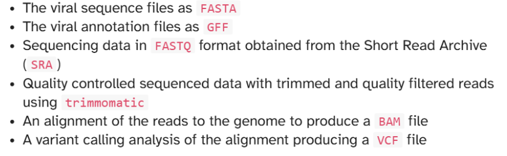

# REPORT 1

# 1. Basic information about GFF Files.

GFF stands for Generic Feature Format. GFF files are <b nine-column b>, <b tab-delimited b>, plain text files used to represent coordinates in one dimension (along an axis). See the GFF3 specification for more details. The columns are:

<code> SEQID <code> the name of the sequence
<code> SOURCE <code> the source (origin) of the feature
<code> FEATURE <code> the type of feature
<code> START <code>the start position of the feature
<code> END <code> the end position of the feature
<code> SCORE <code> the score of the feature
<code> STRAND <code> the strand of the feature
<code> PHASE <code> the phase of the feature (0, 1, or 2)
<code> ATTRIBUTES <code> the attributes of the feature

A general GFF file may look like this:

<code> bio fetch NC_045512 -format gff | head -5 <code>

<code>
NC_045512.2  RefSeq  region          1      29903  .  +  .  ID=NC_045512.2:1..29903;Dbxref=taxon:2697049;collection-date=Dec-2019;country=China;gb-acronym=SARS-CoV-2;gbkey=Src;genome=genomic;isolate=Wuhan-Hu-1;mol_type=genomic  RNA;nat-host=Homo  sapiens;old-name=Wuhan  seafood  market     pneumonia                       virus
NC_045512.2  RefSeq  five_prime_UTR  1      265    .  +  .  ID=id-NC_045512.2:1..265;gbkey=5'UTR
NC_045512.2  RefSeq  gene            266    21555  .  +  .  ID=gene-GU280_gp01;Dbxref=GeneID:43740578;Name=ORF1ab;gbkey=Gene;gene=ORF1ab;gene_biotype=protein_coding;locus_tag=GU280_gp01
NC_045512.2  RefSeq  CDS             266    13468  .  +  0  ID=cds-YP_009724389.1;Parent=gene-GU280_gp01;Dbxref=Genbank:YP_009724389.1,GeneID:43740578;Name=YP_009724389.1;Note=pp1ab%3B                                            translated         by                      -1       ribosomal  frameshift;exception=ribosomal  slippage;gbkey=CDS;gene=ORF1ab;locus_tag=GU280_gp01;product=ORF1ab  polyprotein;protein_id=YP_009724389.1
NC_045512.2  RefSeq  CDS             13468  21555  .  +  0  ID=cds-YP_00 <code>

The GTF format is a variant of GFF where the attributes column is formatted differently.:In addition, the GTF format requires that the gene_id and transcript_id attributes are present for every feature

# 2. Analysis of GFF file of choice
*Prerequisite: Activate environment and check health.

<code>
micromamba activate bioinfo
<code>
You can run <code> doctor.py <code> to be sure. 

<b Tell us a bit about the organism. b> (In this case we choose Cottoperca_gobio)
- Species of fish commonly known as the channel bull blenny.

<b How many sequence regions (chromosomes) does the file contain? Does that match with the expectation for this organism? b>
Using this to get the animal of our choice (Cottoperca_gobio)

<code> wget https://ftp.ensembl.org/pub/current_gff3/cottoperca_gobio/Cottoperca_gobio.fCotGob3.1.115.chr.gff3.gz 
gunzip  Cottoperca_gobio.fCotGob3.1.115.chr.gff3.gz <code>

And using this:
<code> $ grep -v "^#" Cottoperca_gobio.fCotGob3.1.115.chr.gff3 | cut -f1 | sort | uniq -c
  80461 1
  55654 10
  55424 11
  69015 12
  67790 13
  74540 14
  69720 15
  64752 16
  81218 17
  38696 18
  65567 19
  34483 2
  45049 20
  65379 21
  65085 22
  43423 23
  57349 24
  72422 3
  77848 4
  89569 5
  83012 6
  75631 7
  74081 8
  91314 9
(bioinfo)
<code> 

There is ~ 24 chromosomes. The first column is usually the chromosome number.

<b How many features does the file contain? b>
Using:
<code>  grep -v "^#" Cottoperca_gobio.fCotGob3.1.115.chr.gff3 | cut -f3 | sort | uniq -c <code> (get the lines that does not have the hash symbol and get the third column, soriting for unique type and count them)

We will get
<code> 724770 CDS
     14 J_gene_segment
     26 V_gene_segment
      1 Y_RNA
  11897 biological_region
 743204 exon
  21630 five_prime_UTR
  20270 gene
   2075 lnc_RNA
  54260 mRNA
     90 miRNA
   2593 ncRNA_gene
    236 pseudogene
    236 pseudogenic_transcript
    545 rRNA
     24 region
      7 scRNA
    136 snRNA
    240 snoRNA
  15197 three_prime_UTR
     31 transcript <code>

<b How many genes are listed for this organism? b>
Using the results above will give approximately <code> 20270 gene <code> 

<b Is there a feature type that you may have not heard about before? What is the feature and how is it defined? (If there is no such feature, pick a common feature.) b> 

<code> Feature	System	Function
V_gene_segment	Immune system	Antigen-binding diversity
J_gene_segment	Immune system	Gene segment joining
Y_RNA	RNA regulation	Non-coding RNA functions <code>

<b What are the top-ten most annotated feature types (column 3) across the genome? b>
According to the previous question and running this 
<code>  grep -v "^#" Cottoperca_gobio.fCotGob3.1.115.chr.gff3 | cut -f3 | sort | uniq -c | sort
      1 Y_RNA
      7 scRNA
     14 J_gene_segment
     24 region
     26 V_gene_segment
     31 transcript
     90 miRNA
    136 snRNA
    236 pseudogene
    236 pseudogenic_transcript
    240 snoRNA
    545 rRNA
   2075 lnc_RNA
   2593 ncRNA_gene
  11897 biological_region
  15197 three_prime_UTR
  20270 gene
  21630 five_prime_UTR
  54260 mRNA
 724770 CDS
 743204 exon <code>
 
 The answer is exons with <code> 743204 exon <code>

<b Having analyzed this GFF file, does it seem like a complete and well-annotated organism? b>

It does, the genome is assembled at a chromosomal level so therefore, it must be well annotated. 

<b Share any other insights you might note. b>

There are different type of .GFF file on ensembl 
File	Scope	Content quality	Typical use
.chr.gff3	Chromosomes only	Curated, clean	Standard analyses 
.gff3	Full assembly	Curated + extra scaffolds	Complete genome work
.abinitio.gff3	Predictions only	Lower confidence	Gene discovery / comparison