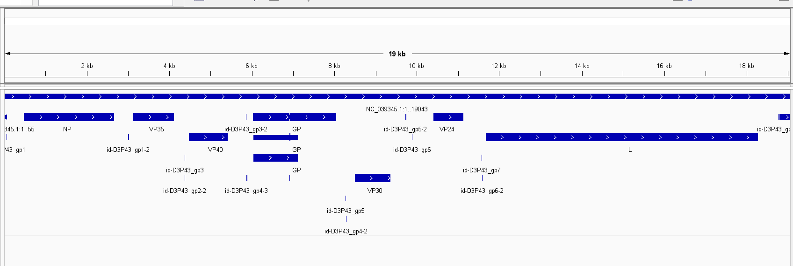

## ACTUAL REPORT 3.1

**In the right sidebar, find the links to scientific publications:**

*Group 1: Ebola paper*
*Group 2: Zika paper*
*Group 3: Staphylococcus publication*
*You have been assigned to group 1, 2, or 3 (if not, randomly assign yourself to a group).*
Since I am a crazy person, I am going to do all three.  **FOR THIS README, EBOLA PAPER FIRST**

*Genomic surveillance elucidates Ebola virus origin and transmission during the 2014 outbreak published in 2014 in the Science research journal.*

### BEFORE WE START

Some useful numbers:
NCBI RefSeq assembly: ```GCF_000848505.1``` NCBI Assembly ID for Ebola virus/H.sapiens-tc/COD/1976/Yambuku-Mayinga
Submitted GenBank assembly: ```GCA_000848505.1```
SRA BioProject ID: ```PRJNA257197```
RefSeq chromosome: ```	NC_002549.1```Ebola virus - Mayinga, Zaire, 1976, complete genome.
Genebank chromosome: ```AF086833.2``` Ebola virus - Mayinga, Zaire, 1976, complete genome.
GenBank ID: ```KM233118``` Zaire ebolavirus isolate Ebola virus/H.sapiens-wt/SLE/2014/Makona-NM042.3, complete genome

These are all used, so let's find new data

Genebank assemly ```GCA_900094155.1``` by Institute for Medical Microbiology - Complete genome sequence of an Ebola virus isolate from an imported case in Germany ex Sierra Leone determined by circle sequencing (Cir-seq)

Genome assembly ```ASM350581v1``` with genebank ```GCA_003505815.1``` - Bombali ebolavirus/Mops condylurus/SLE/2016/PREDICT_SLAB000156 and ref-seq ```GCF_003505815.1``` (let's use refseq for non redundant data)
What's so special about this Bombali ebolavirus? 

**it’s not known to be infectious to humans.**

NON-INFECTIOUS EBOLA??


THE WORKFLOW
```
Download the genome as or GenBank
Download the sequence data from the SRA
Align the reads to the genome
Call the variants
Annotate the variants
Visualize and interpret the results
```

### Data retrieval:

**Identify the accession numbers for the genome referenced in your assigned paper.** 
Answer:
```GCF_003505815.1``` (alternative )
```GCF_000848505.1``` (main one i'm supposed to do)
Alternative will be in a different section 

**Write shell commands to download the genome and annotation data. Ensure your commands are reusable and reproducible.**
///////////////////////////////////////////////////MAIN
 Using
 ```datasets summary genome accession GCF_000848505.1 | jq```
 we get
```
{
  "reports": [
    {
      "accession": "GCF_000848505.1",
      "annotation_info": {
        "name": "Annotation submitted by NCBI RefSeq",
        "provider": "NCBI RefSeq",
        "release_date": "2018-08-13",
        "stats": {
          "gene_counts": {
            "protein_coding": 7,
            "total": 7
          }
        }
      },
      "assembly_info": {
        "assembly_level": "Complete Genome",
        "assembly_name": "ViralProj14703",
        "assembly_status": "current",
        "assembly_type": "haploid",
        "paired_assembly": {
          "accession": "GCA_000848505.1",
          "annotation_name": "Annotation submitted by Institute of Virology, Philipps-University Marburg",
          "status": "current"
        },
        "release_date": "2000-09-27",
        "submitter": "Institute of Virology, Philipps-University Marburg"
      },
      "assembly_stats": {
        "atgc_count": "18959",
        "contig_l50": 1,
        "contig_n50": 18959,
        "gc_count": "7787",
        "gc_percent": 41,
        "number_of_component_sequences": 1,
        "number_of_contigs": 1,
        "number_of_scaffolds": 1,
        "scaffold_l50": 1,
        "scaffold_n50": 18959,
        "total_number_of_chromosomes": 1,
        "total_sequence_length": "18959",
        "total_ungapped_length": "18959"
      },
      "current_accession": "GCF_000848505.1",
      "organism": {
        "infraspecific_names": {
          "isolate": "Ebola virus/H.sapiens-tc/COD/1976/Yambuku-Mayinga"
        },
        "organism_name": "Zaire ebolavirus",
        "tax_id": 186538
      },
      "paired_accession": "GCA_000848505.1",
      "source_database": "SOURCE_DATABASE_REFSEQ",
      "type_material": {
        "type_display_text": "ICTV species exemplar",
        "type_label": "TYPE_ICTV"
      }
    }
  ],
  "total_count": 1
}
(bioinfo)
```


//////////////////////////////////////////////////ALTERNATIVE
```datasets summary genome accession GCF_003505815.1 | jq```
Result?
```
{
  "reports": [
    {
      "accession": "GCF_003505815.1",
      "annotation_info": {
        "name": "Annotation submitted by NCBI RefSeq",
        "provider": "NCBI RefSeq",
        "release_date": "2018-10-29",
        "stats": {
          "gene_counts": {
            "protein_coding": 7,
            "total": 7
          }
        }
      },
      "assembly_info": {
        "assembly_level": "Complete Genome",
        "assembly_method": "PRINSEQ v. 0.20.2; Bowtie2 v. 2.0.6; MIRA v. 4.0; Geneious v. 9.1.7",
        "assembly_name": "ASM350581v1",
        "assembly_status": "current",
        "assembly_type": "haploid",
        "bioproject_accession": "PRJNA282681",
        "bioproject_lineage": [
          {
            "bioprojects": [
              {
                "accession": "PRJNA282681",
                "parent_accessions": [
                  "PRJNA270892"
                ],
                "title": "Filovirus family project"
              },
              {
                "accession": "PRJNA270892",
                "title": "PREDICT, the surveillance and virus discovery component of the Emerging Pandemic Threats program"
              }
            ]
          }
        ],
        "paired_assembly": {
          "accession": "GCA_003505815.1",
          "annotation_name": "Annotation submitted by PREDICT Consortium",
          "status": "current"
        },
        "release_date": "2018-09-07",
        "sequencing_tech": "Sanger dideoxy sequencing; Illumina",
        "submitter": "PREDICT Consortium"
      },
      "assembly_stats": {
        "atgc_count": "19043",
        "contig_l50": 1,
        "contig_n50": 19043,
        "gc_count": "8661",
        "gc_percent": 45.5,
        "number_of_component_sequences": 1,
        "number_of_contigs": 1,
        "number_of_scaffolds": 1,
        "scaffold_l50": 1,
        "scaffold_n50": 19043,
        "total_number_of_chromosomes": 1,
        "total_sequence_length": "19043",
        "total_ungapped_length": "19043"
      },
      "current_accession": "GCF_003505815.1",
      "organism": {
        "infraspecific_names": {
          "isolate": "Bombali ebolavirus/Mops condylurus/SLE/2016/PREDICT_SLAB000156"
        },
        "organism_name": "Bombali virus",
        "tax_id": 2010960
      },
      "paired_accession": "GCA_003505815.1",
      "source_database": "SOURCE_DATABASE_REFSEQ",
      "type_material": {
        "type_display_text": "ICTV species exemplar",
        "type_label": "TYPE_ICTV"
      }
    }
  ],
  "total_count": 1
}
```

### Visualization:
*getting the data out*
///////////////////////////////MAIN
```datasets download genome accession GCF_000848505.1 --include genome,protein,gff3,cds,seq-report,rna```
``` unzip -n ncbi_dataset.zip ```

gives us
```
inflating: README.md
  inflating: ncbi_dataset/data/assembly_data_report.jsonl
  inflating: ncbi_dataset/data/GCF_000848505.1/cds_from_genomic.fna
  inflating: ncbi_dataset/data/GCF_000848505.1/GCF_000848505.1_ViralProj14703_genomic.fna
  inflating: ncbi_dataset/data/GCF_000848505.1/genomic.gff
  inflating: ncbi_dataset/data/GCF_000848505.1/protein.faa
  inflating: ncbi_dataset/data/GCF_000848505.1/sequence_report.jsonl
  inflating: ncbi_dataset/data/dataset_catalog.json
  inflating: md5sum.txt
(bioinfo)
```
**I will be using the SRA downloader to do the suggested NGS pipeline.**

#### SUB, MAIN NGS PIPELINE

using ``` esearch -db sra -query PRJNA257197```
gives 
```
<ENTREZ_DIRECT>
  <Db>sra</Db>
  <WebEnv>MCID_69e511e2780ea5113403c7e6</WebEnv>
  <QueryKey>1</QueryKey>
  <Count>891</Count>
  <Step>1</Step>
  <Elapsed>2</Elapsed>
</ENTREZ_DIRECT>
(bioinfo)
```
I don't need 891 of them. That's excessive, and I don't have the computing power. I am going to use ```SRA EXPLORER```
I found a good candidate ```SRR1972883```
```mkdir reads```
```cd reads```
then getting the reads 
```
prefetch SRR1972883
fasterq-dump --split-files SRR1972883
```
which gives 

```
2026-04-19T17:40:06 prefetch.3.2.1: 1) Resolving 'SRR1972883'...
2026-04-19T17:40:09 prefetch.3.2.1: Current preference is set to retrieve SRA Normalized Format files with full base quality scores
2026-04-19T17:40:13 prefetch.3.2.1: 1) Downloading 'SRR1972883'...
2026-04-19T17:40:13 prefetch.3.2.1:  SRA Normalized Format file is being retrieved
2026-04-19T17:40:13 prefetch.3.2.1:  Downloading via HTTPS...
2026-04-19T17:41:07 prefetch.3.2.1:  HTTPS download succeed
2026-04-19T17:41:09 prefetch.3.2.1:  'SRR1972883' is valid: 570717164 bytes were streamed from 570701369
2026-04-19T17:41:09 prefetch.3.2.1: 1) 'SRR1972883' was downloaded successfully
2026-04-19T17:41:09 prefetch.3.2.1: 1) Resolving 'SRR1972883's dependencies...
2026-04-19T17:41:09 prefetch.3.2.1: 'SRR1972883' has 0 unresolved dependencies
spots read      : 4,740,497
reads read      : 9,480,994
reads written   : 9,480,994
(bioinfo)
```
that's a lot of reads

A simple viewing give us a nuce line count 
```
$ cat SRR1972883_1.fastq | wc -l
18961988
(bioinfo)
 ```
 and
```
$ cat SRR1972883_2.fastq | wc -l
18961988
(bioinfo)
```
but they are in fastq so we have to zip them.  ```gzip *.fastq```
HISHISHISHISHISHISHIHSIHSIHISHISHISHISHIHSIHSIHSIHSIHISHISHISHISHISHISHISHISHSI (HISTAG)

//////////////////////////////ALT
```datasets download genome accession GCF_003505815.1 --include genome,protein,gff3,cds,seq-report,rna```
```unzip -n ncbi_dataset.zip```
gives us
```
Archive:  ncbi_dataset.zip
  inflating: README.md
  inflating: ncbi_dataset/data/assembly_data_report.jsonl
  inflating: ncbi_dataset/data/GCF_003505815.1/cds_from_genomic.fna
  inflating: ncbi_dataset/data/GCF_003505815.1/GCF_003505815.1_ASM350581v1_genomic.fna
  inflating: ncbi_dataset/data/GCF_003505815.1/genomic.gff
  inflating: ncbi_dataset/data/GCF_003505815.1/protein.faa
  inflating: ncbi_dataset/data/GCF_003505815.1/sequence_report.jsonl
  inflating: ncbi_dataset/data/dataset_catalog.json
  inflating: md5sum.txt
(bioinfo)
```
going to the right folder and then 
```
~/ebola_test/ncbi_dataset/data/GCF_003505815.1
$ ls
GCF_003505815.1_ASM350581v1_genomic.fna  cds_from_genomic.fna  genomic.gff  protein.faa  sequence_report.jsonl
(bioinfo)
```
The data already have the .fai so you don't need to index it

**Use IGV to visualize the genome and its annotations (e.g., GFF file) relative to the genome sequence.**


This is not surprising since this is a ssRNA virus (-) so ony 1 strand has the genes (the positive strand)
It also have many overlapping genes. (however, these are not overlapping genes, these can be mRNA, cds, exon, etc (**BE VERY CAREFUL WHILE VIEWING IGV**))

### Data evaluation:

**Determine the genome size and count the number of features of each type in the GFF file.**
Using ```seqkit stats GCF_003505815.1_ASM350581v1_genomic.fna```
We get: 
```
file                                     format  type  num_seqs  sum_len  min_len  avg_len  max_len
GCF_003505815.1_ASM350581v1_genomic.fna  FASTA   DNA          1   19,043   19,043   19,043   19,043
(bioinfo)
```

**Identify the longest gene. What is its name and function? (You may need to search external resources.)**
I will be using gffread 
```micromamba create -n gfftools -c bioconda -c conda-forge gffread```
```micromamba activate gfftools```
```gffread genomic.gff -E``` // for a sanity check
``` gffread genomic.gff -g GCF_003505815.1_ASM350581v1_genomic.fna | awk '$3=="gene"' ```
Results?
```
NC_039345.1     RefSeq  gene    464     2683    .       +       .       ID=gene-D3P43_gp1;gene_name=NP
NC_039345.1     RefSeq  gene    3114    4139    .       +       .       ID=gene-D3P43_gp2;gene_name=VP35
NC_039345.1     RefSeq  gene    4466    5446    .       +       .       ID=gene-D3P43_gp3;gene_name=VP40
NC_039345.1     RefSeq  gene    6043    8060    .       +       .       ID=gene-D3P43_gp4;gene_name=GP
NC_039345.1     RefSeq  gene    8484    9383    .       +       .       ID=gene-D3P43_gp5;gene_name=VP30
NC_039345.1     RefSeq  gene    10399   11154   .       +       .       ID=gene-D3P43_gp6;gene_name=VP24
NC_039345.1     RefSeq  gene    11666   18298   .       +       .       ID=gene-D3P43_gp7;gene_name=L
```
7 genes, like we expected but we have to calculate length. Jeez, why not just do it with the CDS file we downloaded earlier?

doing ```seqkit fx2tab -n -l cds_from_genomic.fna```
give us
```
lcl|NC_039345.1_cds_YP_009513274.1_1 [gene=NP] [locus_tag=D3P43_gp1] [db_xref=GeneID:37784991] [protein=nucleoprotein] [protein_id=YP_009513274.1] [location=464..2683] [gbkey=CDS]       2220
lcl|NC_039345.1_cds_YP_009513275.1_2 [gene=VP35] [locus_tag=D3P43_gp2] [db_xref=GeneID:37784985] [protein=polymerase complex protein] [protein_id=YP_009513275.1] [location=3114..4139] [gbkey=CDS]       1026
lcl|NC_039345.1_cds_YP_009513276.1_3 [gene=VP40] [locus_tag=D3P43_gp3] [db_xref=GeneID:37784986] [protein=matrix protein] [protein_id=YP_009513276.1] [location=4466..5446] [gbkey=CDS]   981
lcl|NC_039345.1_cds_YP_009513277.1_4 [gene=GP] [locus_tag=D3P43_gp4] [db_xref=GeneID:37784987] [protein=spike glycoprotein] [exception=RNA editing] [protein_id=YP_009513277.1] [location=join(6043..6915,6915..8060)] [gbkey=CDS]        2019
lcl|NC_039345.1_cds_YP_009513278.1_5 [gene=GP] [locus_tag=D3P43_gp4] [db_xref=GeneID:37784987] [protein=small secreted glycoprotein] [protein_id=YP_009513278.1] [location=6043..7140] [gbkey=CDS]        1098
lcl|NC_039345.1_cds_YP_009513279.1_6 [gene=GP] [locus_tag=D3P43_gp4] [db_xref=GeneID:37784987] [protein=second secreted glycoprotein] [exception=RNA editing] [protein_id=YP_009513279.1] [location=join(6043..6914,6916..6940)] [gbkey=CDS]      897
lcl|NC_039345.1_cds_YP_009513280.1_7 [gene=VP30] [locus_tag=D3P43_gp5] [db_xref=GeneID:37784988] [protein=minor nucleoprotein] [protein_id=YP_009513280.1] [location=8484..9383] [gbkey=CDS]      900
lcl|NC_039345.1_cds_YP_009513281.1_8 [gene=VP24] [locus_tag=D3P43_gp6] [db_xref=GeneID:37784989] [protein=membrane-associated protein] [protein_id=YP_009513281.1] [location=10399..11154] [gbkey=CDS]    756
lcl|NC_039345.1_cds_YP_009513282.1_9 [gene=L] [locus_tag=D3P43_gp7] [db_xref=GeneID:37784990] [protein=RNA-dependent RNA polymerase] [protein_id=YP_009513282.1] [location=11666..18298] [gbkey=CDS]      6633
(bioinfo)
```
a command 
``` 
seqkit fx2tab -n -l cds_from_genomic.fna | \
awk -F'\t' '{
  match($1,/\[gene=([^]]+)\]/,a);
  print a[1], $2
}' | sort -k2 -n 
``` 
from ChatGPT gives: 

```
VP24 756
GP 897
VP30 900
VP40 981
VP35 1026
GP 1098
GP 2019
NP 2220
L 6633
```
So L is the longest gene and its an **protein=RNA-dependent RNA polymerase**

**Pick another gene, and describe its name and function.**

gene VP24 and its function is membrane-associated protein

**Examine the distribution of genomic features: Are they closely packed or is there significant intergenic space?**
It is quite tightly packed since only 19kb but already 7 genes on 1 strand with total cds of 16,530, there isn't much intergenic space or only 13% intergenic space (the 13% is WRONG since cds include overlapping sequence = bad)

**Using IGV, estimate what proportion of the genome is covered by coding sequences.**
For the question, chatGPT gives 
 coding=$(awk -F'\t' '$3=="CDS"{print $1"\t"$4-1"\t"$5}' genomic.gff | bedtools sort -i - | bedtools merge | awk '{s+=$3-$2} END{print s}')
genome=$(seqkit stats -T GCF_003505815.1_ASM350581v1_genomic.fna | awk 'NR==2{print $5}')
echo "$coding / $genome"
14534 / 19043
(bioinfo)
for around 76%

### Alternative genome builds:

**Find alternative genome builds for your organism (include their accession numbers).** 

Mentioned aboev

**Briefly discuss what different questions could be answered using a different genome build, considering the focus of your assigned paper.**

I didn't notice correctly and accidently do the alternative one as the main one but I think you can answer some questiosn regarding which protein in a virus makes it infectious for human host, or which changes to a gene can make a virus infectious since my virus is not infectious. 

### Report:

**Write and submit your report to your repository, summarizing your findings and including your commands and visualizations.**

Done above


[def]: images/