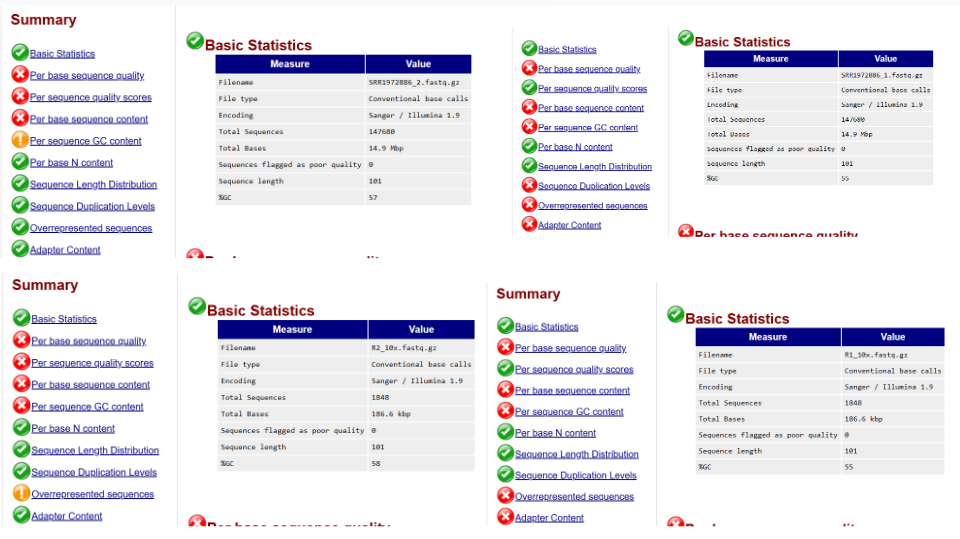

# REPORT 4

## Continue from last week:

**Review the scientific publication you studied previously.**
Ebola virus

**Identify the BioProject and SRR accession numbers for the sequencing data associated with the publication.**

From report_3 

Some useful numbers:
NCBI RefSeq assembly: ```GCF_000848505.1``` NCBI Assembly ID for Ebola virus/H.sapiens-tc/COD/1976/Yambuku-Mayinga
Submitted GenBank assembly: ```GCA_000848505.1```
SRA BioProject ID: ```PRJNA257197```
RefSeq chromosome: ```	NC_002549.1```Ebola virus - Mayinga, Zaire, 1976, complete genome.
Genebank chromosome: ```AF086833.2``` Ebola virus - Mayinga, Zaire, 1976, complete genome.

## Write a Bash script:

**Reuse and expand your code from last week.**
**Create a bash shell script with the code from last week.**
**Add commands to download at least one sequencing dataset using the SRR number(s).**
**Download only a subset of the data that would provide approximately 10x genome coverage. Briefly explain how you estimated the amount of data needed for 10x coverage.**
My previous search was really poorly optimized and downloaded a very high coverage, let's try again

In a file that is get10.sh

```
#!/bin/bash

# Activate your environment
micromamba activate bioinfo

# Creating working directory
mkdir reads10x
cd ./reads10x

# Downloading the reads the chosen file is https://www.ncbi.nlm.nih.gov/sra/?term=SRR1972886, which is the smallest sample of 300mb,
# we still need to downsize it


# Download
echo "Downloading $SRR..."
prefetch SRR1972886
fastq-dump SRR1972886 --split-files


# Data has length read of around 100bp,
# Estimating amount of data needed for 10x coerage: C =  N X L / G Where
#C = coverage = 10
#N = reads -> we need around  1900 reads which is around 0.013 of our sample
#L = length ~ 0.1 kb
#G = genome size = 19kb

seqtk sample -s100 SRR1972886_1.fastq 0.013 > R1_10x.fastq
seqtk sample -s100 SRR1972886_2.fastq 0.013 > R2_10x.fastq

gzip *.fastq

echo "Done: ~1500x dataset created"

seqkit stats *.gz
```
will give you it. seqtk sample is inherently random so the results aren't exactly reproducible

## Quality assessment:

**Generate basic statistics on the downloaded reads (e.g., number of reads, total bases, average read length).**

runing script gives 

```
Downloading ...
2026-04-20T05:02:56 prefetch.3.2.1: 1) Resolving 'SRR1972886'...
2026-04-20T05:02:58 prefetch.3.2.1: Current preference is set to retrieve SRA Normalized Format files with full base quality scores
2026-04-20T05:03:00 prefetch.3.2.1: 1) Downloading 'SRR1972886'...
2026-04-20T05:03:00 prefetch.3.2.1:  SRA Normalized Format file is being retrieved
2026-04-20T05:03:00 prefetch.3.2.1:  Downloading via HTTPS...
2026-04-20T05:03:12 prefetch.3.2.1:  HTTPS download succeed
2026-04-20T05:03:12 prefetch.3.2.1:  'SRR1972886' is valid: 17054743 bytes were streamed from 17046055
2026-04-20T05:03:12 prefetch.3.2.1: 1) 'SRR1972886' was downloaded successfully
2026-04-20T05:03:12 prefetch.3.2.1: 1) Resolving 'SRR1972886's dependencies...
2026-04-20T05:03:12 prefetch.3.2.1: 'SRR1972886' has 0 unresolved dependencies
Read 147680 spots for SRR1972886
Written 147680 spots for SRR1972886
Done: ~1500x dataset created
processed files:  4 / 4 [======================================] ETA: 0s. done
file                   format  type  num_seqs     sum_len  min_len  avg_len  max_len
R1_10x.fastq.gz        FASTQ   DNA      1,848     186,648      101      101      101
R2_10x.fastq.gz        FASTQ   DNA      1,848     186,648      101      101      101
SRR1972886_1.fastq.gz  FASTQ   DNA    147,680  14,915,680      101      101      101
SRR1972886_2.fastq.gz  FASTQ   DNA    147,680  14,915,680      101      101      101
```

**Run FASTQC on the downloaded data to generate a quality report.**

Runnig fastqc on all of the files ``` fastqc *.gz``` gives
```
 ls
R1_10x.fastq.gz     R2_10x.fastq.gz     SRR1972886                SRR1972886_1_fastqc.zip   SRR1972886_2_fastqc.zip
R1_10x_fastqc.html  R2_10x_fastqc.html  SRR1972886_1.fastq.gz     SRR1972886_2.fastq.gz
R1_10x_fastqc.zip   R2_10x_fastqc.zip   SRR1972886_1_fastqc.html  SRR1972886_2_fastqc.html
```

**Evaluate the FASTQC report and summarize your findings.**

Create an environment for multiqc 

```micromamba create -n multiqc_env -c conda-forge -c bioconda python=3.10 multiqc fastqc```
```micromamba create -n multiqc_env -c conda-forge -c bioconda python=3.10 multiqc fastqc```
``` multiqc . ```
and then ```  explorer.exe multiqc_report.html```

The data is basically unusable and probably beyond saving, but some quality control can be done 



**Perform any necessary quality control steps (e.g., trimming, filtering) and briefly describe your process.**
```
fastp \
  -i SRR1972886_1.fastq.gz \
  -I SRR1972886_2.fastq.gz \
  -o clean_R1.fastq.gz \
  -O clean_R2.fastq.gz \
  -q 20 \
  -u 30 \
  -n 5 \
  -l 50 \
  -h fastp_report.html \
  -j fastp_report.json
  ```
Using fastp for our complete sample:
- Removes low-quality bases (Q < 20) the ```-q 20``` (think no under q20)
- Discards reads with >30% low-quality bases the ```-u 30``` (think no under 30)
- Removes reads with too many Ns the 
- Filters short reads (<50 bp) the ```-l 50``` (think length at least 50)
- Automatically trims adapters

for the downsized sample, we use the default setting since removingtoo much can cause problems

```
fastp \
  -i R1_10x.fastq.gz \
  -I R2_10x.fastq.gz \
  -o clean_R1_10x.fastq.gz \
  -O clean_R2_10x.fastq.gz \
  -h fastp_10x.html \
  -j fastp_10x.json
  ```


RESULTS

```
$ fastp \
  -i SRR1972886_1.fastq.gz \
  -I SRR1972886_2.fastq.gz \
  -o clean_R1.fastq.gz \
  -O clean_R2.fastq.gz \
  -q 20 \
  -u 30 \
  -n 5 \
  -l 50 \
  -h fastp_report.html \
  -j fastp_report.json
Read1 before filtering:
total reads: 147680
total bases: 14915680
Q20 bases: 12618065(84.596%)
Q30 bases: 11611604(77.8483%)
Q40 bases: 2822020(18.9198%)

Read2 before filtering:
total reads: 147680
total bases: 14915680
Q20 bases: 7911916(53.0443%)
Q30 bases: 7108240(47.6562%)
Q40 bases: 1685006(11.2969%)

Read1 after filtering:
total reads: 64223
total bases: 6431956
Q20 bases: 6340575(98.5793%)
Q30 bases: 6066136(94.3125%)
Q40 bases: 1586427(24.6648%)

Read2 after filtering:
total reads: 64223
total bases: 6431956
Q20 bases: 6264363(97.3944%)
Q30 bases: 5859161(91.0945%)
Q40 bases: 1498375(23.2958%)

Filtering result:
reads passed filter: 128446
reads failed due to low quality: 166230
reads failed due to too many N: 94
reads failed due to too short: 590
reads failed due to adapter dimer: 0
reads with adapter trimmed: 5204
bases trimmed due to adapters: 150450

Duplication rate: 0%

Insert size peak (evaluated by paired-end reads): 165

JSON report: fastp_report.json
HTML report: fastp_report.html

fastp -i SRR1972886_1.fastq.gz -I SRR1972886_2.fastq.gz -o clean_R1.fastq.gz -O clean_R2.fastq.gz -q 20 -u 30 -n 5 -l 50 -h fastp_report.html -j fastp_report.json
fastp v1.3.2, time used: 2 seconds
```

AND 
```
Read1 before filtering:
total reads: 1848
total bases: 186648
Q20 bases: 158670(85.0103%)
Q30 bases: 146272(78.3678%)
Q40 bases: 35437(18.986%)

Read2 before filtering:
total reads: 1848
total bases: 186648
Q20 bases: 98313(52.6729%)
Q30 bases: 87990(47.1422%)
Q40 bases: 20869(11.1809%)

Read1 after filtering:
total reads: 862
total bases: 86033
Q20 bases: 84093(97.7451%)
Q30 bases: 80200(93.22%)
Q40 bases: 20683(24.0408%)

Read2 after filtering:
total reads: 862
total bases: 86033
Q20 bases: 82144(95.4796%)
Q30 bases: 75985(88.3208%)
Q40 bases: 19288(22.4193%)

Filtering result:
reads passed filter: 1724
reads failed due to low quality: 1972
reads failed due to too many N: 0
reads failed due to too short: 0
reads failed due to adapter dimer: 0
reads with adapter trimmed: 82
bases trimmed due to adapters: 2062

Duplication rate: 0%

Insert size peak (evaluated by paired-end reads): 144

JSON report: fastp_10x.json
HTML report: fastp_10x.html

fastp -i R1_10x.fastq.gz -I R2_10x.fastq.gz -o clean_R1_10x.fastq.gz -O clean_R2_10x.fastq.gz -h fastp_10x.html -j fastp_10x.json
fastp v1.3.2, time used: 1 seconds
```
```mkdir clean``` and then ```mv clean* clean```

then ```fastqc *```

*IT ACTUALLY GOT BETTER?*


Post-trimming quality control using ```fastp``` showed substantial improvement in **per-base quality scores** and removal of **low-quality reads** and **adapter contamination.** 

However, **per base sequence content** and **GC content** remained flagged.

These patterns are expected for viral sequencing data and are not indicative of poor quality. Since Ebolavirus intrinsically have non random GC distribution since it's not very large. And per base sequence content could be introduced during library preperation

## Compare sequencing platforms:

**Search the SRA for another dataset for the same genome, but generated using a different sequencing platform (e.g., if original data was Illumina select PacBio or Oxford Nanopore).**

Basically beyond saving for this. Let's try a more recent ion torrent project (2015) ```PRJEB10265``` with accession run we are using: ```ERR979718```


modify ```get10.sh``` to ```get.sh```

```
#!/bin/bash

# Activate your environment
micromamba activate bioinfo

# Creating working directory
mkdir reads_full
cd ./reads_full

# Downloading the reads the chosen file is https://www.ncbi.nlm.nih.gov/sra/?term=SRR1972886, which is the smallest sample of 300mb,
# we still need to downsize it


# Download
echo "Downloading $SRR..."
prefetch ERR979718
fastq-dump ERR979718 --split-files


gzip *.fastq

echo "Done: fullx dataset created"

seqkit stats *.gz
```
since it's ion torrent it's not paired ends

```
file                  format  type  num_seqs    sum_len  min_len  avg_len  max_len
ERR979718_1.fastq.gz  FASTQ   DNA     45,070  8,554,926       25    189.8      344
```

It's somehow even worse


**Briefly compare the quality or characteristics of the datasets from the two platforms.**
The fact that ion current look worse is to be expected since they look worse on fastqc, which is more specific for illumina

Getting ```BBDuk```
``` micromamba create -n bbtools_env -c bioconda -c conda-forge bbmap```then ```micromamba activate bbtools_env```

And using this
```
 bbduk.sh \
  in=ERR979718_1.fastq.gz \
  out=clean_ERR979718.fastq.gz \
  qtrim=r \
  trimq=15 \
  minlength=50 \
  maxns=10 \
  ref=adapters \
  ktrim=r \
  k=23 \
  mink=11 \
  hdist=1
```
Quality trimming **(qtrim=r, trimq=15)**: Low-quality bases are removed from the 3’ end using a Phred threshold of 15.
Length filtering **(minlength=50)**: Reads shorter than 50 bp after trimming are discarded.
Ambiguous base filtering **(maxns=10)**: Reads with too many unknown bases (Ns) are removed.
Adapter removal **(ref=adapters, ktrim=r, k=23, mink=11, hdist=1)**: Sequencing adapters are detected using k-mers and removed, allowing up to 1 mismatch.

Gives

```
java -ea -Xmx5994m -Xms5994m -cp /home/tristuowngf/micromamba/envs/bbtools_env/opt/bbmap-39.01-1/current/ jgi.BBDuk in=ERR979718_1.fastq.gz out=clean_ERR979718.fastq.gz qtrim=r trimq=15 minlength=50 maxns=10 ref=adapters ktrim=r k=23 mink=11 hdist=1
Executing jgi.BBDuk [in=ERR979718_1.fastq.gz, out=clean_ERR979718.fastq.gz, qtrim=r, trimq=15, minlength=50, maxns=10, ref=adapters, ktrim=r, k=23, mink=11, hdist=1]
Version 39.01

maskMiddle was disabled because useShortKmers=true
0.024 seconds.
Initial:
Memory: max=6285m, total=6285m, free=6267m, used=18m

Added 217135 kmers; time:       0.147 seconds.
Memory: max=6285m, total=6285m, free=6257m, used=28m

Input is being processed as unpaired
Started output streams: 0.140 seconds.
Processing time:                0.745 seconds.

Input:                          45070 reads             8554926 bases.
QTrimmed:                       16622 reads (36.88%)    340837 bases (3.98%)
KTrimmed:                       14 reads (0.03%)        211 bases (0.00%)
Low quality discards:           2023 reads (4.49%)      76218 bases (0.89%)
Total Removed:                  3134 reads (6.95%)      417266 bases (4.88%)
Result:                         41936 reads (93.05%)    8137660 bases (95.12%)

Time:                           1.035 seconds.
Reads Processed:       45070    43.53k reads/sec
Bases Processed:       8554k    8.26m bases/sec
```

via ```fastqc``` gives

a somewhat underwhelming but still *better* than nothing improvement


It could be that bbduk isn't really good, let's try fastp'

```
fastp \
  -i ERR979718_1.fastq.gz \
  -o fastp_cleaned.fastq.gz \
  -q 15 \
  -u 40 \
  -n 10 \
  -l 50 \
  -h fastp_report.html \
  -j fastp_report.json
```

gives 
```
Detecting adapter sequence for read1...
No adapter detected for read1

Read1 before filtering:
total reads: 45070
total bases: 8554926
Q20 bases: 7575470(88.551%)
Q30 bases: 4769201(55.748%)
Q40 bases: 706(0.00825256%)

Read1 after filtering:
total reads: 42840
total bases: 8464361
Q20 bases: 7525296(88.9057%)
Q30 bases: 4752599(56.1483%)
Q40 bases: 701(0.00828178%)

Filtering result:
reads passed filter: 42840
reads failed due to low quality: 650
reads failed due to too many N: 0
reads failed due to too short: 1580
reads failed due to adapter dimer: 0
reads with adapter trimmed: 0
bases trimmed due to adapters: 0

Duplication rate (may be overestimated since this is SE data): 31.0606%

JSON report: fastp_report.json
HTML report: fastp_report.html

fastp -i ERR979718_1.fastq.gz -o fastp_cleaned.fastq.gz -q 15 -u 40 -n 10 -l 50 -h fastp_report.html -j fastp_report.json
fastp v1.3.2, time used: 15 seconds
```

and ```fastqc fastp_cleaned.fastq.gz```
gives...basically the same result, well it is probably due to the sequencing type 

