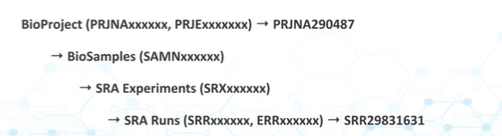

# SEQUENCING AND FASTQ

## DATA HAVE HIERACHY 



We have had a lot of tool mentioned but here is one more 
```ffq - A tool to find sequencing data and metadata from public databases```

```SSR``` are reads, belonging to projects, to get all ```SSR``` from a project you can do from the ```bio``` tool (more on it later)
```
# Produces JSON output
bio search PRJNA392446

# Produces CSV output
bio search PRJNA392446 -H --csv
```
Some papers are cross linked so you may be able to cross link the pubmed paper to the database
```
esearch -db pubmed -query 'PMC4431643' | \
        elink -target sra | \
        efetch -format runinfo > runinfo.csv
```

```bio``` is a tool that can help you get metadata easily

```
# Obtain run metadata based on SRR number
# The metadata includes the URL to the reads!
bio search SRR5790106

# Obtain run metadata based on PRJN number
bio search PRJNA392446
```

When using fastq dump remember to split them if your pipeline requires so 

```
# Download the first 1000 reads based on SRR number
mkdir -p reads
fastq-dump -X 1000 -F --outdir reads --split-files SRR5790106
```

## QUALITY CONTROL, WHY DO I HAVE TO DO IT?
*this section only work for illumina file*

**0. Since this step alters data, we have to be VERY CAREFUL WHILE USING IT**

**1.GARBAGE IN = GARBAGE OUT** 

Sometimes you just have to tell the wetlab to do the sequencing again

**2. WHY IS IT IMPORTANT**

The more unknown your data is, the more you have to correct mistakes before they catch on.
But don't try too hard because it can result in *overfitting*, making data match what you want

Step 3 and 4 are from the biostar handbook 
**3. WHEN?**
Quality control may be performed at different stages

Pre-alignment: “raw data” - the protocols are the same regardless of what analysis will follow
Post-alignment: “data filtering” - the protocols are specific to the analysis that is performed.

**4. HOW?***
QC typically follows this process.

Evaluate (visualize) data quality.
Stop and move to the next analysis step if the quality appears to be satisfactory.
If not, execute one or more data altering steps then go to step 1.

note: most QC tool sucks (not my words)

also, QCing can cause mistakes as well, sometimes more than the original data. So, if it's not broken, don't fix it.

**5. WHICH?**
These are recommended 
```fastp```, ```Trimmomatic```, and, ```cutadapt```
implementations will be discussed later. And each software will produce different results. And it is hard to reproduce it with different versions 

## LOW QUALITY BASE PAIR QUALITY CONTROL

What a mouthful

for ```fastp```
```
# If the data is single end
fastp --cut_tail -i SRR1553607_1.fastq -o SRR1553607_1.trim.fq

# If the data is paired-end
fastp --cut_tail -i SRR1553607_1.fastq -I SRR1553607_2.fastq -o SRR1553607_1.trim.fq -O SRR1553607_2.trim.fq
```

for ```trimmomatic```
```
# Run trimmomatic in single end mode
trimmomatic SE SRR1553607_1.fastq  SRR1553607_1.trim.fq  SLIDINGWINDOW:4:30

# Run trimmomatic in paired-end mode
trimmomatic PE SRR1553607_1.fastq SRR1553607_2.fastq \
               SRR1553607_1.trim.fq SRR1553607_1.unpaired.fq \
               SRR1553607_2.trim.fq SRR1553607_2.unpaired.fq \
               SLIDINGWINDOW:4:30

# Generate fastqc reports all datasets.
fastqc *fastq *.fq
```

in ```bbduk```
```
# Run bbduk in single end mode
bbduk.sh in=SRR1553607_1.fastq out=SRR1553607_1.trim.fq qtrim=r overwrite=true qtrim=30

# Run bbduk in paired-end mode
bbduk.sh in1=SRR1553607_1.fastq in2=SRR1553607_2.fastq \
         outm1=SRR1553607_1.trim.fq out1=SRR1553607_1.unpaired.fq \
         outm2=SRR1553607_2.trim.fq out2=SRR1553607_2.unpaired.fq.fq \
         qtrim=r overwrite=true qtrim=30
```

## ADAPTERS QUALITY CONTROL
These are just products of sequencing, and they are usually "tradesecrets" (capitalism)

```fastq``` trimming adapters in paired end mode
```
# Trim adapters in paired end mode and trim low quality bases from the ends
fastp --cut_tail --adapter_sequence AGATCGGAAGAGCACACGT \
       -i SRR519926_1.fastq -o SRR519926_1.trim.fq \
       -I SRR519926_2.fastq -O SRR519926_2.trim.fq
```
or with ```bbduk```
```bbduk.sh in=SRR519926_1.fastq out=SRR519926_1.trim.fq ref=adapter.fa``` (adapter.fa is the reference adapter sequence)

or with trimmomatic
```
trimmomatic PE SRR519926_1.fastq SRR519926_2.fastq  \
               SRR519926_1.trim.fq SRR519926_1.unpaired.fq \
               SRR519926_2.trim.fq SRR519926_2.unpaired.fq \
               SLIDINGWINDOW:4:30 TRAILING:30 ILLUMINACLIP:adapter.fa:2:30:5
```
or ```trimmomatic PE -basein SRR519926_1.fastq -baseout SRR519926.fq  \
               SLIDINGWINDOW:4:30 TRAILING:30 ILLUMINACLIP:adapter.fa:2:30:5```

One question, do we trim on adapters or low quality base pair first? Well, does not really make much difference. But still problematic if we don't check


## DUPLICATES QUALITY CONTROL

Duplicates can stem from 

1. Artificial ones
2. Just actual duplicates in the genome 

How do we differentiate between them? Well...

**Should I delete duplicates**

For SNPs and variant calling, usually yes

**How do interpret duplication graph like in fastqc?**

There are 2 ways to measure duplcation 

**A. How many reads are duplicated?** - This is about all reads (total counts)
**B. How many unique sequences are duplicated?** - This is about distinct sequences (unique DNA strings)

we can use ```picard``` to mark duplicates 

## WHAT IS PAIRED ENDS READ AGAIN?
*Paired-end reads are a DNA sequencing method where both ends of a DNA fragment are sequenced, producing two linked reads (and) per fragment.*


And depending on the machine, the reads can overlap 


NOTE: DNA comes from a pool of cells -> ssDNA -> fragmented -> size exclusion -> small subset is sequenced 


## WHAT IS COVERAGE? 

[!description](images_week2/Screenshot%202026-04-20%20103113.png)

## HOW DO INTERPRET COVERAGE 

-> The probablity of a target base NOT being sequenced 


Example:

