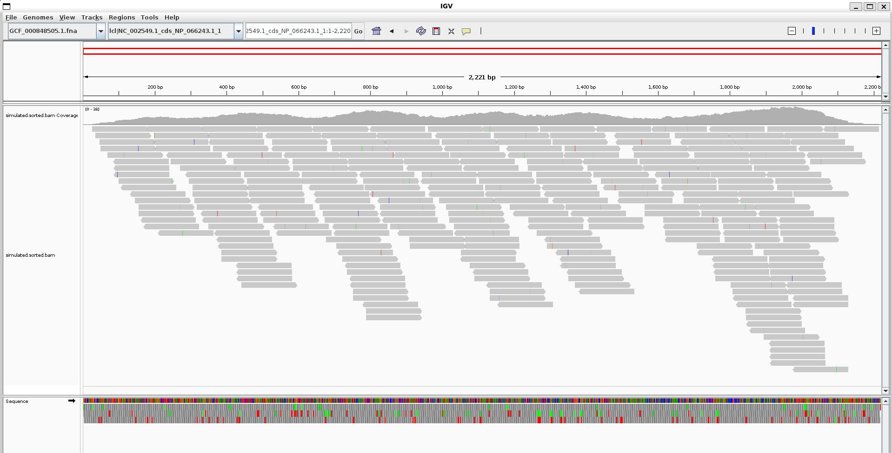
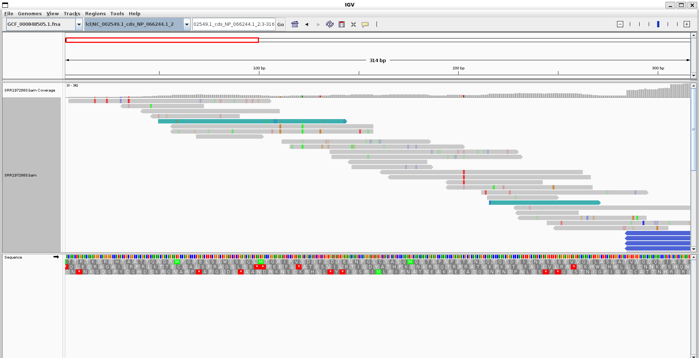
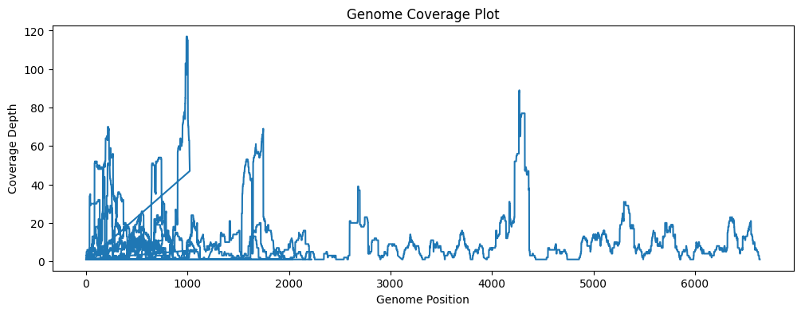

# SHORT READ ALIGNMENTS

## CHOOSING THE RIGHT TOOL 


## INDEXING
Basically using a lookup table

```bwa index refs/genome.fa``` (optional for minimap2)

## ALIGNMENT TEMPLATE 
### bwa
```
# Index the reference genome (only needs to be done once)
bwa index ${REF} 

# Align the paired-end reads
bwa mem ${REF} ${R1} ${R2} > ${SAM}

# Sort the SAM file to BAM
cat ${SAM} | samtools sort > ${BAM}

# Index the BAM file
samtools index ${BAM}
```

### minimap2

```
# Align single end reads with minimap2.
minimap2 --MD -ax sr ${REF} ${R1} | \
         samtools sort > ${BAM}
```
### bowtie2
Very flexible
```
# Index the genome
bowtie2-build ${REF} ${REF}  # Build the Bowtie2 index

# Align the reads
bowtie2 -x ${REF} -1 ${R1} -2 ${R2} > ${SAM} 
```


## WHICH TO USE??
Depends and you can fine tune tools to get the results you want

## ALIGNMENT VS MAPPING
Quote 
```
Mapping

A mapping is a region where a read sequence is placed.
A mapping is regarded to be correct if it overlaps the true region.
Alignment

An alignment is the detailed placement of each base in a read.
An alignment is regarded to be correct if each base is placed correctly.
```

## CHECKLIST
```
Alignment algorithm: global, local, or semi-global?
Can the aligner filter alignments based on external parameters?
Can the aligner report more than one alignment per query?
How will the aligner handle INDELs (insertions/deletions)?
Can the aligner skip (or splice) over intronic regions?
Will the aligner find chimeric alignments?
```

## THE BAM/SAM FORMAT
```SAM``` :(Sequence Alignment/Map) and ```BAM``` is evil binary brother. 

There are 11 columns in a bam file
```
QNAME - Query (read) name
FLAG - Bitwise flag with alignment details
RNAME - Reference sequence name
POS - 1-based leftmost mapping position
MAPQ - Mapping quality score
CIGAR - Compact alignment representation
RNEXT - Mate/next read reference name
PNEXT - Mate/next read position
TLEN - Observed template length
SEQ - Segment sequence
QUAL - Base quality scores
TAGS - Optional fields for additional information
```

```samtools``` = master of this.  (also ```bedtools``` and ```picard```)

```
# Display available samtools operations
samtools

# Download a remote BAM file
wget https://genome.ucsc.edu/goldenPath/help/examples/bamExample.bam

# Index the BAM file
samtools index bamExample.bam

# Print BAM file statistics
samtools flagstat bamExample.bam
```

IMPORTANT: THEY CAN BE VIEW IN IGV

# ACTUAL REPORT 

## Assignment Checklist

### 1. Makefile Setup

Previously on our journey with Ebola:

Previously on the Ebola test we used 

NCBI RefSeq assembly: ```GCF_000848505.1``` NCBI Assembly ID for Ebola virus/H.sapiens-tc/COD/1976/Yambuku-Mayinga

Submitted GenBank assembly: ```GCA_000848505.1```

SRA BioProject ID: ```PRJNA257197```

RefSeq chromosome: ```	NC_002549.1```Ebola virus - Mayinga, Zaire, 1976, complete genome.

Genebank chromosome: ```AF086833.2``` Ebola virus - Mayinga, Zaire, 1976, complete genome.

SRR sample used: ```SRR1972883```

- [x] Create a `Makefile` from the original bash script 
*Created and linked in template section*
- [x] Add rule to download genome  
- [x] Add rule to download sequencing reads from SRA  

### 2. Documentation
- [x] Write `README.md` explaining how to use the Makefile
*Type make help for any usage of the makefile*  
- [x] Include example commands (e.g., `make`, `make align`)  
- [x] Describe file structure and outputs  
```
#=========================================
SHELL := bash
.ONESHELL:
.SHELLFLAGS := -eu -o pipefail -c
.DELETE_ON_ERROR:
MAKEFLAGS += --warn-undefined-variables
MAKEFLAGS += --no-builtin-rules

ifeq ($(origin .RECIPEPREFIX), undefined)
  $(error This Make does not support .RECIPEPREFIX. Please use GNU Make 4.0 or later)
endif
.RECIPEPREFIX = >
#=========================================
```
```
# =========================================
#DEFINE GENOME HERE AND ALLOW INPUT FROM COMMAND LINE
SRR_ID ?= SRR1972883
REFSEQ_ID ?= GCF_000848505.1
# =========================================
```

Defining our variables/ID. THE ```?=``` is basically allowing user to input their files

*Basically setting up the Makefile (important is the RECIPEPREFIX = >)*

```
# =========================================
# DEFINE and allow input from command line:
# - reference genome FASTA filename
# - FASTQ filenames
# - SAM filename
# - sorted BAM filename
# - BAM index filename (.bai)
#DEFINE THE FILES HERE 
REFSEQ_FASTA := reference/$(REFSEQ_ID).fna
REFSEQ_INDEX := reference/$(REFSEQ_ID).fna.fai
READS_DONE := reads/$(SRR_ID).done # this is only a marker file
# READS ARE PAIRED END SO TWO FILES
R1 := reads/$(SRR_ID)_1.fastq
R2 := reads/$(SRR_ID)_2.fastq
ALIGNMENT_SAM := alignment/$(SRR_ID).sam
ALIGNMENT_BAM := alignment/$(SRR_ID).bam
ALIGNMENT_BAM_INDEX := alignment/$(SRR_ID).bam.bai
# =========================================
```
Basically setting up the file names

```
# =========================================
# CREATE DIRECTORIES
# - reference/     for genome FASTA + indexes
# - reads/         for FASTQ files
# - alignment/     for SAM/BAM outputs
# REMEMBER THAT OUR DELIM IS > SO USE IT TO NOT GET  *** missing separator.  Stop. ERROR
dirs: 
> mkdir -p reference reads alignment
.PHONY: dirs
# =========================================
```
Creating directories

```
# =========================================
# Whenever someone uses this makefile it will print out that you can input the SRR and RefSeq (using a .PHONY) IDs from the command line, and it will show the default values that will be used if you don't specify them.
help:
> @echo "Usage: make [target] [SRR_ID=SRRxxxxxxx] [REFSEQ_ID=GCF_xxxxxxx]"
> @echo "Default SRR_ID: $(SRR_ID)"
> @echo "Default REFSEQ_ID: $(REFSEQ_ID)"
> @echo ""
> @echo "Required tools: datasets, fasterq-dump, bwa, samtools, preferably the bioinfio environment"
> @echo "Targets:"
> @echo "  download_refseq - downloads the reference genome FASTA"
> @echo "  download_srr    - downloads the sequencing reads from SRA"
> @echo "  index           - creates index for the reference genome"
> @echo "  align           - aligns reads to the reference genome"
> @echo "  index_bam       - generates BAM index (.bai)"
> @echo "  dirs            - creates necessary directories"
> @echo "  build           - runs the full workflow (download, index, align, index_bam)"
.PHONY: help
# =========================================
```
What will execute when someone type ```make help``` which shows the syntax of this file.

```
# =========================================
#building the entire workflow in one command
build: download_refseq download_srr index align index_bam
.PHONY: build
# =========================================
```
Execute the entre code

```
# =========================================
# Download the reference genome FASTA file using the RefSeq ID from NCBI using datasets
# datasets download genome accession GCF_000848505.1 
#--include genome,protein,gff3,cds,seq-report,rna
# index the file too using samtools faidx
# Since we are downloading a zip file, we need to unzip it and find the fasta file inside and copy it to the reference directory with the name $(REFSEQ_ID).fna
download_refseq: $(REFSEQ_FASTA)
$(REFSEQ_FASTA):
> datasets download genome accession $(REFSEQ_ID) --include genome,protein,gff3,cds,seq-report,rna --filename reference/$(REFSEQ_ID).zip
> unzip -o reference/$(REFSEQ_ID).zip -d reference/
> find reference/ncbi_dataset/data -name "*.fna" -exec cp {} $@ \;
> rm reference/$(REFSEQ_ID).zip
.PHONY: download_refseq
# =========================================
```
Downloading the reference, and copying it to the reference file so that we can play with it later

```
# =========================================
## make the index here and find the fasta file 
# basically means that it will search for any file with the .fna extension in the reference/ncbi_dataset/data directory and take the first one it finds. This is useful because the exact filename may not be known in advance, especially if it includes version numbers or other details.
# if there is no fasta file it will print an error 
# indexing the fasta file using bwa is needed because bwa requires it own index format, but samtools faidx creates a .fai index which is also needed for alignment and other downstream analyses. So we need both indexes for different purposes.
REFSEQ_INDEX := \
reference/$(REFSEQ_ID).fna.fai \
reference/$(REFSEQ_ID).fna.amb \
reference/$(REFSEQ_ID).fna.ann \
reference/$(REFSEQ_ID).fna.bwt \
reference/$(REFSEQ_ID).fna.pac \
reference/$(REFSEQ_ID).fna.sa
index: $(REFSEQ_INDEX)
$(REFSEQ_INDEX): $(REFSEQ_FASTA)
> samtools faidx $<
> bwa index $<
.PHONY: index
# =========================================
```
Basically creating an index for reference

```
# =========================================
# Download the sequencing reads from SRA using the SRR ID
# Use fasterq dump and they are paired ends so split ends
# SRR1972883_1.fastq and SRR1972883_2.fastq
# no need for compression since we are just going to align them and bwa doesn't require gzipped files
# since we declared a marker file earlier, let's use it here
download_srr: $(READS_DONE)
$(READS_DONE):
> fasterq-dump $(SRR_ID) --split-files -O reads/
> touch $@
.PHONY: download_srr
# =========================================
```
Basically downloading the reads 

```
# =========================================
# Recall that we defined read 1 and read 2 as variables earlier, so we can use those here.
# And require the reference index 
align: $(ALIGNMENT_BAM)
$(ALIGNMENT_SAM): $(R1) $(R2) $(REFSEQ_FASTA)
> bwa mem $(REFSEQ_FASTA) $(R1) $(R2) > $@
$(ALIGNMENT_BAM): $(ALIGNMENT_SAM)
> samtools sort -o $@ $<
.PHONY: align
# =========================================
```
Basically alinging the reads 

```
# =========================================
# Index BAM file to create .bai index using samtools index
# since we probably don't know where the fna file is it's best to index by finding the file
index_bam: $(ALIGNMENT_BAM_INDEX)
$(ALIGNMENT_BAM_INDEX): $(ALIGNMENT_BAM)
> samtools index $<
.PHONY: index_bam
# ========================================
```
Basically indexing the bam file and we are done!!! (with the alingment part at least)

### 3. Makefile Targets
- [x] `index` → Index the reference genome  
- [x] `align` → Align reads and produce sorted BAM  
- [x] Generate BAM index (`.bai`)  

### 4. Visualization
- [x] Visualize BAM for simulated reads (reads artificially created to match your reference)
- [x] Visualize BAM for SRA reads (real reads like we did)
- [x] Include screenshots or describe observations  

Let's use art_illumina for simulated reads

```
art_illumina \
-i reference/GCF_000848505.1.fna \
-p \
-l 150 \
-f 20 \
-m 200 \
-s 10 \
-o simulated
```
which creates ```simulated1.aln  simulated1.fq  simulated2.aln  simulated2.fq```

we then
```
 bwa mem \
reference/GCF_000848505.1.fna \
simulated1.fq \
simulated2.fq \
> simulated.sam
```
```samtools sort simulated.sam -o simulated.sorted.bam```
```samtools index simulated.sorted.bam```

We now have our simulated alignment

 (The simulated reads are very pretty, no noise)
 (Real reads, a lot of noise)


### 5. Alignment Statistics
- [x] Generate alignment statistics (e.g., `samtools flagstat`)  
- [x] Report percentage of reads aligned  
- [x] Calculate expected average coverage  
- [x] Calculate observed average coverage  
- [x] Estimate coverage variation across genome  
- [x] Include a visualization (coverage plot or IGV screenshot)  

```
$ samtools flagstat alignment/SRR1972883.bam
9481053 + 0 in total (QC-passed reads + QC-failed reads)
9480994 + 0 primary
0 + 0 secondary
59 + 0 supplementary
0 + 0 duplicates
0 + 0 primary duplicates
2179 + 0 mapped (0.02% : N/A)
2120 + 0 primary mapped (0.02% : N/A)
9480994 + 0 paired in sequencing
4740497 + 0 read1
4740497 + 0 read2
234 + 0 properly paired (0.00% : N/A)
1218 + 0 with itself and mate mapped
902 + 0 singletons (0.01% : N/A)
92 + 0 with mate mapped to a different chr
4 + 0 with mate mapped to a different chr (mapQ>=5)
```

To get the depth/coverage plot we can use 
``` samtools depth alignment/SRR1972883.bam > coverage.txt``` and then visualize 
 The plot is very ugly indeed. 


### 6. Final Checks
- [x] All commands run successfully via Makefile  
- [x] Repository is organized and reproducible  
- [x] GitHub link is ready for submission  