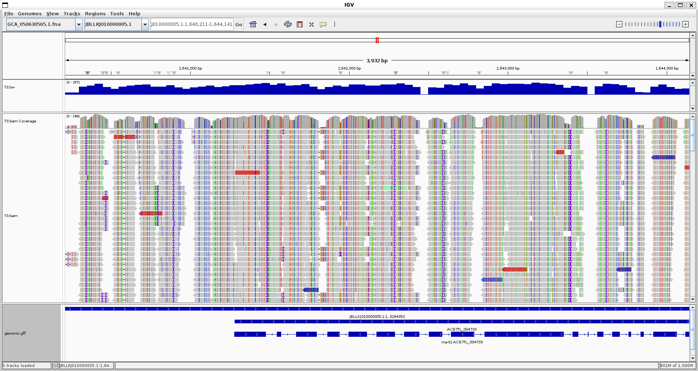
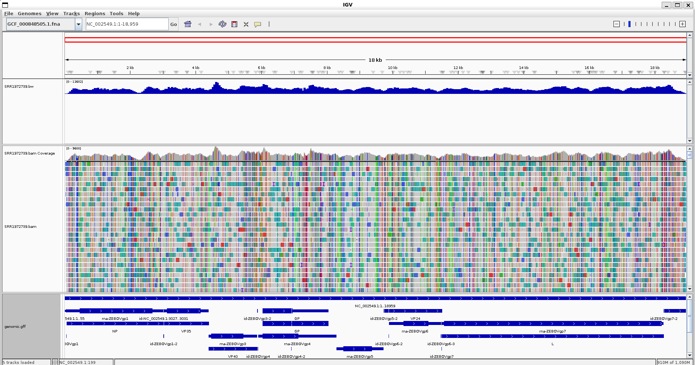

# REPORT 6

## BEFORE WE START
- [x] Create a Makefile that aligns reads to a reference and generates a BAM alignment file (reuse Week 6 work if applicable)
- [x] Ensure the Makefile is generic and parameterised (no hardcoded SRR or file names)
- [x] Allow execution via parameters, e.g. `make fastq SRR=SRR1972739`
- [x] Extend the Makefile to generate bigWig (wiggle) coverage tracks
- [x] Use a second sequencing run for the same organism (Week 5 dataset or new SRR)
- [x] Demonstrate Makefile execution for original dataset (SRR1972739)
- [x] Demonstrate Makefile execution for second dataset (different instrument)


## Added feature:
+ Ability to use your own data 
+ Ability to generate bigWig
+ Ability to specify threads count
+ Convert to bam directly without via sam (save disk space)
+ Add progress bar for alignment
+ Ability to run with ONT data

## Things done:
+ Executed on a new organism (my own data)
+ Executed on another ebola strain
+ Executed on original dataset

- [x] Upload the project to a GitHub repository
- [x] Include a README.md report with workflow description and Makefile usage
This one
- [x] Include evidence of BAM generation for both datasets

### Evidence Trametes 

To run, we will use 

``` make build REFSEQ_ID=GCA_050630565.1 SRR_ID=T3 USE_SRA=no THREADS=8```

```
[M::mem_pestat] low and high boundaries for proper pairs: (1, 23034)
[M::mem_pestat] analyzing insert size distribution for orientation FR...
[M::mem_pestat] (25, 50, 75) percentile: (403, 468, 542)
[M::mem_pestat] low and high boundaries for computing mean and std.dev: (125, 820)
[M::mem_pestat] mean and std.dev: (473.64, 105.07)
[M::mem_pestat] low and high boundaries for proper pairs: (1, 959)
[M::mem_pestat] analyzing insert size distribution for orientation RF...
[M::mem_pestat] (25, 50, 75) percentile: (1925, 3376, 4800)
[M::mem_pestat] low and high boundaries for computing mean and std.dev: (1, 10550)
[M::mem_pestat] mean and std.dev: (3533.42, 2274.61)
[M::mem_pestat] low and high boundaries for proper pairs: (1, 13425)
[M::mem_pestat] analyzing insert size distribution for orientation RR...
[M::mem_pestat] (25, 50, 75) percentile: (754, 1613, 6965)
[M::mem_pestat] low and high boundaries for computing mean and std.dev: (1, 19387)
[M::mem_pestat] mean and std.dev: (3250.79, 3272.56)
[M::mem_pestat] low and high boundaries for proper pairs: (1, 25598)
[M::mem_pestat] skip orientation FF
[M::mem_pestat] skip orientation RF
[M::mem_pestat] skip orientation RR
[M::mem_process_seqs] Processed 310156 reads in 494.726 CPU sec, 65.991 real sec
[main] Version: 0.7.19-r1273
[main] CMD: bwa mem -t 8 reference/GCA_050630565.1.fna reads/T3_1.fastq reads/T3_2.fastq
[main] Real time: 11176.902 sec; CPU: 77611.965 sec
[bam_sort_core] merging from 2 files and 8 in-memory blocks...
```
and

```
 cat *.txt

**********************************************
Stats for BAM file(s):
**********************************************

Total reads:       44623013
Mapped reads:      29176585     (65.3846%)
Forward strand:    28721905     (64.3657%)
Reverse strand:    15901108     (35.6343%)
Failed QC:         0    (0%)
Duplicates:        0    (0%)
Paired-end reads:  44623013     (100%)
'Proper-pairs':    25937002     (58.1247%)
Both pairs mapped: 26556715     (59.5135%)
Read 1:            22300868
Read 2:            22322145
Singletons:        2619870      (5.87112%)

44623013 + 0 in total (QC-passed reads + QC-failed reads)
44283722 + 0 primary
0 + 0 secondary
339291 + 0 supplementary
0 + 0 duplicates
0 + 0 primary duplicates
29176585 + 0 mapped (65.38% : N/A)
28837294 + 0 primary mapped (65.12% : N/A)
44283722 + 0 paired in sequencing
22141861 + 0 read1
22141861 + 0 read2
25772002 + 0 properly paired (58.20% : N/A)
26288574 + 0 with itself and mate mapped
2548720 + 0 singletons (5.76% : N/A)
391116 + 0 with mate mapped to a different chr
116991 + 0 with mate mapped to a different chr (mapQ>=5)
```

## Evidence Ebola_1:

To run we will use 

``` make build USE_SRA=yes``` as it was the original parameter. 

```
[M::process] read 792080 sequences (80000080 bp)...
[M::process] read 724594 sequences (73183994 bp)...
[M::mem_pestat] # candidate unique pairs for (FF, FR, RF, RR): (25792, 136002, 339, 17452)
[M::mem_pestat] analyzing insert size distribution for orientation FF...
[M::mem_pestat] (25, 50, 75) percentile: (70, 120, 193)
[M::mem_pestat] low and high boundaries for computing mean and std.dev: (1, 439)
[M::mem_pestat] mean and std.dev: (138.06, 85.70)
[M::mem_pestat] low and high boundaries for proper pairs: (1, 562)
[M::mem_pestat] analyzing insert size distribution for orientation FR...
[M::mem_pestat] (25, 50, 75) percentile: (111, 157, 232)
[M::mem_pestat] low and high boundaries for computing mean and std.dev: (1, 474)
[M::mem_pestat] mean and std.dev: (177.28, 88.66)
[M::mem_pestat] low and high boundaries for proper pairs: (1, 595)
[M::mem_pestat] analyzing insert size distribution for orientation RF...
[M::mem_pestat] (25, 50, 75) percentile: (50, 108, 269)
[M::mem_pestat] low and high boundaries for computing mean and std.dev: (1, 707)
[M::mem_pestat] mean and std.dev: (113.75, 102.00)
[M::mem_pestat] low and high boundaries for proper pairs: (1, 926)
[M::mem_pestat] analyzing insert size distribution for orientation RR...
[M::mem_pestat] (25, 50, 75) percentile: (63, 109, 178)
[M::mem_pestat] low and high boundaries for computing mean and std.dev: (1, 408)
[M::mem_pestat] mean and std.dev: (127.34, 81.79)
[M::mem_pestat] low and high boundaries for proper pairs: (1, 523)
[M::mem_pestat] skip orientation RF
[M::mem_process_seqs] Processed 792080 reads in 74.584 CPU sec, 11.041 real sec
```

```
**********************************************
Stats for BAM file(s):
**********************************************

Total reads:       1553851
Mapped reads:      803796       (51.7293%)
Forward strand:    1251435      (80.5376%)
Reverse strand:    302416       (19.4624%)
Failed QC:         0    (0%)
Duplicates:        0    (0%)
Paired-end reads:  1553851      (100%)
'Proper-pairs':    757501       (48.7499%)
Both pairs mapped: 761618       (49.0149%)
Read 1:            777361
Read 2:            776490
Singletons:        42178        (2.71442%)

cat: reads: Is a directory
cat: reference: Is a directory
1553851 + 0 in total (QC-passed reads + QC-failed reads)
1516674 + 0 primary
0 + 0 secondary
37177 + 0 supplementary
0 + 0 duplicates
0 + 0 primary duplicates
803796 + 0 mapped (51.73% : N/A)
766619 + 0 primary mapped (50.55% : N/A)
1516674 + 0 paired in sequencing
758337 + 0 read1
758337 + 0 read2
721780 + 0 properly paired (47.59% : N/A)
725446 + 0 with itself and mate mapped
41173 + 0 singletons (2.71% : N/A)
0 + 0 with mate mapped to a different chr
0 + 0 with mate mapped to a different chr (mapQ>=5)
```


## Evidence Ebola_2

To run we will use

```make build_ONT USE_SRA=yes SRR_ID=SRR8959866```

```
**********************************************
Stats for BAM file(s):
**********************************************

Total reads:       1205102
Mapped reads:      1043949      (86.6274%)
Forward strand:    677810       (56.245%)
Reverse strand:    527292       (43.755%)
Failed QC:         0    (0%)
Duplicates:        0    (0%)
Paired-end reads:  0    (0%)

cat: reads: Is a directory
cat: reference: Is a directory
1205102 + 0 in total (QC-passed reads + QC-failed reads)
1122688 + 0 primary
40 + 0 secondary
82374 + 0 supplementary
0 + 0 duplicates
0 + 0 primary duplicates
1043949 + 0 mapped (86.63% : N/A)
961535 + 0 primary mapped (85.65% : N/A)
0 + 0 paired in sequencing
0 + 0 read1
0 + 0 read2
0 + 0 properly paired (N/A : N/A)
0 + 0 with itself and mate mapped
0 + 0 singletons (N/A : N/A)
0 + 0 with mate mapped to a different chr
0 + 0 with mate mapped to a different chr (mapQ>=5)
(bioinfo)
```

Aligned actually pretty well 

- [x] Include IGV screenshots showing:
  - [x] GFF annotations
  - [x] BAM alignments
  - [x] bigWig / wiggle coverage tracks

### TRAMETES


### EBOLA_1


### EBOLA_2

(A lot of noise!)

## Analysis Questions

- [x] Briefly describe differences between the alignments in both BAM files

Illumina has a more well randomly distributed alignments while ONT has some peaks of coverage

ONT has a lot of noise which is typical of long reads which is more adept at detecting large structural variation 

ONT has very blocky reads

- [x] Briefly compare BAM statistics between the two datasets

ONT + minimap2 overal seem to have better alignments

```
1205102 + 0 in total (QC-passed reads + QC-failed reads)
1122688 + 0 primary
40 + 0 secondary
82374 + 0 supplementary
0 + 0 duplicates
0 + 0 primary duplicates
1043949 + 0 mapped (86.63% : N/A)
961535 + 0 primary mapped (85.65% : N/A)
```

Illumina seem to have a lower mapped rate but has no secondary alignments which ONT has 40 of 
```
Total reads:       1553851
Mapped reads:      803796       (51.7293%)
Forward strand:    1251435      (80.5376%)
Reverse strand:    302416       (19.4624%)
Failed QC:         0    (0%)
Duplicates:        0    (0%)
Paired-end reads:  1553851      (100%)
'Proper-pairs':    757501       (48.7499%)
Both pairs mapped: 761618       (49.0149%)
Read 1:            777361
Read 2:            776490
Singletons:        42178        (2.71442%)

cat: reads: Is a directory
cat: reference: Is a directory
1553851 + 0 in total (QC-passed reads + QC-failed reads)
1516674 + 0 primary
0 + 0 secondary
37177 + 0 supplementary
0 + 0 duplicates
0 + 0 primary duplicates
803796 + 0 mapped (51.73% : N/A)
766619 + 0 primary mapped (50.55% : N/A)
```

- [x] Count primary alignments in each BAM file 

Done above

- [x] Identify coordinate with highest coverage (samtools depth)

```
samtools depth alignment/SRR8959866_ONT.bam | sort -k3,3nr | head -n 1
NC_002549.1     8949    130087
```
```
samtools depth alignment/SRR1972739.bam | sort -k3,3nr | head -n 1
NC_002549.1     4609    9600
```
Both have the highest depth at the same region

- [x] Select a gene of interest and count forward-strand alignments covering it

Using ```$ cat reference/ncbi_dataset/data/GCF_000848505.1/genomic.gff | grep "polymerase"```

We can grab the RNA dependent RNA polymerase and then we can find it in our BAMs

```
NC_002549.1     RefSeq  CDS     11581   18219   .       +       0       ID=cds-NP_066251.1;Parent=rna-ZEBOVgp7;Dbxref=GenBank:NP_066251.1,GeneID:911824;Name=NP_066251.1;gbkey=CDS;gene=L;locus_tag=ZEBOVgp7;product=RNA-dependent RNA polymerase;protein_id=NP_066251.1
```

Illumina

```
samtools view -c -F 16 alignment/SRR1972739.bam NC_002549.1:11581-18219
195649
```

ONT

```
 samtools view -c -F 16 alignment/SRR8959866_ONT.bam NC_002549.1:11581-18219
96115
```

recall that ```-F``` means not include and ```16``` is the reverse strand 

from here
```
 samtools flags
About: Convert between textual and numeric flag representation
Usage: samtools flags FLAGS...

Each FLAGS argument is either an INT (in decimal/hexadecimal/octal) representing
a combination of the following numeric flag values, or a comma-separated string
NAME,...,NAME representing a combination of the following flag names:

   0x1     1  PAIRED         paired-end / multiple-segment sequencing technology
   0x2     2  PROPER_PAIR    each segment properly aligned according to aligner
   0x4     4  UNMAP          segment unmapped
   0x8     8  MUNMAP         next segment in the template unmapped
  0x10    16  REVERSE        SEQ is reverse complemented
  0x20    32  MREVERSE       SEQ of next segment in template is rev.complemented
  0x40    64  READ1          the first segment in the template
  0x80   128  READ2          the last segment in the template
 0x100   256  SECONDARY      secondary alignment
 0x200   512  QCFAIL         not passing quality controls or other filters
 0x400  1024  DUP            PCR or optical duplicate
 0x800  2048  SUPPLEMENTARY  supplementary alignment
(bioinfo)
```