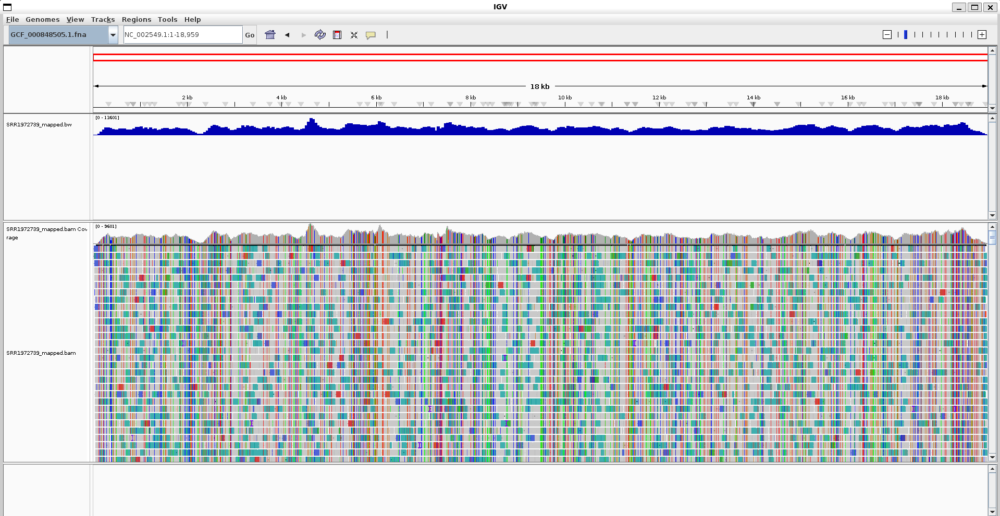

# RE: ABOUT BAM FILES

## WHAT INFORMATION DOES BAM FILES STORE?

```
BAM files store alignment information that includes:

Read names, aligned regions of the sequences and their quality scores
Alignment positions on the reference genome
Mapping quality scores indicating alignment confidence
SAM flags that encode alignment properties (strand, pairing, etc.)
CIGAR strings describing how reads align to the reference
```

Using ```samtools flags```

```
$ samtools flags
About: Convert between textual and numeric flag representation
Usage: samtools flags FLAGS...

Each FLAGS argument is either an INT (in decimal/hexadecimal/octal) representing
a combination of the following numeric flag values, or a comma-separated string
NAME,...,NAME representing a combination of the following flag names:

   0x1     1  PAIRED         paired-end / multiple-segment sequencing technology
   0x2     2  PROPER_PAIR    each segment properly aligned according to aligner
   0x4     4  UNMAP          segment unmapped
   0x8     8  MUNMAP         next segment in the template unmapped
  0x10    16  REVERSE        SEQ is reverse complemented
  0x20    32  MREVERSE       SEQ of next segment in template is rev.complemented
  0x40    64  READ1          the first segment in the template
  0x80   128  READ2          the last segment in the template
 0x100   256  SECONDARY      secondary alignment
 0x200   512  QCFAIL         not passing quality controls or other filters
 0x400  1024  DUP            PCR or optical duplicate
 0x800  2048  SUPPLEMENTARY  supplementary alignment
(bioinfo)
```

Let's use our new found knowledge to interpret our previous results!

```
$ samtools flagstats alignment/SRR1972883.bam
9481053 + 0 in total (QC-passed reads + QC-failed reads)
9480994 + 0 primary
0 + 0 secondary
59 + 0 supplementary
0 + 0 duplicates
0 + 0 primary duplicates
2179 + 0 mapped (0.02% : N/A)
2120 + 0 primary mapped (0.02% : N/A)
9480994 + 0 paired in sequencing
4740497 + 0 read1
4740497 + 0 read2
234 + 0 properly paired (0.00% : N/A)
1218 + 0 with itself and mate mapped
902 + 0 singletons (0.01% : N/A)
92 + 0 with mate mapped to a different chr
4 + 0 with mate mapped to a different chr (mapQ>=5)
(bioinfo)
``` 
Mapped percentage of 0.02%!!!!. It could be that we mapped it to the wrong genome somehow. Let's try fixing the makefile. 

As it turns out, we did not. What we used was a CDS reference. That's why it did not map very well. 

```
$ grep ">" GCF_000848505.1.fna
>lcl|NC_002549.1_cds_NP_066243.1_1 [gene=NP] [locus_tag=ZEBOVgp1] [db_xref=GeneID:911830] [protein=nucleoprotein] [protein_id=NP_066243.1] [location=470..2689] [gbkey=CDS]
>lcl|NC_002549.1_cds_NP_066244.1_2 [gene=VP35] [locus_tag=ZEBOVgp2] [db_xref=GeneID:911827] [protein=polymerase complex protein] [protein_id=NP_066244.1] [location=3129..4151] [gbkey=CDS]
>lcl|NC_002549.1_cds_NP_066245.1_3 [gene=VP40] [locus_tag=ZEBOVgp3] [db_xref=GeneID:911825] [protein=matrix protein] [protein_id=NP_066245.1] [location=4479..5459] [gbkey=CDS]
>lcl|NC_002549.1_cds_NP_066246.1_4 [gene=GP] [locus_tag=ZEBOVgp4] [db_xref=GeneID:911829] [protein=spike glycoprotein] [exception=RNA editing] [protein_id=NP_066246.1] [location=join(6039..6923,6923..8068)] [gbkey=CDS]
>lcl|NC_002549.1_cds_NP_066247.1_5 [gene=GP] [locus_tag=ZEBOVgp4] [db_xref=GeneID:911829] [protein=small secreted glycoprotein] [protein_id=NP_066247.1] [location=6039..7133] [gbkey=CDS]
>lcl|NC_002549.1_cds_NP_066248.1_6 [gene=GP] [locus_tag=ZEBOVgp4] [db_xref=GeneID:911829] [protein=second secreted glycoprotein] [exception=RNA editing] [protein_id=NP_066248.1] [location=join(6039..6922,6924..6933)] [gbkey=CDS]
>lcl|NC_002549.1_cds_NP_066249.1_7 [gene=VP30] [locus_tag=ZEBOVgp5] [db_xref=GeneID:911826] [protein=minor nucleoprotein] [protein_id=NP_066249.1] [location=8509..9375] [gbkey=CDS]
>lcl|NC_002549.1_cds_NP_066250.1_8 [gene=VP24] [locus_tag=ZEBOVgp6] [db_xref=GeneID:911828] [protein=membrane-associated protein] [protein_id=NP_066250.1] [location=10345..11100] [gbkey=CDS]
>lcl|NC_002549.1_cds_NP_066251.1_9 [gene=L] [locus_tag=ZEBOVgp7] [db_xref=GeneID:911824] [protein=RNA-dependent RNA polymerase] [protein_id=NP_066251.1] [location=11581..18219] [gbkey=CDS]
(bioinfo)
```
New data with ```SRR1972739```

```
samtools flagstats alignment/SRR1972739.bam
1553844 + 0 in total (QC-passed reads + QC-failed reads)
1516674 + 0 primary
0 + 0 secondary
37170 + 0 supplementary
0 + 0 duplicates
0 + 0 primary duplicates
803612 + 0 mapped (51.72% : N/A)
766442 + 0 primary mapped (50.53% : N/A)
1516674 + 0 paired in sequencing
758337 + 0 read1
758337 + 0 read2
717768 + 0 properly paired (47.33% : N/A)
725094 + 0 with itself and mate mapped
41348 + 0 singletons (2.73% : N/A)
0 + 0 with mate mapped to a different chr
0 + 0 with mate mapped to a different chr (mapQ>=5)
```
Much better. 

Time to interpret. 

## INTERPRETING, FILTERING, SAMTOOLS

Using ```samtools idxstats alignment/SRR1972739.bam```
We get

```
NC_002549.1     18959   803612  41348
*       0       0       708884
(bioinfo)
```

We can also use these to view stats

```
# Count unmapped reads
samtools view -c -f 4 input.bam

# Count mapped reads (exclude unmapped)
samtools view -c -F 4 input.bam

# Count reads on reverse strand (mapped and reverse)
samtools view -c -F 4 -f 16 input.bam
```
or
```
# Forward strand reads (mapped, not reverse)
samtools view -c -F 4 -F 16 input.bam

# This is equivalent to:
samtools view -c -F 20 input.bam  # 4 + 16 = 20
```

or 
```
# Select uniquely mapped reads (quality ≥ 1 for BWA)
samtools view -c -q 1 input.bam

# Combine quality and flag filtering
samtools view -c -q 1 -F 4 input.bam
```

One of the most common practice is extracting a region

```
# Extract alignments from a region
samtools view -b input.bam chr1:1000-2000 > region.bam

# Index the extracted BAM file
samtools index region.bam
```

We can also remove unmapped reads or extract properly paired, seperate b strand, extract quality etc
```
# Keep only mapped reads
samtools view -b -F 4 input.bam > mapped.bam
samtools index mapped.bam
# Keep only properly paired reads
samtools view -b -f 2 input.bam > proper_pairs.bam
samtools index proper_pairs.bam
# Forward strand reads
samtools view -b -F 4 -F 16 input.bam > forward.bam
# Reverse strand reads  
samtools view -b -F 4 -f 16 input.bam > reverse.bam
# Mapped reads with quality ≥ 20
samtools view -b -F 4 -q 20 input.bam > high_quality.bam
samtools index high_quality.bam
```

Let's remove unmapped reads with our data
```samtools view -b -F 4 alignment/SRR1972739.bam > alignment/SRR1972739_mapped.bam
samtools index alignment/SRR1972739_mapped.bam
```
We get 
```
 samtools flagstats alignment/SRR1972739_mapped.bam
803612 + 0 in total (QC-passed reads + QC-failed reads)
766442 + 0 primary
0 + 0 secondary
37170 + 0 supplementary
0 + 0 duplicates
0 + 0 primary duplicates
803612 + 0 mapped (100.00% : N/A)
766442 + 0 primary mapped (100.00% : N/A)
766442 + 0 paired in sequencing
401416 + 0 read1
365026 + 0 read2
717768 + 0 properly paired (93.65% : N/A)
725094 + 0 with itself and mate mapped
41348 + 0 singletons (5.39% : N/A)
0 + 0 with mate mapped to a different chr
0 + 0 with mate mapped to a different chr (mapQ>=5)
(bioinfo)
```


Very clean

## Alignment types
```
Primary alignments: The best alignment for each read
Secondary alignments: Alternative alignments for reads that map to multiple locations
Supplementary alignments: Chimeric alignments where reads span multiple genomic regions
```

## COVERAGE

```
# Calculate coverage depth
samtools depth input.bam | head

# Find regions with highest coverage
samtools depth input.bam | sort -k3 -nr | head

# Calculate coverage for all positions (including zero coverage)
samtools depth -a input.bam | head
```

## EXAMPLE TEMPLATE (IN TEMPLATE FILE)

## MISC FROM HANDBOOK
Different tools may report slightly different statistics due to how they interpret ambiguous cases. This is normal and expected.

Some alignments may appear biologically impossible (e.g., both reads of a pair on the reverse strand). These could indicate:

Genomic rearrangements in your sample
Alignment artifacts
Real biological variation
Always consider the biological context when interpreting such results.

## FROM HANDBOOK (Working with BAM files)

### WHAT TOOLS DO YOU USE?

```samtools```, ```bamtools``` or ```picard```

### WHAT ARE FLAGS

```
-f flag includes only alignments where the bits match the bits in the flag
-F flag includes only alignments where the bits DO NOT match the bits in the flag.
```

It's best to remember this

```
   0x1     1  PAIRED         paired-end / multiple-segment sequencing technology
   0x2     2  PROPER_PAIR    each segment properly aligned according to aligner
   0x4     4  UNMAP          segment unmapped
   0x8     8  MUNMAP         next segment in the template unmapped
  0x10    16  REVERSE        SEQ is reverse complemented
  0x20    32  MREVERSE       SEQ of next segment in template is rev.complemented
  0x40    64  READ1          the first segment in the template
  0x80   128  READ2          the last segment in the template
 0x100   256  SECONDARY      secondary alignment
 0x200   512  QCFAIL         not passing quality controls or other filters
 0x400  1024  DUP            PCR or optical duplicate
 0x800  2048  SUPPLEMENTARY  supplementary alignment
 ```

 ```4``` means UNMAPPED

 ```-c``` means count. Let's count unmapped in our files!

 ```
 $ samtools view -f 4 SRR1972739_mapped.bam
(bioinfo)
$ samtools view -f 4 SRR1972739.bam | head
SRR1972739.113684       69      NC_002549.1     112     0       *       =       112     0       AAAGAATATGAACAACCGAACAAGACATATGTCTTAGCAGTTACCACGAAAGGCTAAAGGGATCGTGATTCTCACTTGTGTAAACTTTATTGTTGAGGTCT      #####################################################################################################      MC:Z:101M       MQ:i:60 AS:i:0  XS:i:0
SRR1972739.250803       133     NC_002549.1     112     0       *       =       112     0       CAGCCACCGCATCACAAGTTCCGCGATGAACACAGCAGGGCGACCCTACAACATAAAAAGCACCGCCTTAAATTAAGCACGGTAGTGCAACAAACTTTTAC      #####################################################################################################      MC:Z:101M       MQ:i:60 AS:i:0  XS:i:0
...
```
Our files which removed the unmapped reads worked! 

```
$ samtools view -c -f  4 SRR1972739_mapped.bam
0
(bioinfo)
$ samtools view -c -f  4 SRR1972739.bam
750232
(bioinfo)
```

### INTERPRETING A SAMTOOLS COMMAND

```samtools view -F 20 -b SRR1972739.bwa.bam > selected.bam && samtools index selected.bam```
```-F``` = does not include
```20``` = 16 + 4 = UNMAPPED(4) + REVERSE(16)

```samtools view -F 4 -f 16 -b SRR1972739.bwa.bam > selected.bam && samtools index selected.bam```
```-F``` = does not include 
```4``` = UNMAPEPD
```-f``` = includes
```16``` = reverse

All in all,  select alignments on the reverse strand we would filter out UNMAP(4) but select for REVERSE (14):

```-b``` = produce a splice. 

NOTE: ```bamtools``` and ```samtools``` will give different results. 

There are many funny situation. A read being unmapped but on a reverse strand

```
# Alignments that are not mapped to a location
samtools view -c -f 4  SRR1972739.bwa.bam
# 5461

Alignments that are mapped to a location.
samtools view -c -F 4  SRR1972739.bwa.bam
# 15279

# Reads that align to reverse strand.
samtools view -c -F 4 -f 16  SRR1972739.bwa.bam
# 6343

# Alignments to forward strand.
samtools view -c -F 4 -F 16  SRR1972739.bwa.bam
# 8936

# Alignments that are unmapped and on the reverse strand!   Say what?
samtools view -c -f 4 -f 16  SRR1972739.bwa.bam
4
```

```
# Select alignments for reads that are second in pair if they map to the forward strand.
samtools view -b -F 20 -f 128 data.bam > fwd1.bam

# Select alignments for reads that are the first in pair if they map to the reverse strand.
samtools view -b -F 4 -f 80 data.bam > fwd2.bam
```

```
# Unique alignments, mapped, paired, proper pair, both reads 
# in a pair align to the reverse strand.
samtools view -c -q 1 -F 4 -f 51 SRR1972739.bwa.bam
# 124
```

Real biological variation can lead to this btw!

```
# Select uniquely mapped reads when these were aligned with BWA.
samtools view -c -q 1 SRR1972739.bwa.bam
# 15279
```

What does the ```-q``` flag do? 

q = quality. Quality threshold.


Since there is no flag for primary alignment,we just have to remove supplement and secondary alignments. 

## SO YOU WANT TO FILTER YOUR BAM