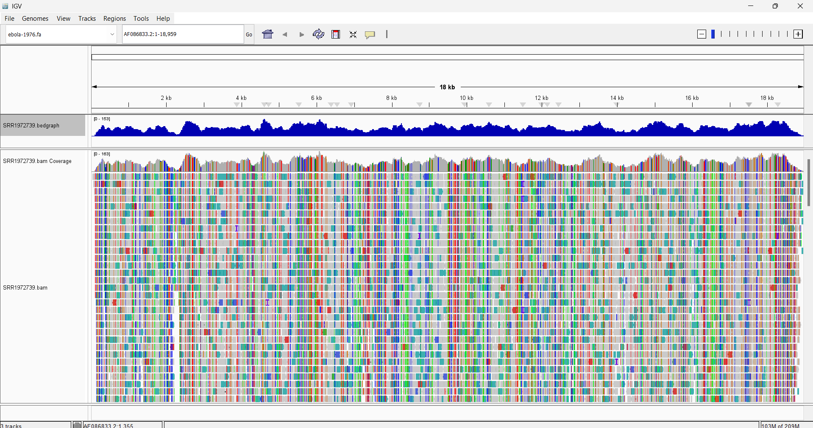
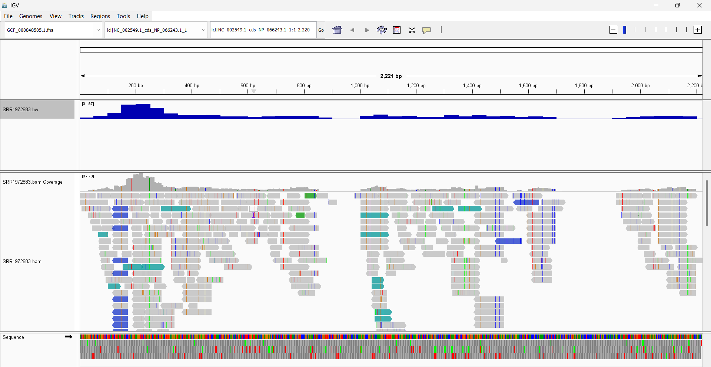

# THE WIGGLE FORMAT
## What is it?

```.wig``` is a format so that you can store genome coverage data. The binary version is called BigWig ```.bw```

The tool we will be using is ```bedGraphToBigWig```

The template for using will be 
```
# Generate the temporary bedgraph file.
LC_ALL=C; bedtools genomecov -ibam  ${BAM} -split -bg | \
    sort -k1,1 -k2,2n > ${BG}

# Convert the bedgraph file to bigwig.
bedGraphToBigWig ${BG} ${REF}.fai ${BW}
...
```
More in the template file

### BIOSTAR EXAMPLE 



This is what the report was asking when they say they want a coverage graph

### OUR ALIGNMENT FROM REPORT 5

using this template  
```
LC_ALL=C; bedtools genomecov -ibam  ${BAM} -split -bg | \
    sort -k1,1 -k2,2n > ${BG}

# Convert the bedgraph file to bigwig.
bedGraphToBigWig ${BG} ${REF}.fai ${BW}
``` 
we will use it for our own data
```alignment/SRR1972883.bam``` for the alignment and ```reference/GCF_000848505.1.fna``` and its index. 

code:
```
LC_ALL=C bedtools genomecov -ibam alignment/SRR1972883.bam -split -bg | \
  sort -k1,1 -k2,2n > SRR1972883.bedgraph

bedGraphToBigWig SRR1972883.bedgraph reference/GCF_000848505.1.fna.fai alignment/SRR1972883.bw
```
or using deeptools

```
micromamba run -n deep \
bamCoverage \
  -b alignment/SRR1972883.bam \
  -o alignment/SRR1972883.bw
```



Very cool