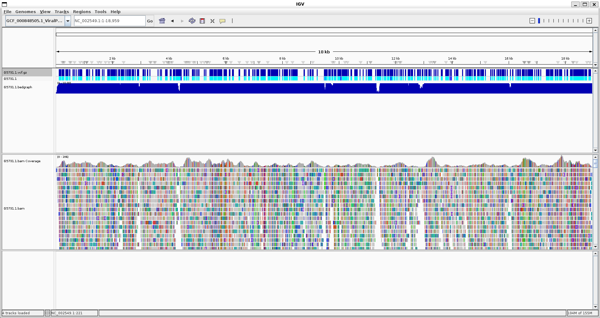
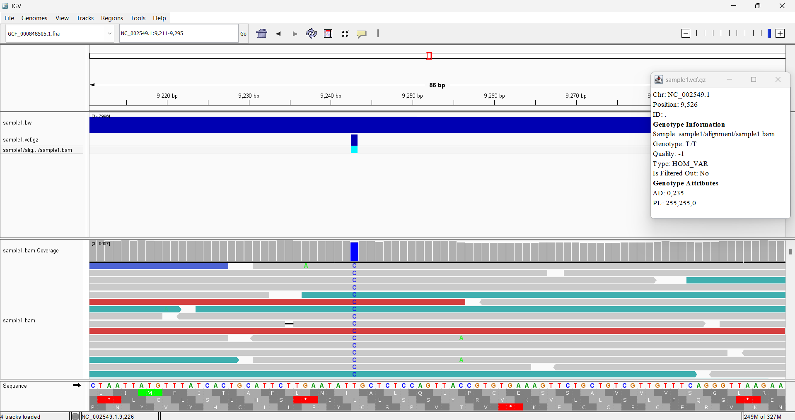
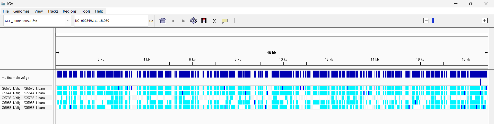

# Variant Calling and VCF

## HOW TO CALL VCFS

```variants.vcf.gz``` - this is the compressed format, always use it. REMEMBER USING ```BGZIP``` s

```variants.bcf``` - this is the binary format. Never use this.

```variants.vcf``` uncompressed. Use for debugging

Workflow: pileup --> call --> filter --> VCF

Pileup --> reads piling up and showing all the variant. 

Which tool to use? ```bcftools```, ```gatk```. 

Here is a run from using the bio/src/recipies make file 

```
##fileformat=VCFv4.2
##FILTER=<ID=PASS,Description="All filters passed">
##bcftoolsVersion=1.23.1+htslib-1.23.1
##bcftoolsCommand=mpileup -d 100 --annotate INFO/AD,FORMAT/DP,FORMAT/AD,FORMAT/ADF,FORMAT/ADR,FORMAT/SP -O u -f refs/Ebola.Mayinga.1976.fa bam/G5731.1.bam
##reference=file://refs/Ebola.Mayinga.1976.fa
##contig=<ID=NC_002549.1,length=18959>
##ALT=<ID=*,Description="Represents allele(s) other than observed.">
##INFO=<ID=INDEL,Number=0,Type=Flag,Description="Indicates that the variant is an INDEL.">
##INFO=<ID=IDV,Number=1,Type=Integer,Description="Maximum number of raw reads supporting an indel">
##INFO=<ID=IMF,Number=1,Type=Float,Description="Maximum fraction of raw reads supporting an indel">
##INFO=<ID=DP,Number=1,Type=Integer,Description="Raw read depth">
##INFO=<ID=VDB,Number=1,Type=Float,Description="Variant Distance Bias for filtering splice-site artefacts in RNA-seq data (bigger is better)",Version="3">
##INFO=<ID=RPBZ,Number=1,Type=Float,Description="Mann-Whitney U-z test of Read Position Bias (closer to 0 is better)">
##INFO=<ID=MQBZ,Number=1,Type=Float,Description="Mann-Whitney U-z test of Mapping Quality Bias (closer to 0 is better)">
##INFO=<ID=BQBZ,Number=1,Type=Float,Description="Mann-Whitney U-z test of Base Quality Bias (closer to 0 is better)">
##INFO=<ID=MQSBZ,Number=1,Type=Float,Description="Mann-Whitney U-z test of Mapping Quality vs Strand Bias (closer to 0 is better)">
##INFO=<ID=SCBZ,Number=1,Type=Float,Description="Mann-Whitney U-z test of Soft-Clip Length Bias (closer to 0 is better)">
##INFO=<ID=SGB,Number=1,Type=Float,Description="Segregation based metric, http://samtools.github.io/bcftools/rd-SegBias.pdf">
##INFO=<ID=MQ0F,Number=1,Type=Float,Description="Fraction of MQ0 reads (smaller is better)">
##FORMAT=<ID=PL,Number=G,Type=Integer,Description="List of Phred-scaled genotype likelihoods">
##FORMAT=<ID=DP,Number=1,Type=Integer,Description="Number of high-quality bases">
##FORMAT=<ID=SP,Number=1,Type=Integer,Description="Phred-scaled strand bias P-value">
##FORMAT=<ID=AD,Number=R,Type=Integer,Description="Allelic depths (high-quality bases)">
##FORMAT=<ID=ADF,Number=R,Type=Integer,Description="Allelic depths on the forward strand (high-quality bases)">
##FORMAT=<ID=ADR,Number=R,Type=Integer,Description="Allelic depths on the reverse strand (high-quality bases)">
##INFO=<ID=AD,Number=R,Type=Integer,Description="Total allelic depths (high-quality bases)">
##FORMAT=<ID=GT,Number=1,Type=String,Description="Genotype">
##FORMAT=<ID=GQ,Number=1,Type=Integer,Description="Phred-scaled Genotype Quality">
##INFO=<ID=AC,Number=A,Type=Integer,Description="Allele count in genotypes for each ALT allele, in the same order as listed">
##INFO=<ID=AN,Number=1,Type=Integer,Description="Total number of alleles in called genotypes">
##INFO=<ID=DP4,Number=4,Type=Integer,Description="Number of high-quality ref-forward , ref-reverse, alt-forward and alt-reverse bases">
##INFO=<ID=MQ,Number=1,Type=Integer,Description="Average mapping quality">
##bcftools_callVersion=1.23.1+htslib-1.23.1
##bcftools_callCommand=call --ploidy 2 --annotate FORMAT/GQ -mv -O u; Date=Sun May 17 02:38:55 2026
##bcftools_normVersion=1.23.1+htslib-1.23.1
##bcftools_normCommand=norm -f refs/Ebola.Mayinga.1976.fa -d all -O u; Date=Sun May 17 02:38:55 2026
#CHROM  POS     ID      REF     ALT     QUAL    FILTER  INFO    FORMAT  G5731.1
NC_002549.1     127     .       C       T       225.417 .       DP=16;AD=0,11;VDB=0.737713;SGB=-0.676189;MQSBZ=0.471405;MQ0F=0;AC=2;AN=2;DP4=0,0,9,2;MQ=58          GT:PL:DP:SP:ADF:ADR:AD:GQ       1/1:255,33,0:11:0:0,9:0,2:0,11:127
NC_002549.1     149     .       C       T       225.421 .       DP=21;AD=0,15;VDB=0.0228753;SGB=-0.689466;MQSBZ=0.57735;MQ0F=0;AC=2;AN=2;DP4=0,0,12,4;MQ=59 :
```
See that there are these columns ```#CHROM  POS     ID      REF     ALT     QUAL    FILTER  INFO    FORMAT  G5731.1```
The type of VCF is ```##fileformat=VCFv4.2```


```
CHROM: Chromosome name or ID where the variant is located.
POS: Position of the variant on the chromosome (1-based).
ID: Identifier for the variant (e.g., rsID from dbSNP) or '.' if unknown.
REF: Reference allele at the given position.
ALT: Alternate allele(s) observed instead of the reference.
QUAL: Quality score indicating confidence in the variant call.
FILTER: Status of variant after applying filters (e.g., "PASS" or filter names).
INFO: Additional variant annotations in a semi-colon-separated key-value format (e.g., allele frequency, depth).
FORMAT: Specifies the data fields included for each sample (e.g., GT for genotype).
SAMPLES: One or more columns with genotype and other sample-specific information (e.g., allele depth or genotype likelihood). These correspond to the fields defined by the FORMAT column.
```

Visualizing using igv



Using ```bcf``` tools you can use it to convert to tabular format

## TERMINOLOGIES THAT ARE UNLIKE THE WAY WE DEFINE THEM 

```ploidy```: number of possible alleles in a single cell

```haplotype```: group of alleles that may be inherited together

## MAKING SIMULATED VCF

```conda install dwgsim```

SNP - single nucleotide polymorphism with 1% frequency 

SNV - single nucleotide variant no minimum frequency

INDEL - insertions and deletions

SV - structural variants (large)

CNV - copy number variation

GERMINELINE VS SOMATIC

Variant calling is a difference of 
**SENSITIVITY** AND **SPECIFICITY**

Yuor eye is also a good variant caller


# ACTUAL REPORT

## Prerequisites

- [x] Completion of the previous assignment that generated BAM files from SRA reads for multiple samples
- [x] A working Makefile that processes 5-10 samples through alignment
- [x] Understanding of the VCF format (covered in lecture materials)

## Extend your existing Makefile to call variants on a single sample of your choice.

- [x] Use your existing BAM file as input
- [x] Generate a VCF file for this sample
- [x] Follow best practices for variant calling
- [x] Visualize the resulting VCF file data alongside the BAM file
- [x] In you markdown show how your Makefile should be used to call variants on a single sample.



Do the make file, have help and use the following instructions
```
> @echo "  toVCF          - convert BAM to VCF (Usage: make toVCF ALIGNMENT_BAM=path/to/alignment.bam REFSEQ_FASTA=path/to/reference.fasta)"
> @echo "  VCFindex		  - index VCF file"
```

## Call variants for all samples

- [x] Run the variant calling workflow for all samples using your design.csv file.
Using parallel we can use these command. 

```head -n 5 design.csv | parallel -j 4 --colsep ',' make -f Makefile_4.mk toVCF VCFindex SRR_ID={1} SAMPLE_NAME={2} USE_SRA=yes READ_CEILING=100000```

we get
```
ls -R G*
G5570.1:
alignment  reads  vcf

G5570.1/alignment:
G5570.1.bam  G5570.1.bam.bai  G5570.1.bw

G5570.1/reads:
SRR1972886.done  SRR1972886.done_fastqc.html  SRR1972886.done_fastqc.zip  SRR1972886_1.fastq.gz  SRR1972886_2.fastq.gz

G5570.1/vcf:
G5570.1.vcf.gz  G5570.1.vcf.gz.tbi

G5644.1:
alignment  reads  vcf

G5644.1/alignment:
G5644.1.bam  G5644.1.bam.bai  G5644.1.bw

G5644.1/reads:
SRR1972901.done  SRR1972901.done_fastqc.html  SRR1972901.done_fastqc.zip  SRR1972901_1.fastq.gz  SRR1972901_2.fastq.gz

G5644.1/vcf:
G5644.1.vcf.gz  G5644.1.vcf.gz.tbi

G5735.2:
alignment  reads  vcf

G5735.2/alignment:
G5735.2.bam  G5735.2.bam.bai  G5735.2.bw

G5735.2/reads:
SRR1972920.done  SRR1972920.done_fastqc.html  SRR1972920.done_fastqc.zip  SRR1972920_1.fastq.gz  SRR1972920_2.fastq.gz

G5735.2/vcf:
G5735.2.vcf.gz  G5735.2.vcf.gz.tbi

G5985.1:
alignment  reads  vcf

G5985.1/alignment:
G5985.1.bam  G5985.1.bam.bai  G5985.1.bw

G5985.1/reads:
SRR1972958.done  SRR1972958.done_fastqc.html  SRR1972958.done_fastqc.zip  SRR1972958_1.fastq.gz  SRR1972958_2.fastq.gz

G5985.1/vcf:
G5985.1.vcf.gz  G5985.1.vcf.gz.tbi

G5988.1:
alignment  reads  vcf

G5988.1/alignment:
G5988.1.bam  G5988.1.bam.bai  G5988.1.bw

G5988.1/reads:
SRR1972960.done  SRR1972960.done_fastqc.html  SRR1972960.done_fastqc.zip  SRR1972960_1.fastq.gz  SRR1972960_2.fastq.gz

G5988.1/vcf:
G5988.1.vcf.gz  G5988.1.vcf.gz.tbi
```
## Create a multisample VCF

- [x] Merge all individual sample VCF files into a single multisample VCF file (bcftools merge)
```
 bcftools merge \
    G5570.1/vcf/G5570.1.vcf.gz \
    G5644.1/vcf/G5644.1.vcf.gz \
    G5735.2/vcf/G5735.2.vcf.gz \
    G5985.1/vcf/G5985.1.vcf.gz \
    G5988.1/vcf/G5988.1.vcf.gz \
    -Oz -o multisample.vcf.gz
```

and then index ``` tabix -p vcf multisample.vcf.gz```
- [x] Visualize the multisample VCF in the context of the GFF annotation file.
- [x] If any samples show poor alignment or no variants, identify and replace them with better samples. Ensure you have sufficient genome coverage across all samples



Since we are using a ceiling. This result is kinda expected. I will try with my own data later probably I hope. 