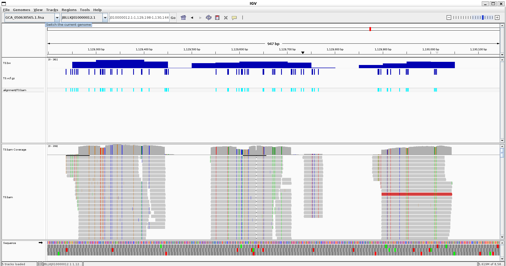
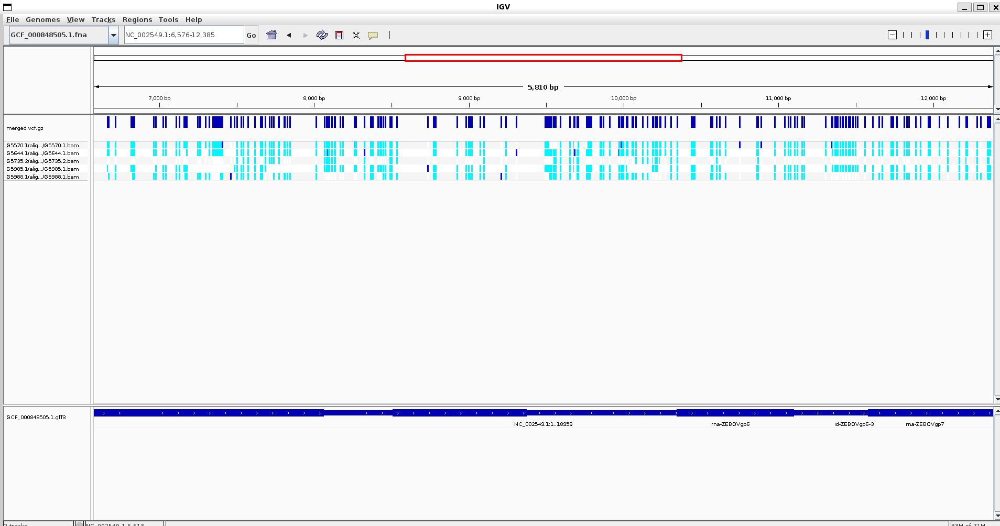
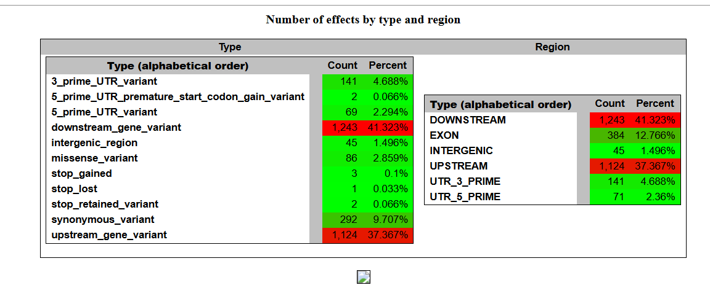
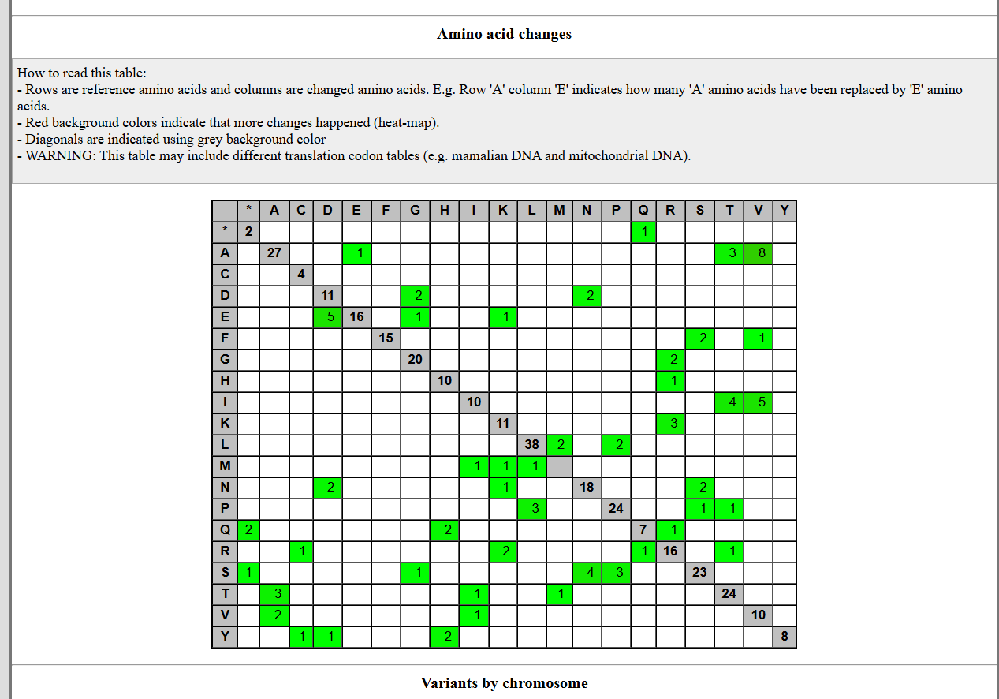

# VCF AND PREDICTION

## BEFORE WE START - TESTING PREVIOUS WEEK MAKEFILE

Since the orginal makefile_4.mk causes a lot of problems since it was designed to do entire full pipelines. We are going to create a new makefile that just do conversion to vcf



Let's redo the task from last week

```
Call variants for all samples
Run the variant calling workflow for all samples using your design.csv file.
Create a multisample VCF
Merge all individual sample VCF files into a single multisample VCF file (bcftools merge)
Visualize the multisample VCF in the context of the GFF annotation file.
```

Since we have 
```
$ ls -R G*/vcf
G5570.1/vcf:
G5570.1.vcf.gz  G5570.1.vcf.gz.tbi

G5644.1/vcf:
G5644.1.vcf.gz  G5644.1.vcf.gz.tbi

G5735.2/vcf:
G5735.2.vcf.gz  G5735.2.vcf.gz.tbi

G5985.1/vcf:
G5985.1.vcf.gz  G5985.1.vcf.gz.tbi

G5988.1/vcf:
G5988.1.vcf.gz  G5988.1.vcf.gz.tbi
```
We then use ```bcftools```

```
find G*/vcf -name "*.vcf.gz" > vcf.list
```

```bcftools merge \
    -l vcf.list \
    -Oz \
    -o merged.vcf.gz
```
Here is the final visualization image



## WEEK 10

Learning how to use ```VEP, SnpEff``` to well...predict stuff

### METHODS 

```SnpEff``` is an annotator and can also predict stuff. It also have many prebuilt libraries. You can also build stuff with the ```build``` command. 

Here is an example run of it using the bio code src makefile cookbook




As for ```VEP``` it is the (Ensemble) Variant effect predictor.

And how do predictors find these? Basically

- Correlate the location of the variant with genomic annotation (that's why we need GTF files during prediction)
- List transcripts affected by it
- Determine consequences
- Match with variatns and proof check

### WHAT IS A VARIANT EFFECT?
WHAT IS THE EFFECT OF A CHANGE? Basically.

People take human variation pretty seriously because we can make political statements about them (like eugenics, yikes)

**HGVS Nomeclature** -> Standard human nomeclature

Substitution: ```NM_004006.2:c.4375C>T``` at that accession number, in the coding sequence, position change from C to T
Deletion : ```NM_004006.2:c.4375del``` ... at that deletion

There are database with variations that can help you annotate your variants like "ClinVar" or "dbSNP" etc. 

VEP also have an online interface.

### ASSIGNMENT 

* [x] Write a Makefile.

We will do a continuation of last week's makefile

* [ ] Write a Markdown file.
* [ ] Reuse the Makefile developed for your previous assignment, which generated a VCF file.
* [ ] Load up and visualize the annotation file in GFF format.
* [ ] Evaluate the effects of at least 3 variants in your VCF file.
* [ ] Use a variant effect prediction tool like snpEff or VEP.
* [ ] If, for some reason, you can't make any of the variant effect prediction software work, use visual inspection via IGV instead to describe the effect of variants relative to a reference genome and the annotation file.
* [ ] Try to identify variants with different effects.
* [ ] Write a Markdown report that summarizes the process and your result.


