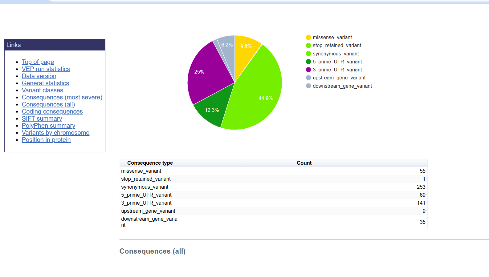
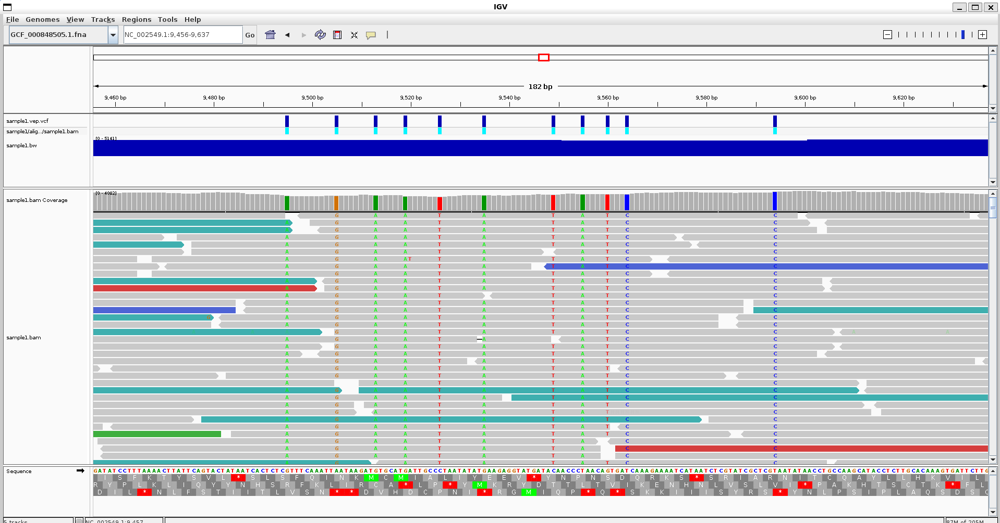
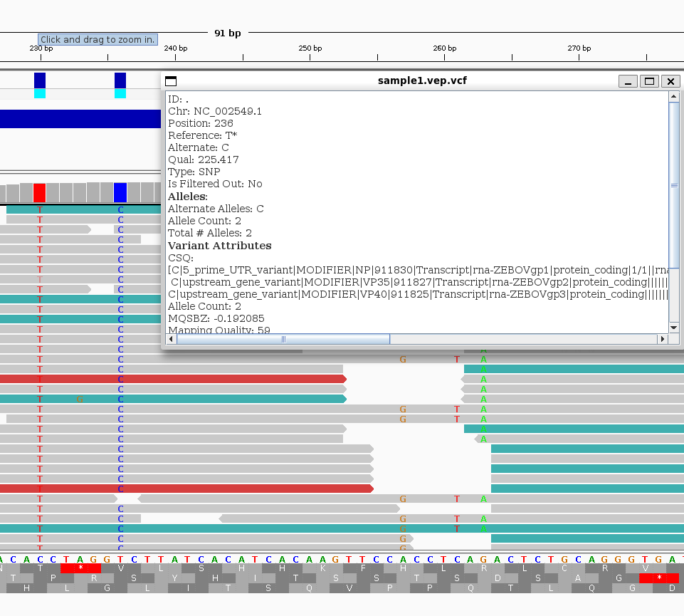
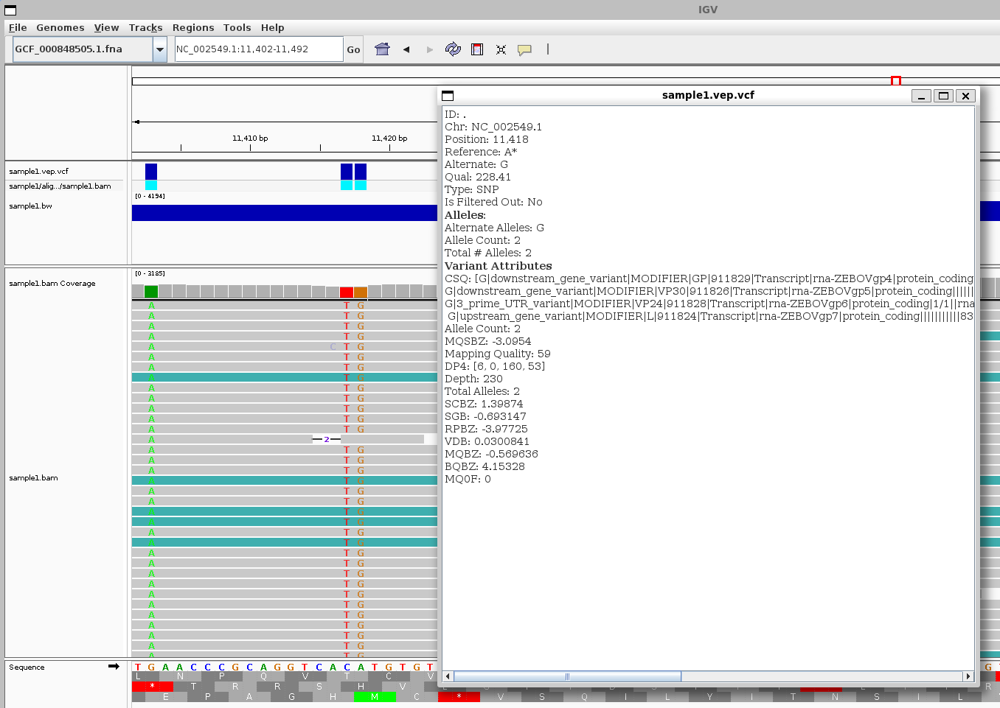
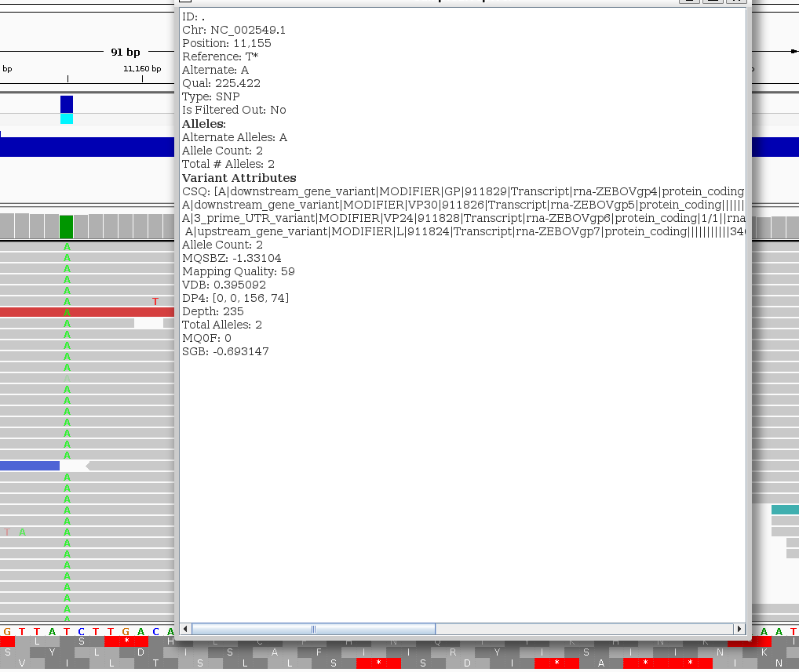

# VCF AND PREDICTION

## BEFORE WE START - TESTING PREVIOUS WEEK MAKEFILE

Since the orginal makefile_4.mk causes a lot of problems since it was designed to do entire full pipelines. We are going to create a new makefile that just do conversion to vcf


Let's redo the task from last week

```
Call variants for all samples
Run the variant calling workflow for all samples using your design.csv file.
Create a multisample VCF
Merge all individual sample VCF files into a single multisample VCF file (bcftools merge)
Visualize the multisample VCF in the context of the GFF annotation file.
```

Since we have 
```
$ ls -R G*/vcf
G5570.1/vcf:
G5570.1.vcf.gz  G5570.1.vcf.gz.tbi

G5644.1/vcf:
G5644.1.vcf.gz  G5644.1.vcf.gz.tbi

G5735.2/vcf:
G5735.2.vcf.gz  G5735.2.vcf.gz.tbi

G5985.1/vcf:
G5985.1.vcf.gz  G5985.1.vcf.gz.tbi

G5988.1/vcf:
G5988.1.vcf.gz  G5988.1.vcf.gz.tbi
```
We then use ```bcftools```

```
find G*/vcf -name "*.vcf.gz" > vcf.list
```

```bcftools merge \
    -l vcf.list \
    -Oz \
    -o merged.vcf.gz
```
Here is the final visualization image


## WEEK 10

Learning how to use ```VEP, SnpEff``` to well...predict stuff

### METHODS 

```SnpEff``` is an annotator and can also predict stuff. It also have many prebuilt libraries. You can also build stuff with the ```build``` command. 

Here is an example run of it using the bio code src makefile cookbook


As for ```VEP``` it is the (Ensemble) Variant effect predictor.

You can use using this template of command and tinker with your liking 
With the follow variables set

```
INPUT=/home/tristuowngf/week10/VEP_RUN/ebola/sample1/vcf/sample1.vcf.gz
OUTPUT=/home/tristuowngf/week10/VEP_RUN/ebola_output/sample1.vep.vcf
GFF=/home/tristuowngf/week10/VEP_RUN/gff/Ebola.Mayinga.1976.gff.gz
FASTA=/home/tristuowngf/week10/VEP_RUN/ebola/reference/GCF_000848505.1.fna
THREADS=4
```

```$ vep   -i $INPUT   -o $OUTPUT   --gff $GFF   --fasta $FASTA    --vcf   --everything   --verbose```

However we can not have the ```species``` if we also remove the ```cache```

Here is a run for the Ebola



Here is the command and run for the trametes sanguinea
```
INPUT=/home/tristuowngf/week10/VEP_RUN/trametes/T3.vcf.gz
OUTPUT=/home/tristuowngf/week10/VEP_RUN/trametes_output/T3.vep.vcf
GFF=/home/tristuowngf/week10/VEP_RUN/gff/Trametes.sanguinea.gff.gz
FASTA=/home/tristuowngf/week10/VEP_RUN/trametes/reference/GCA_050630565.1.fna
THREADS=4
 vep   -i $INPUT   -o $OUTPUT   --gff $GFF   --fasta $FASTA    --vcf   --everything   --verbose
```

And how do predictors find these? Basically

- Correlate the location of the variant with genomic annotation (that's why we need GTF files during prediction)
- List transcripts affected by it
- Determine consequences
- Match with variatns and proof check

### WHAT IS A VARIANT EFFECT?
WHAT IS THE EFFECT OF A CHANGE? Basically.

People take human variation pretty seriously because we can make political statements about them (like eugenics, yikes)

**HGVS Nomeclature** -> Standard human nomeclature

Substitution: ```NM_004006.2:c.4375C>T``` at that accession number, in the coding sequence, position change from C to T
Deletion : ```NM_004006.2:c.4375del``` ... at that deletion

There are database with variations that can help you annotate your variants like "ClinVar" or "dbSNP" etc. 

VEP also have an online interface.

### ASSIGNMENT 

* [x] Write a Makefile.

- [MAKEFILE](veper.mk)

* [x] Write a Markdown file.
This file

* [x] Reuse the Makefile developed for your previous assignment, which generated a VCF file.

* [x] Load up and visualize the annotation file in GFF format.



* [x] Evaluate the effects of at least 3 variants in your VCF file.
* [x] Use a variant effect prediction tool like snpEff or VEP.
* [x] If, for some reason, you can't make any of the variant effect prediction software work, use visual inspection via IGV instead to describe the effect of variants relative to a reference genome and the annotation file.
* [x] Try to identify variants with different effects.
* [x] Write a Markdown report that summarizes the process and your result.

### VARIANT 1



This is a type of upstream variant in the 5'UTR region. Possibly in the regulation of genes rather than changing any core amino acids
The variant have extremely high quality of "59" and also have depth of "245". 
This is a base substituation of 2 pyrimidines so the effect might not be very drastic. 

### VARIANT 2



This is almost the same as the previous ones, between purines A->Gs, in 3'UTR region, probably affect only regulation and not very drastic.

### VARIANT 3



This is almost the sameas variant 2 but this is wayyy rarer, changing from pyrimidine to pyrine T->A