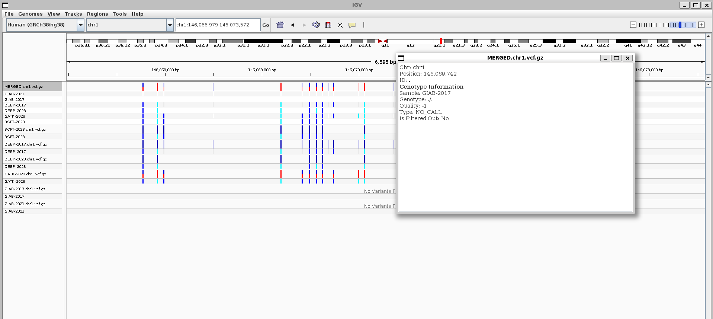
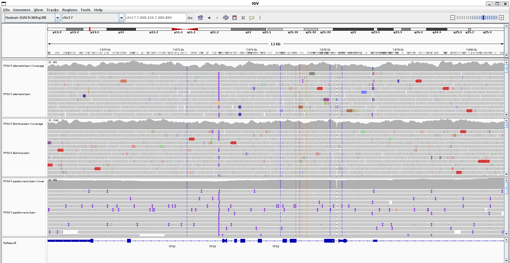

# GENOME IN A BOTTLE / CANCER IN A BOTTLE 

**GIAB** = genome in a bottle = constortium launched by NIST --> have "ground references"
*CIAB* is a an extension also by NIST. For bechmarking and validation

We will test GIAB first ```Index of /ReferenceSamples/giab/data_somatic/HG008```

## GENOME IN A BOTTLE - HG008

We can try out the code in the the course

## VARIANT CALL ACCURACY

How do we know if a variant is actually valid/accurate. Scientists think and scientists have consensus.

GIAB -> SNVs and also SNP

Ground truths aren't really ground truths since tools differ by only 1%. If truths have an error of 1% then comparisons are basically meaningless

We can compare vcfs using the handbook premade package 

```
$ make -f src/workflows/snpeval.mk
#
# Evaluate SNP calls
#
# TARGET = vcf/GIAB-2021.chr1.vcf.gz
# FLAGS  = -e vcf/GIAB-2021.bed
#
# Usage: make data index eval
#
(bioinfo)
```

```When evaluating variant calls, benchmarking tools typically only consider variants within high-confidence regions.```

-> When we pit tools against each others, we have to consider high confidence regions so that the most accurate comparisons can be made



GIAB are considered the gold standard in variation

We can categorize them into 

1. True positives
2. False positives
3. True negatives
4. False negatives (harder to detect because they don't even show up)

```Tools like hap.py and rtg vcfeval are designed to compare VCF files.```

We can compare them using 

```
rtg vcfeval -b GIAB-2021.chr1.vcf.gz   \
            -c GIAB-2017.chr1.vcf.gz   \
            -e GIAB-2021.bed           \
            -t hg38.sdf                \
            -o GIAB-2021-vs-GIAB-2017 
```

## HUMAN VARIANT CALLING (COMPLEMENT TO VARIANT CALL ACCURACY)

1. Reproducibility can be a hassle -> the bio tool can help with metadata

```bio search PRJNA436453```

```
[
    {
        "run_accession": "SRR6808334",
        "sample_accession": "SAMN08625123",
        "sample_alias": "NA12878",
        "sample_description": "NA12878 sample sequenced in Genomics Core Facility, University of Bergen, Norway",
        "first_public": "2018-03-10",
        "country": "",
        "scientific_name": "Homo sapiens",
        "fastq_bytes": "16063659821;21360749786",
        "base_count": "112815949383",
        "read_count": "379033340",
        "library_name": "NA12878",
        "library_strategy": "WGS",
        "library_source": "GENOMIC",
        "library_layout": "PAIRED",
        "instrument_platform": "ILLUMINA",
        "instrument_model": "Illumina HiSeq 4000",
        "study_title": "Analysis options for Next Generation Whole Genome Sequencing",
        "fastq_url": [
            "https://ftp.sra.ebi.ac.uk/vol1/fastq/SRR680/004/SRR6808334/SRR6808334_1.fastq.gz",
            "https://ftp.sra.ebi.ac.uk/vol1/fastq/SRR680/004/SRR6808334/SRR6808334_2.fastq.gz"
        ],
        "info": "16 GB, 21 GB files; 379.0 million reads; 112815.9 million sequenced bases"
    },
    {
        "run_accession": "SRR6794144",
        "sample_accession": "SAMN08625123",
        "sample_alias": "NA12878",
        "sample_description": "NA12878 sample sequenced in Genomics Core Facility, University of Bergen, Norway",
        "first_public": "2018-03-03",
        "country": "",
        "scientific_name": "Homo sapiens",
        "fastq_bytes": "29632274981;34204274461",
        "base_count": "112815949383",
        "read_count": "379033340",
        "library_name": "NA12878",
        "library_strategy": "WGS",
        "library_source": "GENOMIC",
        "library_layout": "PAIRED",
        "instrument_platform": "ILLUMINA",
        "instrument_model": "Illumina HiSeq 4000",
        "study_title": "Analysis options for Next Generation Whole Genome Sequencing",
        "fastq_url": [
            "https://ftp.sra.ebi.ac.uk/vol1/fastq/SRR679/004/SRR6794144/SRR6794144_1.fastq.gz",
            "https://ftp.sra.ebi.ac.uk/vol1/fastq/SRR679/004/SRR6794144/SRR6794144_2.fastq.gz"
        ],
        "info": "30 GB, 34 GB files; 379.0 million reads; 112815.9 million sequenced bases"
    }
]
(bioinfo)
```

# ASSIGNMENT

**Option 1: Compare BAM files across platforms**
- [x] Download BAM files for the same region from 2-3 different platforms

**Region**: `chr17:7,661,779-7,687,538` (TP53 gene body, ~26kb)

Source data browsed from the GIAB HG008 FTP tree:
`https://ftp-trace.ncbi.nlm.nih.gov/ReferenceSamples/giab/data_somatic/HG008/Liss_lab/`

| Platform | Read type | Source BAM (full genome size) |
|---|---|---|
| Illumina (NYGC) | short-read | `NYGC_Illumina-WGS_20231023/HG008-T_Illumina_161x_GRCh38-GIABv3.bam` (249G) |
| Element AVITI | short-read | `Element-AVITI-20241216/HG008-T_Element-StdInsert_111x_GRCh38-GIABv3.bam` (145G) |
| PacBio Revio | long-read (HiFi) | `PacBio_Revio_20240125/HG008-T_PacBio-HiFi-Revio_20240125_116x_GRCh38-GIABv3.bam` (110G) |

However, I did not download the entirety of the bam files, instead, I just use samtools to extract a small portion of it 

Using this template

```bash
samtools view -b "<BAM_URL>" chr17:7661779-7687538 > bam/TP53-T-<platform>.bam
samtools index bam/TP53-T-<platform>.bam
```

What samtools view -b basically do is that it will get only the specified coordinates since these are indexed bam files

we now have the files. The "T" in each samples is the fact that they are "tumors". Normal samples would be marked with "N" instead

```
$ ls -lah
total 3.6M
drwxr-xr-x  2 tristuowngf tristuowngf 4.0K Jul  6 04:59 .
drwxr-xr-x 11 tristuowngf tristuowngf 4.0K Jul  6 04:57 ..
-rw-r--r--  1 tristuowngf tristuowngf 818K Jul  6 04:17 TP53-T-element.bam
-rw-r--r--  1 tristuowngf tristuowngf 5.6K Jul  6 04:17 TP53-T-element.bam.bai
-rw-r--r--  1 tristuowngf tristuowngf 1.8M Jul  6 04:14 TP53-T-illumina.bam
-rw-r--r--  1 tristuowngf tristuowngf 5.6K Jul  6 04:14 TP53-T-illumina.bam.bai
-rw-r--r--  1 tristuowngf tristuowngf 1.1M Jul  6 04:48 TP53-T-pacbio-revio.bam
-rw-r--r--  1 tristuowngf tristuowngf 5.6K Jul  6 04:48 TP53-T-pacbio-revio.bam.bai
(igv)
```

```
 samtools flagstats TP53-T-element.bam
9066 + 0 in total (QC-passed reads + QC-failed reads)
9050 + 0 primary
0 + 0 secondary
16 + 0 supplementary
0 + 0 duplicates
0 + 0 primary duplicates
9059 + 0 mapped (99.92% : N/A)
9043 + 0 primary mapped (99.92% : N/A)
9050 + 0 paired in sequencing
4527 + 0 read1
4523 + 0 read2
8968 + 0 properly paired (99.09% : N/A)
9036 + 0 with itself and mate mapped
7 + 0 singletons (0.08% : N/A)
61 + 0 with mate mapped to a different chr
58 + 0 with mate mapped to a different chr (mapQ>=5)
(bioinfo)
```

```
$ samtools flagstats TP53-T-illumina.bam
19222 + 0 in total (QC-passed reads + QC-failed reads)
19144 + 0 primary
0 + 0 secondary
78 + 0 supplementary
3528 + 0 duplicates
3528 + 0 primary duplicates
19166 + 0 mapped (99.71% : N/A)
19088 + 0 primary mapped (99.71% : N/A)
19144 + 0 paired in sequencing
9599 + 0 read1
9545 + 0 read2
18948 + 0 properly paired (98.98% : N/A)
19032 + 0 with itself and mate mapped
56 + 0 singletons (0.29% : N/A)
79 + 0 with mate mapped to a different chr
60 + 0 with mate mapped to a different chr (mapQ>=5)
(bioinfo)
```

```
tristuowngf@DESKTOP-OGB28J5 ~/week10/week11/GIAB/task1
$ samtools flagstats TP53-T-pacbio-revio.bam
120 + 0 in total (QC-passed reads + QC-failed reads)
120 + 0 primary
0 + 0 secondary
0 + 0 supplementary
0 + 0 duplicates
0 + 0 primary duplicates
120 + 0 mapped (100.00% : N/A)
120 + 0 primary mapped (100.00% : N/A)
0 + 0 paired in sequencing
0 + 0 read1
0 + 0 read2
0 + 0 properly paired (N/A : N/A)
0 + 0 with itself and mate mapped
0 + 0 singletons (N/A : N/A)
0 + 0 with mate mapped to a different chr
0 + 0 with mate mapped to a different chr (mapQ>=5)
(bioinfo)
```

- [x] Compare alignment statistics (read depth, mapping quality, coverage uniformity)

What is of note: pacbio only requires 120 reads to cover this 20kb region with no duplicates -> unsurprising for a long read sequencing method 
Illumina being short read requires a lot more read and also have a lot of duplicates / non-primary alignments

- [x] Visualize alignments in IGV and document platform-specific differences

Since we are using HG38 and extracted from chr17 we have these visualizations

- [x] Deliverable: Report with alignment quality metrics and visualizations



In this image you can compare the read lenghts between each sequencing method and can clearly see that PacBio long read has longer reads and require less read to map the entire thing

**Option 2: Produce and evaluate variant calls**
- [x] Call variants for normal and tumor samples in a region of interest

We would now have to download the normal bam of these. Noting that  ```REGION="chr17:7661779-7687538"```

First we have to download normal and tumor samples using the same command but replace the URLs

```
-rw-r--r--  1 tristuowngf tristuowngf 8.9M Jul  6 05:47 HG008-N-D_Element-StdInsert_77x_GRCh38-GIABv3.bam.bai
-rw-r--r--  1 tristuowngf tristuowngf 9.2M Jul  6 05:48 HG008-N-D_Illumina_118x_GRCh38-GIABv3.bam.bai
-rw-r--r--  1 tristuowngf tristuowngf  12M Jul  6 05:49 HG008-N-P_PacBio-HiFi-Revio_20240125_35x_GRCh38-GIABv3.bam.bai
-rw-r--r--  1 tristuowngf tristuowngf 1.2M Jul  6 05:47 TP53-N-element.bam
-rw-r--r--  1 tristuowngf tristuowngf 5.6K Jul  6 05:47 TP53-N-element.bam.bai
-rw-r--r--  1 tristuowngf tristuowngf 2.7M Jul  6 05:48 TP53-N-illumina.bam
-rw-r--r--  1 tristuowngf tristuowngf 5.6K Jul  6 05:48 TP53-N-illumina.bam.bai
-rw-r--r--  1 tristuowngf tristuowngf 702K Jul  6 05:49 TP53-N-pacbio-revio.bam
-rw-r--r--  1 tristuowngf tristuowngf 5.7K Jul  6 05:49 TP53-N-pacbio-revio.bam.bai
-rw-r--r--  1 tristuowngf tristuowngf 818K Jul  6 04:17 TP53-T-element.bam
-rw-r--r--  1 tristuowngf tristuowngf 5.6K Jul  6 04:17 TP53-T-element.bam.bai
-rw-r--r--  1 tristuowngf tristuowngf    0 Jul  6 05:06 TP53-T-element.bam.fai
-rw-r--r--  1 tristuowngf tristuowngf 1.8M Jul  6 04:14 TP53-T-illumina.bam
-rw-r--r--  1 tristuowngf tristuowngf 5.6K Jul  6 04:14 TP53-T-illumina.bam.bai
-rw-r--r--  1 tristuowngf tristuowngf 1.1M Jul  6 04:48 TP53-T-pacbio-revio.bam
-rw-r--r--  1 tristuowngf tristuowngf 5.6K Jul  6 04:48 TP53-T-pacbio-revio.bam.bai
```

and then we will have to call variants using bcftools 

We can use parallel exactly for this

```
parallel --lb -j4 \
  "make -f ../src/run/bcftools.mk REF=${REF} BAM=TP53-{1}-{2}.bam VCF=vcf/TP53-{1}-{2}.vcf.gz run" \
  ::: N T ::: element illumina pacbio-revio
```
Parallel will put N/T into the {1} and illumina,pacbio,revio into the  {2} field

(Thank you conventional naming)

- [x] Compare variant calls between samples and identify tumor-specific variants
- [x] Compare results to the gold standard DeepVariant calls (if available)

To do the 2 above tasks we have to download the DeepVarant calls 
- [x]  Deliverable: Report with variant counts, tumor-specific variants, and comparison to gold standard

```bcftool isec``` can help us differentiate between variants that is shared, tumor only or normal only. 

We have gold standards

```
 mkdir -p gold
export REGION="chr17:7661779-7687538"

bcftools view -r ${REGION} \
  "https://ftp-trace.ncbi.nlm.nih.gov/ReferenceSamples/giab/data_somatic/HG008/Liss_lab/analysis/Ultima_DeepVariant-somatic-SNV-INDEL_20240822/HG008_edv_AF_recalibration.result.PASS.vcf.gz" \
  -Oz -o gold/TP53-gold-deepvariant.vcf.gz

bcftools index -t gold/TP53-gold-deepvariant.vcf.gz

echo -n "gold-standard variant count in region: "
bcftools view -H gold/TP53-gold-deepvariant.vcf.gz | wc -l
gold-standard variant count in region: 1
```

We then compare them 

```
mkdir -p compare
parallel --lb -j3 
  'mkdir -p compare/{}; bcftools isec -p compare/{} vcf/TP53-tumor-specific-{}.vcf.gz gold/TP53-gold-deepvariant.vcf.gz' \
  ::: element illumina pacbio-revio
```

**Option 3: Visual evaluation of variant calls**
- [ ] Load BAM files and VCF files into IGV for a region with interesting variants
- [ ] Manually inspect variants and classify as true positives, false positives, or uncertain
- [ ] Document examples with screenshots and discuss what makes a variant call convincing
- [ ] Deliverable: Report with true/false positive examples and screenshots

